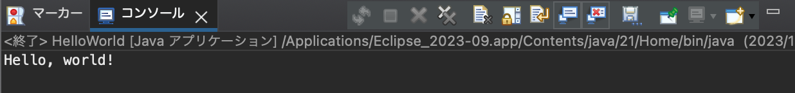
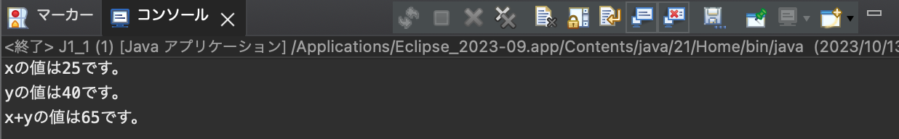
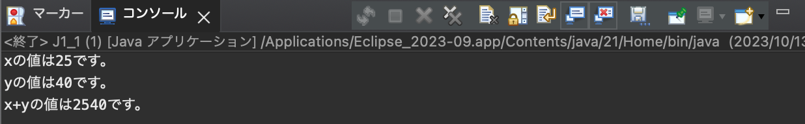
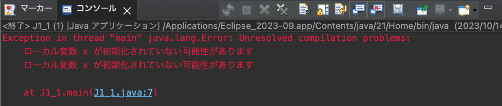

[](https://classroom.github.com/a/3ibgtCqu)

# プログラミング演習II 第１回

* 学籍番号：2264088
* 氏名：河原畑 宏次
* 所属：情報工学EP

# 課題の説明

## 課題1　HelloWorld


<details>
<summary> ソースファイル : 

`./HelloWorld.java` 

</summary>


```java
public class HelloWorld {
    public static void main (String[] args) {
        System.out.println("Hello, world!");
    }
}
```    

</details> 

### プログラムの説明

* `System.out.println`を用いて，"Hello, world"を出力するプログラム

### 実行結果

実行結果は以下の画像のようになった．



### 考察

* このプログラムでは，`System.out.println`を用いることでコンソールに出力することができている．このコードの意味としては，`System`クラスの `out`というstaticフィールドが持つ `println`メソッドを使用するという意味である．


* ここで，`System`クラスは，java.langパッケージ内に存在するが，java.langパッケージはデフォルトでインポートされるため，今回のソースコードでは `import`文の記述は省略している．

---

## 課題2　J1_1

<details>
<summary> ソースファイル : 

`./J1_1.java` 

</summary>


```java
public class J1_1{
    public static void main (String[] args) {
        int x=25;
        int y=40;
        
        System.out.println("xの値は" + x + "です。");
        System.out.println("yの値は" + y + "です。");
        System.out.println("x+yの値は" + (x+y) + "です。");
    }
}
```    

</details> 

### プログラムの説明

* 初期化されたint型変数x, yの値を出力するプログラム

### 実行結果

* 通常の実行結果

<a id = 'error-img'></a>



* 3つ目の `System.out.println()`内の(x+y)の括弧()の無くした場合



* `int x;`としてxの初期値を指定しなかった場合



### 考察

* `println`メソッドでは，C言語の `printf`関数のようにように書式指定子が必要ない．`printf`メソッドを使うことで，C言語と同様の扱いをすることもできる．


* Javaにおける `+`演算子は，数の加算のほかに文字列を連結することができる．つまり，数値同士，文字列同士を`+`演算子で結ぶと，それぞれ数値の加算，文字列の連結が行われる．また，**文字列と数値を `+`演算子で結ぶと，数値が文字列として変換された上で文字列の連結が行われる．**


* `+`演算子の結合規則より， `+`演算子が含まれる場合は，左から順に連結が行われる．今回の[2つ目の実行結果](#error-img)から，(x+y)の括弧()を外すことで，("x+yの値は"という)**文字列** `+` (int型変数xの)**数値**の順であったため，文字列の結合が起こったと考えられる．


* xの値を初期化せずに `println`で参照すると，[3つ目の実行結果の画像](#error-img)のようにエラーが生じた．

# 参考文献

> * 11-5. Systemクラス - マンガで分かる Java入門講座. https://manga.crocro.com/?cat=java&pg=system_class. (2023/10/13 参照)
> 
> * 文字列の連結(+演算子). https://www.javadrive.jp/start/ope/index14.html. (2023/10/14 参照)

# 謝辞

* 特になし

# 感想など

* 早くeclipsの操作とMarkdownの書き方に慣れたいと思った．
