# プログラミング演習II 第10回
* 学籍番号：2264088
* 氏名：河原畑 宏次
* 所属：情報工学EP


# 課題の説明

## 課題1　FileReaderとFileWriter
 
<details>
<summary> ソースファイル : 

`J10_1\src\J10_1.java`

</summary>

``` Java
import java.io.FileReader;
import java.io.FileWriter;
import java.io.IOException;

public class J10_1 {
    public static void main(String[] args) throws Exception {
        // FileReaderとFileWriterを宣言
        FileReader fr1 = null;
        FileReader fr2 = null;
        FileWriter fw = null;
        FileReader fr3 = null;

        try {
            // ファイルストリームを開く
            fr1 = new FileReader(args[0]);
            fr2 = new FileReader(args[1]);
            fw = new FileWriter(args[2]);

            // 読み取ったデータを保存する変数
            int dataA = -1;
            int dataB = -1;

            while (true) {
                // s10_1a.txtから一文字読み取る
                if ((dataA = fr1.read()) != -1) {
                    fw.write(dataA);
                }

                // s10_1b.txtから一文字読み取る
                if ((dataB = fr2.read()) != -1) {
                    fw.write(dataB);
                }

                // 両方とも読み取れなかった場合は終了
                if (dataA == -1 && dataB == -1) {
                    System.out.println(args[0] + ", " + args[1] + "から" + args[2] + "を作成しました\n");
                    break;
                }

            }

        } catch (IOException e) {
            e.printStackTrace();
        } finally {
            try {
                if (fr1 != null)
                    fr1.close();
                if (fr2 != null)
                    fr2.close();
                if (fw != null)
                    fw.close();
            } catch (IOException e) {
                e.printStackTrace();
            }
        }


        // 作成したファイルから読み込みと出力を行う
        try {
            fr3 = new FileReader(args[2]);
            System.out.println("作成したファイルの読み込み開始\n");
            int data = -1;
            while ((data = fr3.read()) != -1) {
                System.out.print((char) data);
            }
            System.out.println();   // 改行
        } catch (Exception e) {
            e.printStackTrace();
        } finally {
            try {
                if (fr3 != null) fr3.close();
            } catch (IOException e) {
                e.printStackTrace();
            }
        }
    }
}
```
</details>
<details>
<summary> ソースファイル : 

`J10_1\src\s10_1a.txt`

</summary>

```text 
雨夜けぎ
雪とわだう
ietngt oyngt
っ君来い
ときのリマ・ブ
ietngt oyngt

深　め想
叶らそもい
ず夜ら
えう気し
Sln ih,Hl ih

ま消るる君のい
へ降続
街にクススツー
色きめ
Sln ih,Hl ih

雨夜けぎ
雪とわだう
ietngt oyngt
っ君来い
ときのリマ・ブ
ietngt oyngt
```
</details>
<details>
<summary> ソースファイル : 

`J10_1\src\s10_1b.txt`

</summary>

```
は更過に
へ変るろ
Sln ih,Hl ih
きとはな
ひりりクススイ
Sln ih,Hl ih

心く秘たい
えれうな
必今な
言そながた
ietngt oyngt

だえ残　へ想
夜とりく
角はリマ・リ
銀のらき
ietngt oyngt

は更過に
へ変るろ
Sln ih,Hl ih
きとはな
ひりりクススイ
Sln ih,Hl ih
```
</details>


### プログラムの説明
一文字ずつ交互に保存した２つのテキストファイル`s10_1a.txt`, `s10_1b.txt`がある。これらのファイルから交互に一文字ずつ読み込み、マージして一つのテキストファイル`d_10.txt`を作成する。

`FileReader`クラスと`FileWriter`クラスから、二つのテキストファイルを読み込むための`fr1`, `fr2`, 読み込んだデータをマージした結果を書き込む`fw`というストリームを開いた。また、FileReaderの`read()`メソッドは、読み取ったデータをint型で返すため、それを保存するためのint型変数`dataA`, `dataB`を用意した。
二つのファイルにあるデータを1文字ずつ分けた際には、その二つのファイルは文字数が1文字異なる場合が存在する。そのため、while文で、二つのファイルの両方からデータが読み取れなくなるまで、繰り返し処理を行う。データが読み取れなくなったことの判断は、read()メソッドが -1 を返すかどうかで判断している。

さらに、作成したファイルはを読み込み内容を表示し確認した。このときに、読み込むためのFileReaderのオブジェクトとして`fr3`を用意した。そして、二つのファイルからデータを読み込んだ時と同様のアルゴリズムでファイルから1文字ずつ読み取り、その読み取った値をsysoutで出力した。ここで、先述したように、FileReaderクラスのread()メソッドは、その戻り値がint型であるため、文字として出力するときは、`(char)`としてchar型にキャストする必要があることに注意した。

プログラム全体において、ファイルストリームの引数には、コマンドライン引数を用いた。


### 実行結果
* 作成されたファイル
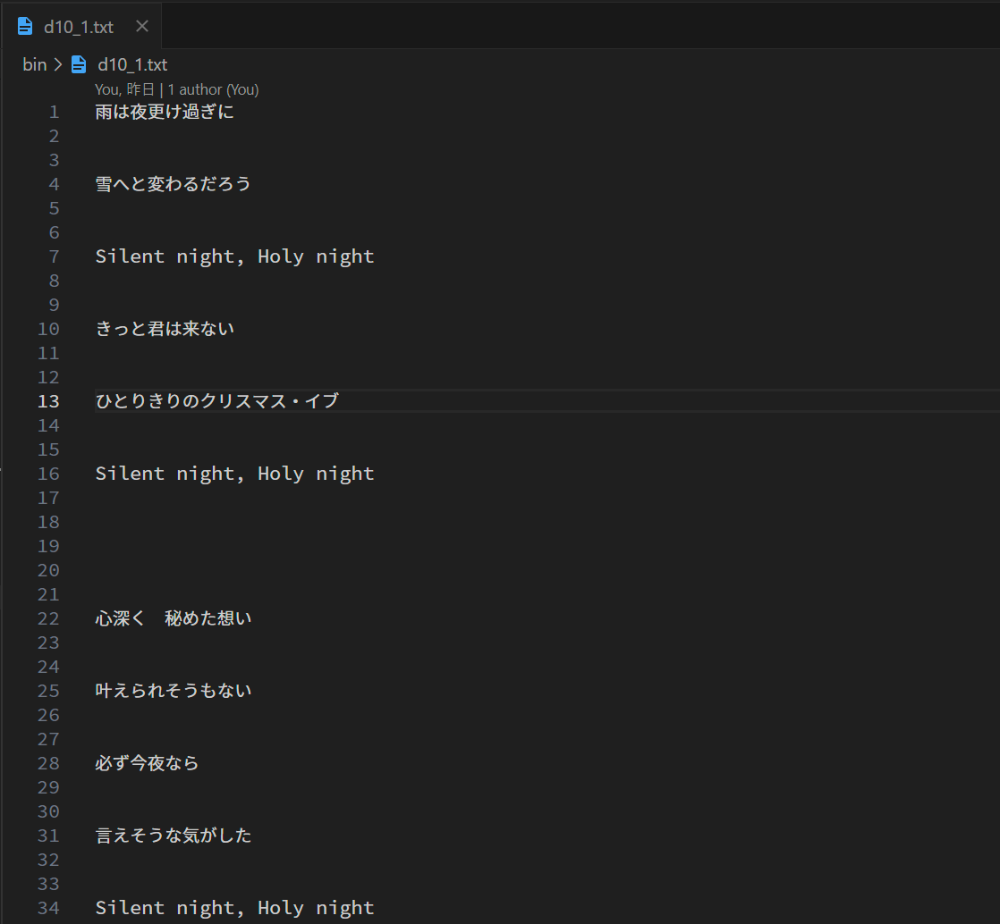

* コンソール画面
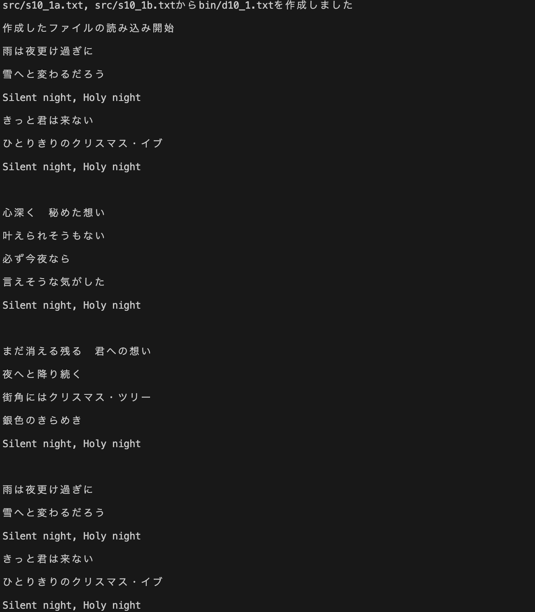

### 考察
#### 課題と反省点
* この提出したコードでは修正したが、元々のコードは、ソースコード全体をtry-catch文で覆っていた。しかし、そのようにすることで弊害が生じた。それは、最後に作成したファイルを読み込む際に、全て読み込まれずに終了してしまうというバグである。
* このバグは、分割されたファイルを読み込みマージする部分と、マージされたファイルを読み込む部分とで、try-catch分を分けることで結果的に解決した。ファイルを参照するFileReaderやFileWriterのようなクラスのオブジェクトは、多くのリソースを消費する。そのため、コード全体を try-catchで覆い、これらのオブジェクトをクローズ処理しないまま他の処理を続けたことが原因だと予想する。
* try-catchブロックはどれくらいの範囲を囲うべきなのかを調べたが、厳密には定まっていないようだった。ただ、tryブロックがどの処理のために行なっているかがわかる程度に止めるべきだと考えた。今後気をつけたい。

<br>

---


## 課題2　BufferedReaderとBufferedWriter
 
<details>
<summary> ソースファイル : 

`J10_2/src/J10_2.java`

</summary>

``` Java
import java.io.BufferedReader;
import java.io.BufferedWriter;
import java.io.FileReader;
import java.io.FileWriter;
import java.io.IOException;
import java.nio.Buffer;

public class J10_2 {
    public static void main(String[] args) throws Exception {
        BufferedReader br = null;
        BufferedWriter bw = null;

        try {
            // BufferedReader/Writerストリームを開く
            br = new BufferedReader(new FileReader("src/s10_2.txt"));
            bw = new BufferedWriter(new FileWriter("bin/d10_2.txt"));

            String data = null;
            while ((data = br.readLine()) != null) {
                // ファイルから一行読み取りStringBufferに保存
                StringBuffer strBuff = new StringBuffer(data);

                for (int i = 0; i < strBuff.length(); i++) {
                    int index = strBuff.indexOf("た", i); // i番目から最初の'た'の位置を保存

                    // 不要な'た'が存在した場合
                    if (index != -1) {
                        strBuff.deleteCharAt(index); // 'た'を削除
                        i = index;    // 探索位置を更新 ("たた"の削除防止)
                    }
                    // 存在しない場合
                    else {
                        break; // 探索終了
                    }
                }

                // 不要な'た'を削除した文字列を書き込む
                bw.write(strBuff.toString());
                bw.newLine();   // 改行
            }
            
            System.out.println("ファイルを作成しました");

        } catch (IOException e) {
            e.printStackTrace();
        } finally {
            try {
                if (br != null) br.close();
                if (bw != null) bw.close();
            } catch (Exception e) {
                e.printStackTrace();
            }
        }

        BufferedReader br2 = null;
        try {
            // BufferReaderを作成
            br2 = new BufferedReader(new FileReader("bin/d10_2.txt"));
            
            // ファイルから読み込んで、画面に表示
            String str = null;
            while ((str = br2.readLine()) != null) {
                System.out.println(str);
            }
        } catch (IOException e) {
            e.printStackTrace();
        } finally {
            try {
                if(br2 != null) br.close();
            } catch (IOException e) {
                e.printStackTrace();
            }
        }

    }
}

```
</details>

<details>
<summary> ソースファイル : 

`J10_2/src/s10_2.txt`

</summary>

```
吾輩たは猫でたある。名た前はまただ無い。
どこたで生れたたかとんと見当がたつたかぬ。
何でも薄た暗いじめたじめしたた所でニャーニャー泣いていたた事だけは記た憶したている。
吾輩はこたこで始めてた人間というもたのを見たた。
しかたもあとでた聞くとそれは書た生という人た間中で一番た獰悪な種た族であったたそうだ。
この書た生というのはた時々我た々を捕えたて煮て食うという話でたある。
しかたしその当た時は何という考もなかったたから別段恐しいとも思わなかったた。
たただ彼の掌にた載せられてスーと持ち上げられたた時何だかフワフワしたた感じがあったたばかりたである。
掌のた上で少し落ちついて書生の顔を見たたのがたいわゆる人間というものの見始でたあろう。
このた時妙なものただと思ったた感じが今でも残っていたる。
第た一毛をもって装た飾されべきはずの顔がつたるつたるしてまるで薬缶だ。
その後た猫にもだいぶ逢ったたがこんな片た輪にはた一度もた出会わしたた事たがない。
のみならず顔の真た中たがあまりに突起したている。
そうたしてその穴の中からた時々ぷたうぷうとた煙を吹く。
どうたも咽せぽくて実に弱ったた。
これたが人た間の飲む煙た草というものたであるた事はよたうやくこの頃知ったた。
```
</details>


### プログラムの説明
テキストファイル`s10_2.txt`を1行単位で読み込み、'た' の文字を除き文章を完成させるプログラムを作成した。完成した文章は、新たに`d10_2.txt`として保存した。ただし、'た' の文字自体を文章で表す場合には、"たた" と文字が連続することに注意した。

まず、`BufferedReader`のメソッド`readLine()`でファイルのデータを1行単位で読み取り、String型の変数`data`に保存した。そして、その変数dataから`StringBuffer`を作成した。このStringBufferの`indexOf()`メソッドを用いて、文字'た'が存在すればそのindexを取得した。さらに取得したindexと`deleteCharAt(index)`とすることで、その取得したindexに位置する文字'た'を消去した文字列を作成する。
ただ、1行に文字'た'は2つ以上含まれる可能性があるので、1行の文字列の中に文字'た'がなくなるまでこの一連の処理を繰り返した。ここで、"たた"となっている場合は、1文字目の'た'だけ消去して、2文字目の'た'は消去しないようにするために、前回見つけた'た'のindexを利用して、`indexOf("た", index)`として、探索位置を前回見つけた'た'次の次の文字からにしている。
例えば、"いたたち"の文字列があった場合、最初の'た'を消去して、次の消去する文字の探索位置は'ち'からになるようにしている。

また、こうして不要な'た'を削除した1行単位の文字列は、`BufferedWriter`の`write()`メソッドを用いて指定したファイルに書き込んだ。この`write()`メソッドは、1行の文字列を一度に書き込むことができるメソッドである。ただし、1行書き込んだ後は、改行コードの書き込みのために、`newLine()`メソッドも使用している。


### 実行結果
* 作成されたファイル
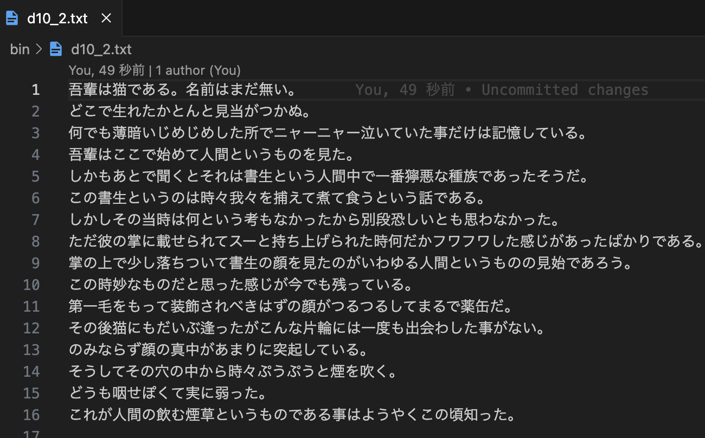

* コンソール画面
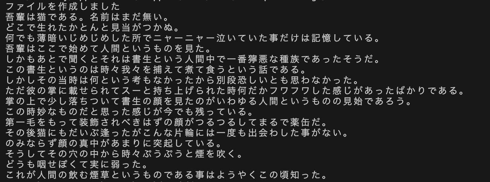

### 考察
#### Bufferedとは
* BufferedReaderやBufferedWriteクラスの、`Buffered`という単語は、その名の通りバッファを利用するという意味である。
* FileReaderやFileWriterのように、ファイルから1文字ずつ読み取ったり、1文字ずつ書き込むのは、いちいちファイルを参照しないといけず効率が悪い。そこで、BufferedReaderやBufferedWriterでは、読み取ったり書き込むデータを、一時的にバッファに保存し、特定のメソッドが呼ばれるとそのバッファにあるデータを一度に処理する。
* 例えば、BufferedWriterの`write()`メソッドでは、引数に渡された文字列を直接ファイルに書き込むのではなく、バッファに書き込んでいく。そして、`flush()`というメソッドが呼ばれた時に、ファイルにバッファの内容を全て一度に書き込む。これにより、FileReaderよりも効率よくファイルにデータを書き込むことができる。BufferedReaderも同様である。

<br>

#### flush()がない場合の処理
* 今回のプログラムでは、BufferedWriterを使ったデータの書き込みで、`flush()`メソッドを使わなかった。この場合でも、実行結果のように正しく書き込みが行われている。この処理について調べてみると、`close()`が呼ばれる際に自動的に`flush()`が呼ばれるとわかった。
* ただし、読み込まれるデータ量が大きい場合は、適度にflush()を使う方が良いと考えた。


<br>

---

## 課題3　FileWriter, FileReader, DataOutputStream, DataInputStream
 
<details>
<summary> ソースファイル : 

`J10_3/src/J10_3.java`

</summary>

``` Java
import java.io.*;
import java.util.Random;

public class J10_3 {
    public static void main(String[] args) throws Exception {
        Random rd = new Random();

        // ファイルの生成と書き込み
        try (FileWriter textfw = new FileWriter("bin/d10_3.txt");
             DataOutputStream bindos = new DataOutputStream(new FileOutputStream("bin/d10_3.bin"))) {
                
            for (int i = 0; i < 10; i++) {
                // 一様なdouble型の乱数を発生
                double data = rd.nextDouble(); 

                // 発生したdouble型の乱数を書き込み
                textfw.write(Double.toString(data) + "\n");
                bindos.writeDouble(data);
            }

        } catch (IOException e) {
            e.printStackTrace();
        }


        // ファイルサイズの表示
        File textFile = new File("bin/d10_3.txt");
        File binFile = new File("bin/d10_3.bin");
        System.out.println("Text File Size = " + textFile.length());
        System.out.println("Binary File Size = " + binFile.length());


        // ファイルの出力
        try (FileReader textfr = new FileReader("bin/d10_3.txt");
                DataInputStream bindis = new DataInputStream(new FileInputStream("bin/d10_3.bin"))) {
            // d10_3.txt の表示
            System.out.println("-----d10_3.txt-----");
            int data = -1;  // 読み取ったデータを保存
            while ((data = textfr.read()) != -1) {
                System.out.print((char)data);
            }

            // d10_3.bin の表示
            System.out.println("-----d10_3.bin-----");
            while (true) {
                System.out.println(bindis.readDouble());
            }

        } catch (EOFException eofe) {
        } catch (IOException e) {
            e.printStackTrace();
        }

    }
}
```
</details>


### プログラムの説明
#### 概略
Randomクラスを使ってdouble型の乱数を発生させて、その値をテキストファイル`d10_3.txt`とバイナリーファイル`d10_3.bin`に書き込むプログラムを作成した。さらに、それぞれのファイルのバイト数を表示し、この作成したファイルを読み込み表示した。

<br>

#### ファイルの生成と書き込み
ひとつ目のtryブロックでは、テキストとバイナリーファイルの書き込みを行なっている。それぞれに使う、FileWriterとDataOutputStreamを作成し、`Random.nextDouble()`で発生したdouble型の乱数を書き込んだ。この時、テキストファイルの書き込みに使うFileWriterでは、発生した乱数を文字列に変換し、その値を`write()`メソッドにより文字列として書き込んだ。

一方で、バイナリーファイルの書き込みに使うDataOutputStreamでは、`writeDouble()`メソッドを使うことで、double型の乱数を8バイトの値として書き込んだ（実際には、long型に変換された後8バイトの値として書き込まれている）。

この一連の処理を10回繰り返すことで、10個のdouble型の乱数をそれぞれのファイルに書き込んでいる。

<br>

#### ファイルサイズの表示とファイルの読み取り
ファイルサイズの表示には、`File`クラスのメソッド`length()`を利用した。

また、2つ目のtryブロックでは、テキストとバイナリーファイルの読み取りを行なっている。それぞれに使う、FileReaderと、DataInputStreamを作成した。
テキストファイルの読み取りでは、課題１で行った処理と同様に、1文字ずつint型のデータとして読み取り、それをchar型にキャストして表示するという処理を、ファイルの全要素で行っている。

一方でバイナリーファイルの読み取りでは、`readDouble()`メソッドを使って、8バイトを読み取り、その値をdouble型と解釈して出力する。この処理を無限ループで繰り返し処理をしている。ただ、バイナリーファイルの読み取りではEOFが読み取られた際に、EOFExceptionが発生しその例外のcatch処理に移ることを利用して、ループの終了としている。

<br>

### 実行結果
* コンソール画面
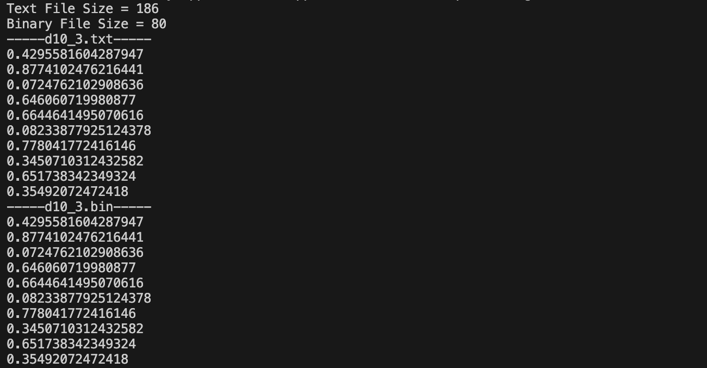

* 作成したテキストファイル
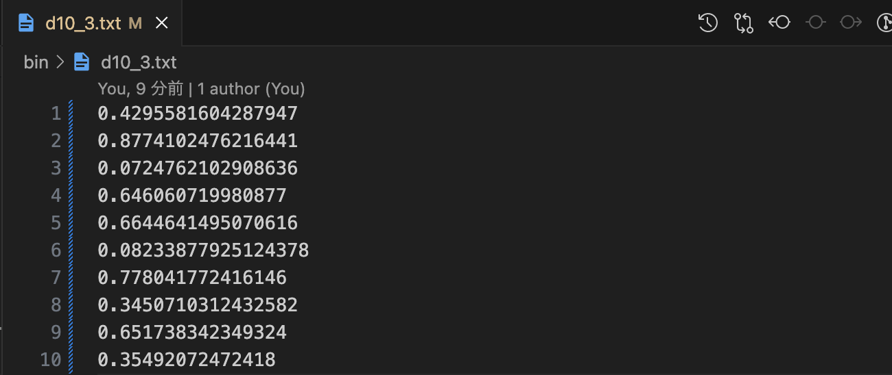

* 作成したバイナリーファイル
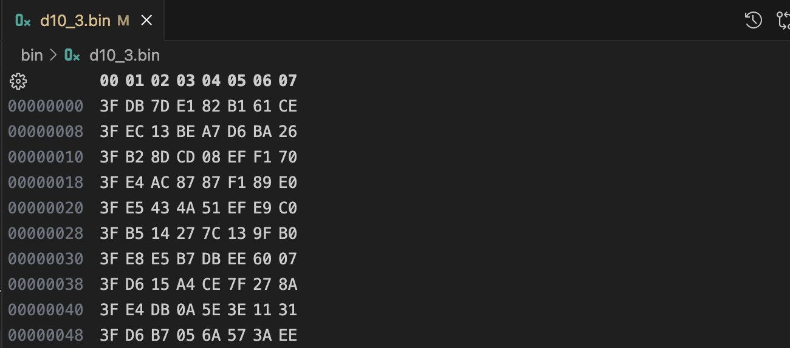


### 考察
#### try-with-resources文について
課題１、課題２では、入出力ストリームオブジェクトのエラー処理に対して、通常のtry-catch文を用いた。しかし、try-catch文では、finallyブロック内の`close()`処理において、nullチェックをしたり、さらにそれ全体をtryブロックで囲う必要があったりと手間がかかる。

```Java
// ファイルから読み取りを行う場合
class ReadFile {
    public static void main(String[] args) {
        FileReader fr = null;

        try {
            fr = new FileReader("sample.txt");      // ストリームを開く

            System.out.println((char)fr.read());    // 1文字読み取って表示
        } catch (IOException ioe) {
            ioe.printStackTrace();                  // 例外処理
        } finally {
            try {
                if(fr != null) fr.close();          // close()処理
            } catch (IOException ioe) {
                ioe.printStackTrace();              // close()処理の例外処理
            }
        }
    }
}
```

そこで、課題３では、`try-with-resources`文を用いて例外処理を行った。try-with-resources文では、上の例と同様の処理を、次のように書くことができる。

```Java
class NewReadFile {
    public static void main(String[] args) {
        // try(~) の ~ で生成されたストリームは、自動でclose()処理が行われる
        try (FileReader fr = new FileReader("sample.txt")) {
            System.out.println((char)fr.read());    // 1文字読み取って表示
        } 
    } catch (IOException ioe) {
        ioe.printStackTrace();                      // 例外処理
    }
}
```

try-with-resources文については、第7回の課題レポートでもまとめたので、以下はそれを転載した。

>   
> #### `try-with-resources`文について
> * `Scanner`クラスのインスタンス`sc`をクローズするコードについて、エラーが発生しても正しくクローズが行われるために、`try`ブロックの中ではなく、finallyブロックの中に`sc.close()`記述した。
> * しかし、`try-with-resources`文を用いることでこの手間を省くことができる。書き方は次のとおりである。
> ```Java
> try (resources) {
>     ~~~
> } catch (Exception e) {
>     ~~~
> } finally {
>     ~~~
> }
> ```
> * ここで、resourcesは、AutoCloseableもしくはCloseableインターフェースを実装したクラスのオブジェクトを表す（大まかにはclose()メソッドを持つクラスのオブジェクトの意味）。
> * tryブロックを抜けた瞬間に、リソースが自動的にcloseされる。
> * resourcesを複数記述することも可能であり、その際は、セミコロン「;」で区切る。
> * resourcesにおいて、オブジェクトをコンストラクタを用いて直接生成した場合、コンストラクタで例外が発生するとリソースが解放されないので、オブジェクトの生成においてネストは避けた方が良い。
> 
> 良い例: 
> ```Java
> try (
>     FileReader fr = new FileReader("sample.txt");
>     BufferedReader br = new BufferedReader(fr)
> ) {
>     ~~~
> } catch {}
> ```
> 悪い例: 
> ```Java
> try (
>     BufferedReader br = new BufferedReader(new FileReader("sample.txt"))
> ) {
>     ~~~
> } catch {}
> ```
> <br>

<br>

---

## 課題4　StreamTokenizer
 
<details>
<summary> ソースファイル : 

`J10_4/src/J10_4.java`

</summary>

``` Java
import java.io.*;
import java.util.ArrayList;

public class J10_4 {
    public static void main(String[] args) throws Exception {
        try (BufferedReader br = new BufferedReader(new FileReader("src/s10_4.txt"))){
            // StreamTokenizerを作成
            StreamTokenizer st = new StreamTokenizer(br);

            // リストの作成 Playerインスタンスを保存
            ArrayList<Player> list = new ArrayList<>();

            // '/' を区切り文字に設定
            st.whitespaceChars('/', '/');
            st.whitespaceChars(',', ',');

            // EOL を有効化
            st.eolIsSignificant(true);

            // 読み取った値を保存する変数
            String position = null, name = null;
            int year = 0, month = 0, date = 0;
            
            while (st.nextToken() != StreamTokenizer.TT_EOF) {
                st.pushBack(); // 次に呼ばれるnextToken()では次の読み込みに移行しない
                
                // nvalCount, svalCount はそれぞれ nval と sval が一行ごとに何回呼ばれたかをカウント
                int nvalCount = 0;
                int svalCount = 0;

                // 一行ごとの処理
                while (st.nextToken() != StreamTokenizer.TT_EOL) {

                    switch (st.ttype) {
                        case StreamTokenizer.TT_NUMBER:
                            if (nvalCount == 0) {
                                year = (int) st.nval;
                                nvalCount++;
                            } else if (nvalCount == 1) {
                                month = (int) st.nval;
                                nvalCount++;
                            } else if (nvalCount == 2) {
                                date = (int) st.nval;
                                nvalCount = 0;
                            }
                            break;

                        case StreamTokenizer.TT_WORD:
                            if (svalCount == 0) {
                                position = st.sval;
                                svalCount++;
                            } else if (svalCount == 1) {
                                name = st.sval;
                                svalCount = 0;
                            }
                            break;
                    }

                }
                // リストにPlayerを追加
                list.add(new Player(position, name, year, month, date));
            }
            
            // Playerを表示
            for (Player player : list) {
                System.out.println(player);
            }

        } catch (IOException e) {
            e.printStackTrace();
        }

    }
}
```
</details>

<details>
<summary> ソースファイル : 

`J10_4/src/Player.java`

</summary>

```Java 
public class Player {
    private String position;    // ポジション
    private String name;        // 名前
    private int year;           // 誕生年 
    private int month;          // 誕生月
    private int date; // 誕生日a
    

    // コンストラクタ
    public Player(String position, String name, int year, int month, int date) {
        this.position = position;
        this.name = name;
        this.year = year;
        this.month = month;
        this.date = date;
    }


    // toString()をオーバーライドしてメンバ変数を表示
    @Override
    public String toString() {
        return String.format("%4d年%2d月%2d日 %s %s", year, month, date, position, name);
    }

}
```
</details>

<details>
<summary> ソースファイル : 

`J10_4/src/s10_4.txt`

</summary>

```
GK 1996/03/16 高丘陽平
2002/9/18 GK 田川知樹 
1986,4,28 GK 中林洋次 
1997 12,18 GK/オビパウエルオビンナ
DF 永戸勝也 1995/1/15
1995,DF/8,25 畠中槙之輔 
DF 1993,4,27 エドゥアルド 
1989,DF 實藤友紀 1/19
DF 岩田智輝 1997/4/7
DF 1995,8/小池龍太,29
1996/11/6 DF 小池裕太 
DF 松原健 1993/2/16
1999,DF/6/27 角田涼太朗 
2003 DF/8/西田勇祐 6
1998/10/18 MF 渡辺皓太
MF 喜田拓也 1994/8/23
1998/6/28 MF 吉尾海夏
MF 2002/2,16 藤田譲瑠チマ
MF 1990,水沼宏太 2/22
2003,8,17 MF 山根陸
FW エウベル 1992/5/27
FW レオセアラ 1995,2,3
1993/1/ FW マルコスジュニオール 19
FW,アンデルソンロペス,1993,9,15
FW 1992,12 宮市亮,14
FW ヤンマテウス 1998/09/04
1992 FW 仲川輝人 7 27
FW 1996/10/22 西村拓真
```
</details>


### プログラムの説明
テキストファイル`s10_4.txt`には、サッカーのポジションと名前、生年月日がカンマまたはスラッシュまたは半角スペースで区切られたデータが、数行にわたりいくつか含まれる。これらのデータを読み取り、`xxxx年xx月xx日 ポジション 名前`と整形して出力するプログラムを作成した。

`Player`クラスを作成した。このクラスは、テキストファイルから得られる、選手の名前、ポジション、誕生年、誕生月、誕生日をそれぞれ保存するインスタンス変数を持ち、コンストラクタでこれらを初期化する。
また、オーバーライドした`soString()`メソッドで、PlayerオブジェクトがtoStringされると、`xxxx年xx月xx日 ポジション 名前`と出力されるように変更した。

ファイルデータの読み取りには、`BufferedReader`クラスを利用した。そのBufferedReaderか`らStreamTokenizer`を作成し、`whitespaceChars()`メソッドを用いて、区切り文字として`/`,と`,`を追加した。また、行末の判断を行うために、`eolIsSignificant()`で EOL を有効化した。

読み取ったデータは、名前とポジション、生年月日に分類し、その分類したデータを元にPlayerオブジェクトを作成する。そして、そのPlayerオブジェクトをArrayListに追加する。このアルゴリズムについて、次のフローチャートでまとめた。

最後に、このようにして作成したPlayerオブジェクトのArrayListを拡張for文を用いて出力した。


### 実行結果
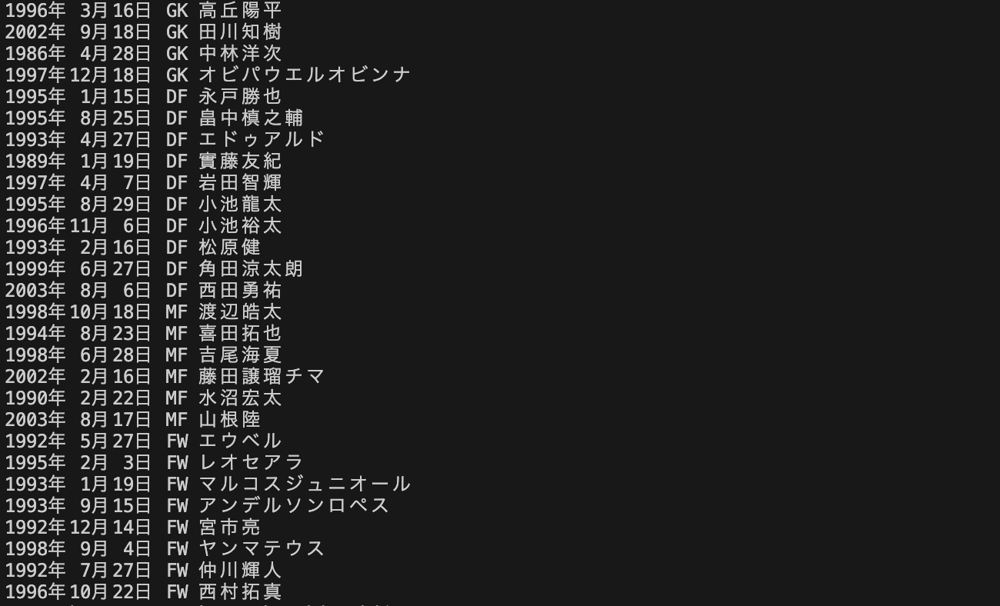


### 考察
#### 反省点と疑問
最初に提出したコードでは、`st.whitespaceChars(',', ',')`を書き忘れていた。この記載がないと、カンマ','が空白文字として認識されない。ただ、実はこの記載がなくても問題なくプログラムは実行でき、確かに実行結果と同様の出力を得た。

この原因について調べるためにデバッグを行った。すると、`1986,4,28 GK 中林洋次`を読み取った際に、まず1986という数字が読み取られた。そしてその後に、','が読み取られ、`ttype`が 44 という数字になった。

* 1986 が読み込まれたとき
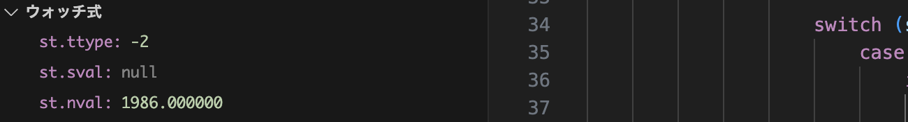
* ',' が読み込まれたとき
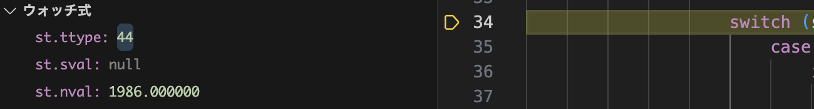
* "GK" が読み込まれたとき
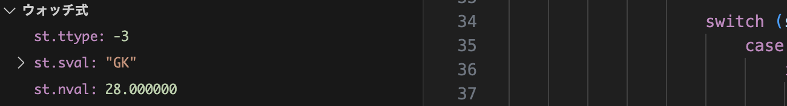

このttypeの値は、`TT_NUMBER`の −2 や、`TT_WORD`の -3 ではない。調べてみて、ASCIIコードに一致すること気づいた。つまり、`TT_WORD`でも、`TT_NUMBER`でもない要素として扱われるため、`ttype`が`TT_WORD`か`TT_NUMBER`かで場合わけをした処理に対して、何の影響も与えなかったとわかった。

ただ、なぜ、空白文字に指定しなかった カンマ ',' が、`TT_WORD`として扱われたかったのかは謎のままである。今後気づいたら追記したいと思う。

<br>

---

## 課題5　ObjectOutputStream, ObjectInputStream
 
<details>
<summary> ソースファイル : 

`J10_5/src/J10_5.java`

</summary>

``` Java
import java.io.BufferedReader;
import java.io.EOFException;
import java.io.FileInputStream;
import java.io.FileOutputStream;
import java.io.FileReader;
import java.io.IOException;
import java.io.ObjectInputStream;
import java.io.ObjectOutputStream;
import java.io.StreamTokenizer;
import java.util.ArrayList;

public class J10_5 {
    private static ArrayList<Player> list;

    public static void main(String[] args) throws Exception {
        // ArrayListを作成
        makeList();

        
        try (ObjectOutputStream objout = new ObjectOutputStream(new FileOutputStream("bin/d10_5.obj"));
             ObjectInputStream objin = new ObjectInputStream(new FileInputStream("bin/d10_5.obj"))) {
            
            // listからPlayerインスタンスを取り出して、ファイルに書き込み
            for (int i = 0; i < list.size(); i++) {
                objout.writeObject(list.get(i));
            }

            Player data = null;
            while ((data = (Player) objin.readObject()) != null) {
                System.out.println(data);
            }
        
        } catch (EOFException eofe) {
        } catch (IOException e) {
            e.printStackTrace();
        }
    }


    // 課題４で作成したものと同様のlistを作成するメソッド
    private static void makeList() {
        try {
            // StreamTokenizerを作成
            StreamTokenizer st = new StreamTokenizer(new BufferedReader(new FileReader("src/s10_5.txt")));

            // リストの作成 Playerインスタンスを保存
            list = new ArrayList<>();

            // '/' を区切り文字に設定
            st.whitespaceChars('/', '/');

            // EOL を有効化
            st.eolIsSignificant(true);

            // 読み取った値を保存する変数
            String position = null, name = null;
            int year = 0, month = 0, date = 0;
            
            while (st.nextToken() != StreamTokenizer.TT_EOF) {
                st.pushBack(); // 次に呼ばれるnextToken()では次の読み込みに移行しない
                
                // nvalNo, svalNo はそれぞれ nval と sval が一行ごとに何回呼ばれたかをカウント
                int nvalNo = 0;
                int svalNo = 0;

                // 一行ごとの処理
                while (st.nextToken() != StreamTokenizer.TT_EOL) {

                    switch (st.ttype) {
                        case StreamTokenizer.TT_NUMBER:
                            if (nvalNo == 0) {
                                year = (int) st.nval;
                                nvalNo++;
                            } else if (nvalNo == 1) {
                                month = (int) st.nval;
                                nvalNo++;
                            } else if (nvalNo == 2) {
                                date = (int) st.nval;
                                nvalNo = 0;
                            }
                            break;

                        case StreamTokenizer.TT_WORD:
                            if (svalNo == 0) {
                                position = st.sval;
                                svalNo++;
                            } else if (svalNo == 1) {
                                name = st.sval;
                                svalNo = 0;
                            }
                            break;
                    }

                }
                // リストにPlayerを追加
                list.add(new Player(position, name, year, month, date));
            }

        } catch (IOException e) {
            e.printStackTrace();
        }

    }
}
```
</details>

<details>
<summary> ソースファイル : 

`J10_5/src/Player.java`

</summary>

```Java 
import java.io.Serializable;

public class Player implements Serializable {
    private String position;    // ポジション
    private String name;        // 名前
    private int year;           // 誕生年 
    private int month;          // 誕生月
    private int date;           // 誕生日
    
    static final long serialVersionUID = 1L;
    

    // コンストラクタ
    public Player(String position, String name, int year, int month, int date) {
        this.position = position;
        this.name = name;
        this.year = year;
        this.month = month;
        this.date = date;
    }


    // toString()をオーバーライドしてメンバ変数を表示
    @Override
    public String toString() {
        return String.format("%4d年%2d月%2d日 %s %s", year, month, date, position, name);
    }
    
}
```
</details>

<details>
<summary> ソースファイル : 

`J10_5/src/s10_5.txt`

</summary>

``` 
GK 1996/03/16 高丘陽平
2002/9/18 GK 田川知樹 
1986,4,28 GK 中林洋次 
1997 12,18 GK/オビパウエルオビンナ
DF 永戸勝也 1995/1/15
1995,DF/8,25 畠中槙之輔 
DF 1993,4,27 エドゥアルド 
1989,DF 實藤友紀 1/19
DF 岩田智輝 1997/4/7
DF 1995,8/小池龍太,29
1996/11/6 DF 小池裕太 
DF 松原健 1993/2/16
1999,DF/6/27 角田涼太朗 
2003 DF/8/西田勇祐 6
1998/10/18 MF 渡辺皓太
MF 喜田拓也 1994/8/23
1998/6/28 MF 吉尾海夏
MF 2002/2,16 藤田譲瑠チマ
MF 1990,水沼宏太 2/22
2003,8,17 MF 山根陸
FW エウベル 1992/5/27
FW レオセアラ 1995,2,3
1993/1/ FW マルコスジュニオール 19
FW,アンデルソンロペス,1993,9,15
FW 1992,12 宮市亮,14
FW ヤンマテウス 1998/09/04
1992 FW 仲川輝人 7 27
FW 1996/10/22 西村拓真
```
</details>


### プログラムの説明
課題４のプログラムで作成したArrayListの内容を、`ObjectOutputStream`でPlayerオブジェクト単位にファイル`d10_5.obj`に書き出し、さらに、d10_5.objファイルから`ObjectInputStream`でファイルの内容をPlayerオブジェクトとして読み込み画面に表示するプログラムを作成した。

よって、課題４で行った、ファイル`d10_5.txt (d10_4.txt と同じ)`からPlayerオブジェクト単位に読み込みArrayListを作成する処理については、`makeList()`というメソッドとして記述した。

次に、作成したArrayListからPlayerオブジェクトを取り出し、ファイルにPlayerオブジェクトとして書き込む処理を行った。まず、`FileOutputStream`オブジェクトを引数にして`ObjectOutputStream`を作成した。このストリームのメソッド`writeObject()`を利用して、ArrayListからget()メソッドで取り出したPlayerオブジェクトをファイルに保存した。

さらに、そこで作成したファイルから、`FileInputStream`を作成し、それから`ObjectInputStream`を作成した。そしてこのストリームが持つ、`readObject()`メソッドでPlayerオブジェクトを読み取り、sysoutで画面に表示した。

`Player`クラスは、基本的には課題４で用いたものと変わりないが、`Serializable`インターフェースを実装し、`static final long serialVersionUID`を付与した。


### 実行結果
* コンソール画面
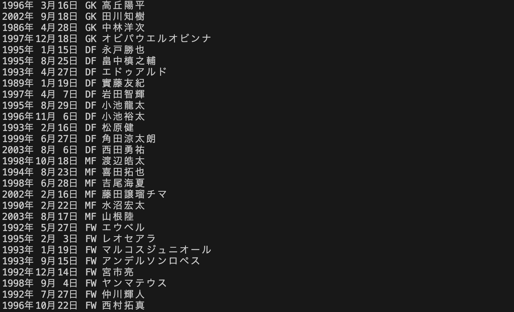

* 作成されたobjファイル
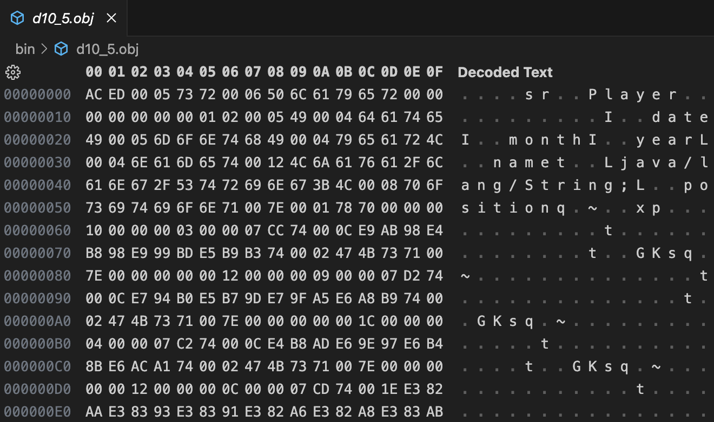

### 考察
#### Serializableとは
* 日本語で直列化を意味するこの言葉は、オブジェクトを読み書きできる形に整えることを指す。オブジェクトをシリアライズ可能にするには、Serializableインターフェースを実装する必要がある。しかし、このインターフェースは、メソッドや定数を持たないためオーバーライドする必要はない。ただ、明示的にシリアライズ可能だと宣言するためのものに過ぎない。

* シリアライズされるのは、そのオブジェクトが持つインスタンス変数である。つまり、staticな要素はシリアライズされない。
* シリアルバージョンUIDとは、オブジェクトの読み書きの前後でクラスのバージョンが異なっていないかを識別するためのものである。ゆえに、コードを変更したりインスタンス変数の値が変わったりした場合には、
  この数値も変更する必要がある。定義しなかった場合には、自動で生成されるが、Javaのドキュメントには、明示的に定義することが推奨されている。


<br>

---


# 参考文献
> * Java：Reader/Writerにおけるclose()メソッド呼び出しの流儀: 愛ゆえにプログラムは美しい. http://endeavour.cocolog-nifty.com/developer_room/2015/06/javareaderwrite.html. (2023/12/16 参照)
> * Microsoft Learn. TokenType Enum (Java.IO) | Microsoft Learn. https://learn.microsoft.com/en-us/dotnet/api/java.io.tokentype?view=net-android-34.0. (2022/12/16 参照)
> * TASK NOTES. 【Java】Serializableの基本（シリアライズ・直列化） - TASK NOTES. https://www.task-notes.com/entry/20150925/1443150000. (2023/12/17 参照)

# 謝辞
* 特になし

# 感想など
特になし