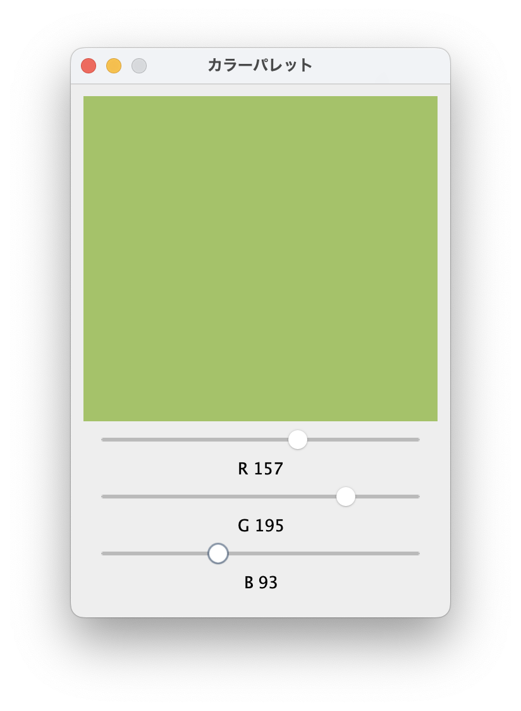
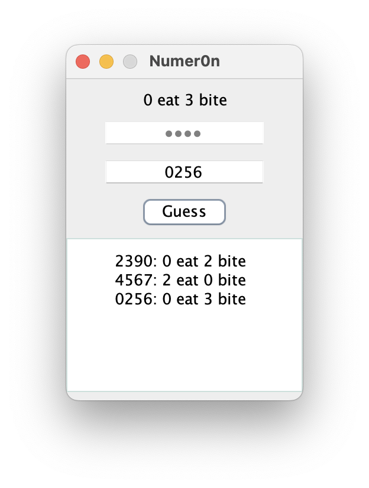

# プログラミング演習II 第11回
* 学籍番号：2264088
* 氏名：河原畑 宏次
* 所属：情報工学EP


# 課題の説明

## 課題1　Canvasを用いた三角関数の描画アプリの作成
 
<details>
<summary> ソースファイル : 

`J11_1/src/J11_1.java`

</summary>

``` Java
import java.awt.*;
import java.awt.event.ActionEvent;
import java.awt.event.ActionListener;

import javax.swing.*;

public class J11_1 extends JFrame implements ActionListener {
    // canvasの生成
    MyCanvas canvas = new MyCanvas();
        
    public static void main(String[] args) throws Exception {
        // フレームの生成
        J11_1 frame = new J11_1("三角関数");
        frame.setVisible(true);
    }

    // フレームの作成
    public J11_1(String title) {
        // 初期設定
        setTitle(title);
        setBounds(900, 200, 400, 300);
        setDefaultCloseOperation(JFrame.EXIT_ON_CLOSE);

        canvas.setSize(361, 201);        // canvasの大きさを設定

        // 関数描画部分のパネル
        JPanel functionPanel = new JPanel();
        functionPanel.setBackground(Color.GREEN);
        functionPanel.add(canvas);
        


        // ボタンの設定
        JButton sinButton = new JButton("Sin");
        JButton cosButton = new JButton("Cos");
        sinButton.addActionListener(this);
        sinButton.setActionCommand("Sin");  // コマンドの設定: Sin
        cosButton.addActionListener(this);
        cosButton.setActionCommand("Cos");  // コマンドの設定: Cos
        

        // ボタン部分のパネル
        JPanel buttonPanel = new JPanel();
        buttonPanel.add(sinButton);
        buttonPanel.add(cosButton);

        // Columnレイアウト
        JPanel colPanel = new JPanel();
        colPanel.setLayout(new BoxLayout(colPanel, BoxLayout.PAGE_AXIS));
        colPanel.add(functionPanel);
        colPanel.add(buttonPanel);


        // ContentPaneに追加
        getContentPane().add(colPanel, BorderLayout.CENTER);

    }
    

    // ボタンが押された時のイベントを作成
    @Override
    public void actionPerformed(ActionEvent e) {
        // 関数名を Sin / Cos に設定して再描画
        canvas.setFunctionName(e.getActionCommand());
        canvas.repaint();
    }

}

class MyCanvas extends Canvas {
    // 関数名を保存
    private String functionName = "Sin";

    public void setFunctionName(String functionName) {
        this.functionName = functionName;
    }

    // CanvasでSin関数描画
    @Override
    public void paint(Graphics g) {

        // Sin曲線
        if (functionName.equals("Sin")) {
            for (int i = 0; i < 360 - 1; i++) {
                double rad1 = i * (Math.PI / 180);
                double rad2 = (i + 1) * (Math.PI / 180);

                int y1 = 100 - (int) (Math.sin(rad1) * 100);
                int y2 = 100 - (int) (Math.sin(rad2) * 100);

                g.drawLine(i, y1, i + 1, y2);
                g.drawString(functionName, getWidth() / 2, getHeight() / 6);
            }
        }
        // Cos曲線
        else if (functionName.equals("Cos")) {
            for (int i = 0; i < 360 - 1; i++) {
                double rad1 = i * (Math.PI / 180);
                double rad2 = (i + 1) * (Math.PI / 180);

                int y1 = 100 - (int) (Math.cos(rad1) * 100);
                int y2 = 100 - (int) (Math.cos(rad2) * 100);

                g.drawLine(i, y1, i + 1, y2);
                g.drawString(functionName, getWidth() / 2, getHeight() / 6);
            }
        }
    }
}
```
</details>


### プログラムの説明
#### プログラムの概要
フレームを作成し、その中にグラフを描画するための `Canvas` と 描画する曲線を選択する `JButton` を２つ作成した。
JButton は、"Sin" と “Cos” とし、"Sin" を押すと Canvas を Sin 曲線に “Cos” を押すと Canvas を Cos 曲線に書き換えるよう機能を持たせた。
Canvas の大きさは、(361,201) とし、一周期分が丁度 Canvas に収まるようにした。
起動時には、Sin 曲線が描画される。

#### sin関数とcos関数の描画について
`Canvas`では、`paint()`メソッドが用意されておりこの関数の中に描画したい対象を記述する。

コードでは、Canvasクラスを継承した`MyCanvas`クラスを作成し、メンバ変数`String functionName`に "Sin" が保存されているときはsin関数を描画し、 "Cos" が保存されているときにはcos関数が描画されるように設計した。ただし、functionNameは、後述する`ActionListener`が変更する。

各関数の描画は第11回の解説を参考にした。`drawLine()`メソッドを利用して、360個の微小な線分を関数の曲線に応じて描画することで、全体としてなめらかなsin(cos)カーブを描くことができた。また、`drawString()`メソッドを用いて関数名の表示も行った。

#### ボタンとActionListener
Swingでは、各コンポーネントに`ActionListener`クラスを追加することで、ボタンを押したりテキストを入力するなどの行動を検知し、それに応じたイベントを`actionPerformed()`メソッドで発生させることができる。課題では、mainメソッドを持つクラス自体にActionListenerを実装している。

"Sin" と "Cos" のボタンには、`addActionListener(this)`によりリスナーを追加するとともに、`setActionCommand("Sin(Cos)")`を指定しそれぞれボタンに応じたコマンドを設定した。これにより、イベントを発生させるactionPerformed()メソッドで`getActionCommand()`を利用することで、発生したイベントが持つコマンドを知ることができ、どちらのボタンが押されたのかがわかるようになる。ここで判明したコマンド（"Sin" または "Cos"）をイベントのたびに先述したMyCanvasのメンバ`functionName`に設定する（functionNameはpaint()で描画する関数を決定する）。

実は、以上だけではボタンを押しても描画が変化しない。これは、Canvasは、変更があっても自動で再描画が行われないからである。よって変更があるたび、つまりボタンが押されるたびに再描画を行う必要がある。そこで、actionPerformed()メソッドにてCanvasの再描画をこなう`repaint()`メソッドを呼び出している。


### 実行結果
* プログラム開始直後と "Sin" ボタンを押した場合


* "Cos" ボタンを押した場合


### 考察
#### レイアウトについて
全体のレイアウトを考える上で、次に画像のようなレイアウトを考えた。


JavaDriveを参考にして、パネル（`JPanel`）を利用してレイアウトを構成した。まず、課題のフレームには大きく分けてCanvasを描画する部分と2つのボタンを描画する部分に分けられる。そこで、その二つの部分をそれぞれパネルとして扱った。

そして、この二つのパネルは縦に並んでいるので、要素を縦に並べるパネルで全体を覆った。JPanelには、デフォルトとして`FlowLayout`というレイアウトが割り当てられている。このレイアウトでは、追加されたコンポーネントが左から右に配置され必要あれば改行して続く。つまり、ウィンドウサイズに応じてレイアウトが変更されてしまう可能性がある。そこで、全体を覆うパネルとして、次のようなパネル`colPanel`を作成した。これにより、要素が上から下へ縦に並ぶパネルを作成できた。
```Java
// Columnレイアウト
JPanel colPanel = new JPanel();
colPanel.setLayout(new BoxLayout(colPanel, BoxLayout.PAGE_AXIS));
```
また、ボタンを描画する部分はボタンを横に並べるが、ここではデフォルトのFlowLayoutを使用している。

<br>

---


## 課題2　三角関数の計算機アプリの作成
 
<details>
<summary> ソースファイル : 

`J11_2/src/J11_2.java`

</summary>

``` Java
import java.awt.Color;
import java.awt.Dimension;
import java.awt.Font;
import java.awt.event.ActionEvent;
import java.awt.event.ActionListener;
import javax.swing.*;


public class J11_2 extends JFrame implements ActionListener {
    // インスタンス変数
    private JLabel resultJLabel; // 計算結果を表示するラベル
    private JTextField textField; // 計算の引数を入力するテキストフィールド
    ButtonGroup buttonGroup;


    public static void main(String[] args) throws Exception {
        // フレームを作成
        J11_2 frame = new J11_2("Computer");
        frame.setVisible(true);
    }

    public J11_2(String title) {
        // 初期設定
        setTitle(title);
        setBounds(300, 300, 300, 250);
        setDefaultCloseOperation(JFrame.EXIT_ON_CLOSE);


        // 計算結果を表示するラベルとそれを囲うパネル
        resultJLabel = new JLabel(" ");
        resultJLabel.setPreferredSize(new Dimension(100, 50));
        resultJLabel.setFont(new Font(Font.DIALOG, Font.PLAIN, 15)); // フォントの設定;
        JPanel resultPanel = new JPanel();
        resultPanel.add(resultJLabel);

        // 計算のための引数を入力するテキストフィールドとそれを囲うパネル
        textField = new JTextField(20);
        textField.setHorizontalAlignment(JTextField.CENTER);
        textField.setToolTipText("関数の引数の値を入力してください");
        JPanel textPanel = new JPanel();
        textPanel.add(textField);


        // ラジオボタンを生成
        JRadioButton[] radioButtons = {
            new JRadioButton("Sin", true),
            new JRadioButton("Cos"),
            new JRadioButton("Tan"),
        };

        // ラジオボタンにActionCommandを追加
        radioButtons[0].setActionCommand("Sin");
        radioButtons[1].setActionCommand("Cos");
        radioButtons[2].setActionCommand("Tan");

        // ラジオボタンのパネル
        JPanel radioButtonPanel = new JPanel();

        // ボタングループ
        buttonGroup = new ButtonGroup();
        
        // ラジオボタンをパネルに追加 & ボタングループに追加 
        for (int i = 0; i < radioButtons.length; i++) {
            radioButtonPanel.add(radioButtons[i]);
            buttonGroup.add(radioButtons[i]);
        }

        // 計算開始するボタンとそれを囲うパネル
        JButton completeButton = new JButton("Complete");
        completeButton.addActionListener(this); // ActionListenerを追加
        JPanel buttonPanel = new JPanel();
        buttonPanel.add(completeButton);
   

        // 全体のレイアウト: Columnレイアウト
        JPanel overallPanel = new JPanel();
        BoxLayout colLayout = new BoxLayout(overallPanel, BoxLayout.PAGE_AXIS);
        overallPanel.setLayout(colLayout);

        // コンポーネントとパネルを配置 (上から順に配置)
        overallPanel.add(resultPanel);
        overallPanel.add(textPanel);
        overallPanel.add(radioButtonPanel);
        overallPanel.add(buttonPanel);

       
        getContentPane().add(overallPanel);
    }


    // ボタンのイベント
    @Override
    public void actionPerformed(ActionEvent e) {
        // 選択された関数名を取得
        String functionName = buttonGroup.getSelection().getActionCommand();

        // 入力された引数の値を取得
        double arg = Double.valueOf(textField.getText());
        double radian = Math.toRadians(arg); // 弧度法をラジアンに変換
        double result = 0;
        
        switch (functionName) {
            case "Sin":
                result = Math.sin(radian);
                break;
            case "Cos":
                result = Math.cos(radian);
                break;
            case "Tan":
                result = Math.tan(radian);
                break;

            default:
                break;
        }
        
        // 計算結果を結果を表すラベルにセット
        resultJLabel.setText(String.format("%.9f", result));
    }
}
```
</details>


### プログラムの説明
#### プログラムの概要
ラジオボタンで選択した三角関数に対して、テキストフィールドに入力した値を引数に与えた結果が表示されるプログラムを作成した。ただし、テキストフィールドに入力する引数の単位は degree（度）が選ばれるとする。

#### ラジオボタンとイベント
Sin, Cos, Tan の3つの三角関数を表すラジオボタンのうちの一つを選べるようにするために、これらのラジオボタンをひとつのグループとして登録する必要がある。インスタンス変数として定義した、`buttonGroup`によってこのグループ化を行った。また、各ボタンに、ActionCommandを対応する関数の名前で割り当てた。また、次のような記述により初期状態で "Sin" のボタンが選ばれているように設定した。
```Java
// 第2引数を true とすることで初期状態で選択されているように設定
new JRadioButton("Sin", true);
```

Completeボタンに`ActionListener`を設定し、ボタンが押されると計算が行われ結果が表示されるというイベントを発生させるようにした。

発生させるイベントの処理を記述する`actionPerformed()`メソッドでは、まず最初にどのラジオボタンが選択されているかを取得する。そのためには、対象のボタングループが持つ`getSelection()`メソッドを用いて選択されているボタンを受け取り、さらにそのボタンが持つ ActionCommand （選ばれた関数名） を`getActionCommand()`により取得した。

また、テキストフィールドに入力された値は、JTextFieldが持つ`getText()`メソッドにより取得し、double値に変換した。

取得した関数名に応じて計算を行うために、switch文により計算処理を記述している。
最後に、計算結果をラベルに表示するために、`format()`メソッドにより適切な書式を設定して表示した。


### 実行結果
* "Sin" に　45（度）を与えた場合


* "Cos" に 180（度）を与えた場合


* "Tan" に 60（度）を与えた場合


### 考察
* 全体のレイアウトの構成は課題１とほとんど同じである。全体を覆うパネルとして、要素が縦に並ぶように`BoxLayout`を使用している。
* 工夫した点として、引数の値を入力するテキストフィールドに対して、カーソルを合わせると引数の値を入力するよう促すツールチップを表示するように設定した。これは、JTextFieldが持つ`setToolTipText()`メソッドにより設定できる。これによりユーザーが使いやすいアプリになると思う。


<br>

---

## 課題3　カラーパレットアプリの作成
 
<details>
<summary> ソースファイル : 

`J11_3/src/J11_3.java`

</summary>

``` Java
import java.awt.*;
import javax.swing.*;
import javax.swing.JSlider;
import javax.swing.border.EmptyBorder;
import javax.swing.event.ChangeEvent;
import javax.swing.event.ChangeListener;

public class J11_3 extends JFrame implements ChangeListener {
    /* インスタンス変数 */

    // Canvas (指定されたRGBカラーを表示)
    Canvas myCanvas;

    // スライダー   (rgbを設定)
    JSlider rSlider;
    JSlider gSlider;
    JSlider bSlider;

    // ラベル   (rgbの各値を表示)
    JLabel rValue;
    JLabel gValue;
    JLabel bValue;

    /* インスタンス変数ここまで */


    public static void main(String[] args) throws Exception {
        // フレームの作成
        J11_3 frame = new J11_3("カラーパレット");
        frame.setVisible(true);
    }

    // フレームの作成
    public J11_3(String title) {
        // 初期設定
        setTitle(title);
        setSize(300, 450);
        setDefaultCloseOperation(JFrame.EXIT_ON_CLOSE);
        setLocationRelativeTo(null); // 画面の中央に設置
        setResizable(false);    // サイズ固定

        // Canvasの作成
        myCanvas = new Canvas();
        myCanvas.setBackground(new Color(127, 127, 127));

        // Canvasのパネルを作成
        canvasPanel = new JPanel();
        canvasPanel.add(myCanvas);

        // スライダーの作成
        rSlider = new JSlider(0, 255);
        gSlider = new JSlider(0, 255);
        bSlider = new JSlider(0, 255);

        // スライダーにChangeListenerを設定
        rSlider.addChangeListener(this);
        gSlider.addChangeListener(this);
        bSlider.addChangeListener(this);

        // スライダーの値を表示するラベルの作成
        rValue = new JLabel("R " + rSlider.getValue());
        gValue = new JLabel("G " + gSlider.getValue());
        bValue = new JLabel("B " + bSlider.getValue());

        // 中央揃えに設定
        rValue.setAlignmentX(JComponent.CENTER_ALIGNMENT);
        gValue.setAlignmentX(JComponent.CENTER_ALIGNMENT);
        bValue.setAlignmentX(JComponent.CENTER_ALIGNMENT);

        // 全体のパネル ( Columnパネル )
        JPanel panel = new JPanel();
        panel.setLayout(new BoxLayout(panel, BoxLayout.PAGE_AXIS));
        panel.setBorder(new EmptyBorder(new Insets(10, 10, 20, 10)));   // marginを設定

        panel.add(myCanvas);
        panel.add(rSlider);
        panel.add(rValue);
        panel.add(gSlider);
        panel.add(gValue);
        panel.add(bSlider);
        panel.add(bValue);

        // contentPaneに追加
        getContentPane().add(panel);
    }


    @Override
    public void stateChanged(ChangeEvent e) {
        // スライダーの変更があればラベルに表示する値を更新
        rValue.setText("R " + rSlider.getValue());
        gValue.setText("G " + gSlider.getValue());
        bValue.setText("B " + bSlider.getValue());

        // 決まったRGBにCanvasのカラーを変更
        myCanvas.setBackground(new Color(rSlider.getValue(), gSlider.getValue(), bSlider.getValue()));
    }
   
}
```
</details>


### プログラムの説明
#### プログラムの概要
R、G、B の3つのスライダーの値を調節することで、指定したRGBの色をCanvas上に表示するカラーパレットアプリを作成した。

#### スライダーと ChangeListener
ボタンやチェックボックス、スライダーなどが変化したことを検知するためには、それらのコンポーネントに`ChangeListener`を設定する必要がある。そうすることで、これらに何か変化があったときには、そのChangeListenerを実装したクラスが持つ`stateChanged()`メソッドが呼び出されイベントを発生させることができる。今回の課題では、main()メソッドを持つクラスにChangeListenerを実装した。

`stateChanged()`メソッドでは、スライダーの値が変更されるたびに、スライダーの値を表示するラベル（`rValue`, `gValue`, `bValue`）の値を変更する。変更されたスライダーに対応するラベルのみ値を更新することが望ましいと思われる。しかしコードの可読性を考えて、今回は次のように記述することで、3つすべてのラベルを更新することにした。
```Java
public void stateChanged(ChangeEvent e) {
    // スライダーの変更があればラベルに表示する値を更新
    rValue.setText("R " + rSlider.getValue());
    gValue.setText("G " + gSlider.getValue());
    bValue.setText("B " + bSlider.getValue());

    // 決まったRGBにCanvasのカラーを変更
    myCanvas.setBackground(new Color(rSlider.getValue(), gSlider.getValue(), bSlider.getValue()));
}
```
また、Canvasのカラーを変更するために、`setBackground(int r, int g, int b)`メソッドの引数に、それぞれRGBの3つのスライダーの値を`getValue()`により取得して設定した。


### 実行結果
<!-- 画像　横並び -->


### 考察
#### Canvasについて
`Canvas`は描画を行うことができるエリアを提供するJava AWTのコンポーネントである。Swingのコンポーネントではないため、Canvasについて書かれている資料がすくなくサイズやレイアウトに苦戦した。
特に、Swingのコンポーネントである`JPanel`と同時に使った時の処理が不安定になり、全体のレイアウトも崩れてしまうことがあった。そこで、Canvas部分はパネルを使わずにそのまま`ContentPane`に追加した。

レイアウトの崩れる問題については、以下のような問題を確認した。
* Canvasをパネルに追加した際はCanvasが描画されない。パネルを透明にしてみたがCanvasが描画されなかった。また、適当なサイズを固定しても描画されなかった。 => この問題は、パネルを使わないことで解決した。
* ウィンドウのサイズを変更しCanvasが拡大した場合、Canvasの大きさがその拡大したサイズ以下に戻らない。つまり、サイズが伸びはするが縮まないという問題がある。

<div style="text-align: center;">

</div>

Canvasに対して、`setMaximumSize(new Dimension(280, 280));`のように最大サイズを初期状態のサイズと同じ値で指定することで、動画のようにウィンドウの大半をCanvasが占めてしまうことはなくなったが、ウィンドウを拡大してもサイズが伸びることもなくなるため根本的な解決には至らなかった。

#### 反省点
* ウィンドウのサイズを変更したときにレイアウトが崩れてしまうことがあるため、ウィンドウのサイズの固定することにした。ウィンドウのサイズを固定するために、対象のフレームに対して`setResizable(false)`を設定した。
* ただ、これらの問題はCanvasの代わりに`JPanel`を利用し、ChangeEventにてそのパネルの背景色を変更するように変更することで解決できた（課題ではCanvasを使うことが条件だったためコードの更新は行なっていない）。

<br>

---

## 課題4　  Numer0n（数当てゲーム）の作成
 
<details>
<summary> ソースファイル : 

`J11_4/src/J11_4.java`

</summary>

``` Java
import java.awt.*;
import java.awt.event.*;
import java.util.*;
import javax.swing.*;
import javax.swing.border.LineBorder;
import javax.swing.text.*;

public class J11_4 extends JFrame implements ActionListener {
    // インスタンス変数
    private JPasswordField passwordField;
    private JTextField inputTextField;
    private JLabel resultLabel;
    JTextArea resultArea;
    private int count = 0;

    // ランダムな 0 ~ 9 の重複しないlistを作成
    ArrayList<String> list = new ArrayList<>();

    public static void main(String[] args) throws Exception {
        J11_4 frame = new J11_4("Numer0n");
        frame.setVisible(true);
    }

    // フレーム処理
    public J11_4(String title) {
        // 初期設定
        setTitle(title);
        setSize(new Dimension(200, 300));
        setLocationRelativeTo(null); // 画面中央に設置
        setDefaultCloseOperation(EXIT_ON_CLOSE);
        setResizable(false);

        // 結果を表示するラベル
        resultLabel = new JLabel("RESULT");

        // 当てるパスワードを表示するパスワードフィールド
        passwordField = new JPasswordField();
        passwordField.setEnabled(false); // コピーや入力の禁止
        passwordField.setMaximumSize(new Dimension((int) (getWidth() * 0.7), 8));
        passwordField.setHorizontalAlignment(JPasswordField.CENTER); // 文字を中央に配置

        passwordField.setText(setNum()); // パスワードをランダムに設定

        // 予想を入力するテキストフィールド
        inputTextField = new JTextField(20);
        inputTextField.setMaximumSize(new Dimension((int) (getWidth() * 0.7), 8));
        inputTextField.setHorizontalAlignment(JPasswordField.CENTER); // 文字を中央に配置
        inputTextField.setToolTipText("4桁の数字を予想して入力しよう!");
        ((AbstractDocument) inputTextField.getDocument()).setDocumentFilter(new DocumentSizeFilter(4)); // ４桁の数字のみ入力を受け付け
        // テキストを全選択
        inputTextField.addFocusListener(new FocusAdapter() {
            @Override
            public void focusGained(FocusEvent e) {
                ((JTextComponent) e.getComponent()).selectAll();
            }
        });

        // Guessボタン ( 予想を送信 )
        JButton guessButton = new JButton("Guess");
        guessButton.addActionListener(this);

        // 今までの結果を保存するパネル
        JScrollPane resultScrollPane = new JScrollPane();
        resultArea = new JTextArea();
        resultArea.setMargin(new Insets(10, 40, 10, 10));
        resultArea.setEditable(false);
        resultScrollPane.setBorder(new LineBorder(new Color(200, 225, 220)));
        resultScrollPane.setViewportView(resultArea);

        // 全体のレイアウトパネル
        // レイアウト: column
        JPanel panel = new JPanel();
        panel.setLayout(new BoxLayout(panel, BoxLayout.PAGE_AXIS));

        // コンポーネントを中央ぞろえ
        resultLabel.setAlignmentX(JComponent.CENTER_ALIGNMENT);
        passwordField.setAlignmentX(JComponent.CENTER_ALIGNMENT);
        inputTextField.setAlignmentX(JComponent.CENTER_ALIGNMENT);
        guessButton.setAlignmentX(JComponent.CENTER_ALIGNMENT);
        resultScrollPane.setAlignmentX(JComponent.CENTER_ALIGNMENT);

        // コンポーネントを追加
        panel.add(Box.createRigidArea(new Dimension(0, 10))); // gap
        panel.add(resultLabel);
        panel.add(Box.createRigidArea(new Dimension(0, 7))); // gap
        panel.add(passwordField);
        panel.add(Box.createRigidArea(new Dimension(0, 7))); // gap
        panel.add(inputTextField);
        panel.add(Box.createRigidArea(new Dimension(0, 7))); // gap
        panel.add(guessButton);
        panel.add(Box.createRigidArea(new Dimension(0, 7))); // gap
        panel.add(resultScrollPane);
        panel.add(Box.createRigidArea(new Dimension(0, 7))); // gap

        // ContentPaneにパネルを追加
        getContentPane().add(panel);
    }

    // パスワードをランダムに生成するメソッド
    private String setNum() {
        list.clear(); // リストの初期化

        // ランダムで重複しない0 ~ 9のlistを作成
        for (int i = 0; i < 10; i++) {
            list.add(Integer.toString(i));
        }
        Collections.shuffle(list);

        // listから最初の４つの数字とパスワードとする
        String password = "";
        for (int i = 0; i < 4; i++) {
            password += list.get(i);
        }
        return password; 
    }

    // ボタンが押された時の処理
    @Override
    public void actionPerformed(ActionEvent e) {
        // 文字数が４でなかったらなにもしない
        if (inputTextField.getText().length() != 4)
            return;

        count++; // 当てた回数を保存

        // eat（数字と桁があっている数）と bite（桁があっていないが同じ数字が含まれる数）を保存
        int eat = 0;
        int bite = 0;

        // パスワードと入力された値を取得
        String pass = new String(passwordField.getPassword());
        String input = inputTextField.getText();

        for (int i = 0; i < 4; i++) {
            char passNum = pass.charAt(i); // パスワードのi桁目
            Boolean match = (passNum == input.charAt(i)); // パスワードのi桁目と一致するかどうか
            Boolean isContained = input.contains(String.valueOf(passNum)); // パスワードのi桁目を含むかどうか

            // パスワードのi桁目の数字が、予想したものでも同じi桁目にあるとき
            if (match) {
                eat++;
            }
            // パスワードのi桁目の数字が、予想したものでは同じ桁にはないが別の箇所に存在するとき
            else if (isContained) {
                bite++;
            }
        }

        // 結果を表示
        resultLabel.setText(eat + " eat " + bite + " bite");

        // 結果を埋め込み
        resultArea.append(input + ": " + eat + " eat " + bite + " bite\n");

        // 完全に当てられた場合の処理
        if (eat == 4) {
            makeNewGame(pass, input);
        }
        
    }

    // 当てられた時の処理。OptionPaneの表示ともういちど遊べるように設定
    private void makeNewGame(String pass, String input) {
        // 正解したと分かるようにOptionPaneを表示
        JLabel msg1 = new JLabel("正解！");
        msg1.setForeground(Color.RED);
        JLabel msg2 = new JLabel("正解の値: " + pass);
        JLabel msg3 = new JLabel("手数: " + count);
        JPanel msgPanel = new JPanel();
        msgPanel.setLayout(new BoxLayout(msgPanel, BoxLayout.PAGE_AXIS));
        msgPanel.add(msg1);
        msgPanel.add(msg2);
        msgPanel.add(msg3);

        JOptionPane.showMessageDialog(this, msgPanel, "正解おめでとう!", JOptionPane.INFORMATION_MESSAGE);
        // OptionPaneここまで

        // 新たなパスワードを設定
        passwordField.setText(setNum());
        // カウンターとeat, biteのリセット
        count = 0;
        // 結果と入力を表示するラベルのリセット
        resultLabel.setText("RESULT");
        inputTextField.setText("");
        resultArea.setText("");
    }

}

// 文字数を制限する DocumentFilter
class DocumentSizeFilter extends DocumentFilter {
    private int maxCharacters;

    public DocumentSizeFilter(int maxChars) {
        maxCharacters = maxChars;
    }

    @Override
    public void replace(FilterBypass fb, int offset, int length, String text, AttributeSet attrs) throws BadLocationException {
        int newLength = fb.getDocument().getLength() - length + text.length();
        if (newLength <= maxCharacters && text.matches("\\d*")) {
            super.replace(fb, offset, length, text, attrs);
        }
    }
}
```
</details>


### プログラムの説明
#### プログラムの概要
`JPasswordField`に0 ~ 9の重ならない4つの数字を設定しこの数字をユーザーが当てる。ユーザーが`JTextField`に予想した数字を入力し "Guess" ボタンを押すと、数字と桁があってる数を`eat`、桁があっていなくても同じ数字が含まれていたら`bite`として数え、そのeatとbiteの数を画面上部に表示する。

#### パスワードの生成について
`setNum()`メソッドにて、0 ~ 9の重ならない4つの数字をパスワードとして生成する。ここでは次のようなアルゴリズムを採用した。
1. [0, 1, 2, ... , 9] という配列を用意する。
2. この配列の要素をランダムに入れ替える（シャッフルする）。
3. シャッフルされた配列の最初の4つの要素をパスワードとする。
これにより、重複せずにランダムな4つの数字を取得できた。

#### 入力の正誤判定について
"Guess" ボタンが押されると、そのとき`JTextField`に入力されている値とパスワードとして設定した値を比較し、リザルトを表示するパネルを更新する。そのために、"Guess" ボタンに `ActionListener`を設定しそのイベントを発生させる`actionPerformed()`メソッド内で、この比較を行った。

eatの数とbiteの数の計算には、次のようなアルゴリズムを採用した。
1. eat と bite の数を保存する変数を用意する。
1. パスワードの１桁目と入力した値の１桁目が一致するならば eat としてカウントする。
2. 一致しない場合に、入力した数字の１桁目が４桁のパスワードのどこかに含まれているならば bite としてカウントする。
3. 上記の手順をパスワードの２桁目、３桁目、４桁目に対しても同様に行い、最終的な eat と bite の数を判定結果とする。

このようにして得た結果を`JLabel`に表示する。ただし、eat が４の場合は全て当たっているので、ゲームをリスタートできるようにメソッド`makeNewGame()`を呼び出してパスワードの再設定を行なった。
※ makeNewGame()メソッドの詳細については考察で述べる。


### 実行結果
* 正解の値が "4502" であった場合



### 考察
#### 工夫した点
* 過去の入力とその結果を履歴として表示するように改良した。また、履歴がページに収まらなくなった場合にでもスクロールして履歴を遡ることができるようにも設定した。
* 正解の値が入力されている`JPasswordField`は、編集したりコピーによる値の不正な取得を防止するために、`passwordField.setEnabled(false);`を指定している。
* 数字を入力する`JTextField`では、数字のみを受け付けるように設定した。また、`DocumentFilter`を活用し、4桁以下の数字のみ入力受付するようにした。これにより、バグを防止している。
* また、次のコードにより`JTextField`をクリックするとテキストを全選択するように設定した。これにより何度も数字を入力する際にユーザーのストレスを減少させることができると考えた。
```Java
// テキストフィールドをクリックするとテキストを全選択
inputTextField.addFocusListener(new FocusAdapter() {
    @Override
    public void focusGained(FocusEvent e) {
        ((JTextComponent) e.getComponent()).selectAll();
    }
});
```

#### `makeNewGame()`メソッドについて
"Guess" ボタンが押され、eatの数が４となりパスワードを当てることができたときには、もう一度ゲームができるように、`makeNewGame()`メソッドが呼び出される。ここでは、もう一度ゲームができるように、新たなパスワードを設定したり、リザルトの表示を元に戻したりするだけでなく、正解したことがわかるように新たなポップアップウィンドウを表示するように工夫した。このウィンドウには次の動画のように、正解のパスワードの値や正解するまでにかかった手数などを表示した。

<div style="text-align: center;">

</div>

<br>

---


# 参考文献
> * JavaDrive. Swingを使ってみよう | Let'sプログラミング. https://www.javadrive.jp/tutorial/. (2023/1/4 参照)
> * てんぷらメモ. JTextField内のテキストをすべて選択 - Java Swing Tips. https://ateraimemo.com/Swing/SelectAll.html. (2023/1/4 参照)
> * 書式付きテキストフィールド. http://www.edu.tuis.ac.jp/~mackin/software/docs/ja/guide/swing/1.4/ftf.html. (2023/1/8 参照)

# 謝辞
JavaDrive様の記事が非常に参考になりましたのでここに感謝の意を示します。

# 感想など
GUIの設計においてSwingは比較的手軽に設計できて便利だと思った。ただ、レイアウトの構成に関しては他と比べても難しかった。