[](https://classroom.github.com/a/zeZj0sqa)
# プログラミング演習II 第12回
* 学籍番号：2264088
* 氏名：河原畑 宏次
* 所属：情報工学EP


# 課題の説明

## 課題1　BorderLayout と GridLayout
 
<details>
<summary> ソースファイル : 

`J12_1/src/J12_1.java`

</summary>

``` Java
import javax.swing.*;
import java.awt.*;

public class J12_1 extends JFrame {
    public static void main(String[] args) throws Exception {
        J12_1 frame = new J12_1("課題1");
        frame.setVisible(true);
    }

    // フレームの描画
    public J12_1(String title) {
        // 初期設定
        setTitle(title);
        setBounds(1000, 200, 300, 500);
        setDefaultCloseOperation(JFrame.EXIT_ON_CLOSE);


        // canvas
        NewCanvas newCanvas = new NewCanvas();
        newCanvas.setSize(new Dimension(300, 300));
        JPanel canvasPanel = new JPanel();
        canvasPanel.add(newCanvas);


        // Centerに配置するボタン
        JButton upButton = new JButton("↑");
        JButton downButton = new JButton("↓");
        JButton leftButton = new JButton("←");
        JButton rightButton = new JButton("→");
        JButton centerButton = new JButton("Center");
        // ボタンにActionListenerを追加
        CanvasListener canvasListener = new CanvasListener(newCanvas);
        upButton.addActionListener(canvasListener); 
        downButton.addActionListener(canvasListener); 
        leftButton.addActionListener(canvasListener);
        rightButton.addActionListener(canvasListener); 
        centerButton.addActionListener(canvasListener);
        
        // Centerに配置するボタンのパネル（BorderLayout）
        JPanel centerButtonPanel = new JPanel(new BorderLayout());
        centerButtonPanel.add(upButton, BorderLayout.NORTH);
        centerButtonPanel.add(downButton, BorderLayout.SOUTH);
        centerButtonPanel.add(leftButton, BorderLayout.WEST);
        centerButtonPanel.add(rightButton, BorderLayout.EAST);
        centerButtonPanel.add(centerButton, BorderLayout.CENTER);


        // Bottomに配置するボタン
        JButton blueButton = new JButton("Blue");
        JButton redButton = new JButton("Red");
        // ボタンにActionListenerを追加
        blueButton.addActionListener(canvasListener);
        redButton.addActionListener(canvasListener);

        // Bottomに配置するボタンのパネル（GridLayout）
        JPanel bottomPanel = new JPanel(new GridLayout(1, 2));
        bottomPanel.add(blueButton);
        bottomPanel.add(redButton);
        
        
        // フレームにコンポーネントを追加
        add(canvasPanel, BorderLayout.NORTH);
        add(centerButtonPanel, BorderLayout.CENTER);
        add(bottomPanel, BorderLayout.SOUTH);
    }
}
```
</details>

<details>
<summary> ソースファイル : 

`J12_1/src/NewCanvas.java`

</summary>

```Java 
import java.awt.*;


public class NewCanvas extends Canvas {
    /* インスタンス変数 */
    private Point circlePoint = new Point(150, 150);    // 円の座標
    private Color circleColor = Color.BLUE;                 // 円の色

    // 円の色のセッター
    public void setCircleColor(Color circleColor) {
        this.circleColor = circleColor;
    }

    // 円の座標を (x, y) だけずらすメソッド
    public void translatePosition(int x, int y) {
        circlePoint.translate(x, y);
    }

    // 円の座標を初期状態に戻すメソッド
    public void initPosition() {
        circlePoint.setLocation(getWidth()/2, getWidth()/2);
    }


    // Canvasに描画するものを記述
    @Override
    public void paint(Graphics g) {
        // 正方形を描画
        g.setColor(new Color(255, 160, 160));
        g.fillRect(10, 10, 280, 280);

        // 球を描画
        g.setColor(circleColor);
        g.fillOval((int)circlePoint.getX()-10, (int)circlePoint.getY()-10, 20, 20);
    }
}
```
</details>

<details>
<summary> ソースファイル : 

`J12_1/src/CanvasListener.java`

</summary>

```Java 
import java.awt.Color;
import java.awt.event.ActionEvent;
import java.awt.event.ActionListener;


public class CanvasListener implements ActionListener{
    /* インスタンス変数 */ 
    private String cmd = "";        // コマンド名
    private NewCanvas canvas;       // Canvas

    public CanvasListener(NewCanvas canvas) {
        this.canvas = canvas;
    }

    // ボタンが押された時のイベントを作成
    @Override
    public void actionPerformed(ActionEvent e) {
        // コマンドを取得
        cmd = e.getActionCommand();
        
        // コマンドに応じて円の位置を ずらす/元に戻す  
        // （ translatePosition(x, y) / initPosition() ）
        switch (cmd) {
            case "↑":
                canvas.translatePosition(0, -5);
                break;
            case "↓":
                canvas.translatePosition(0, 5);
                break;
            case "←":
                canvas.translatePosition(-5, 0);
                break;
            case "→":
                canvas.translatePosition(5, 0);
                break;
            case "Center":
                canvas.initPosition();
                break;

            case "Blue":
                canvas.setCircleColor(Color.BLUE);
                break;
            case "Red":
                canvas.setCircleColor(Color.RED);
                break;
        
            default:
                break;
        }

        canvas.repaint();   // canvasの再描画
    }
}
```
</details>


### プログラムの説明
#### プログラムの概要
`Canvas`に描かれた円を上下左右に動かすことのできるボタンと、円の色を変えることのできるボタンを持つアプリを作成した。

#### レイアウトについて
レイアウトは主に`J12_1/src/J12_1.java`に記述した。

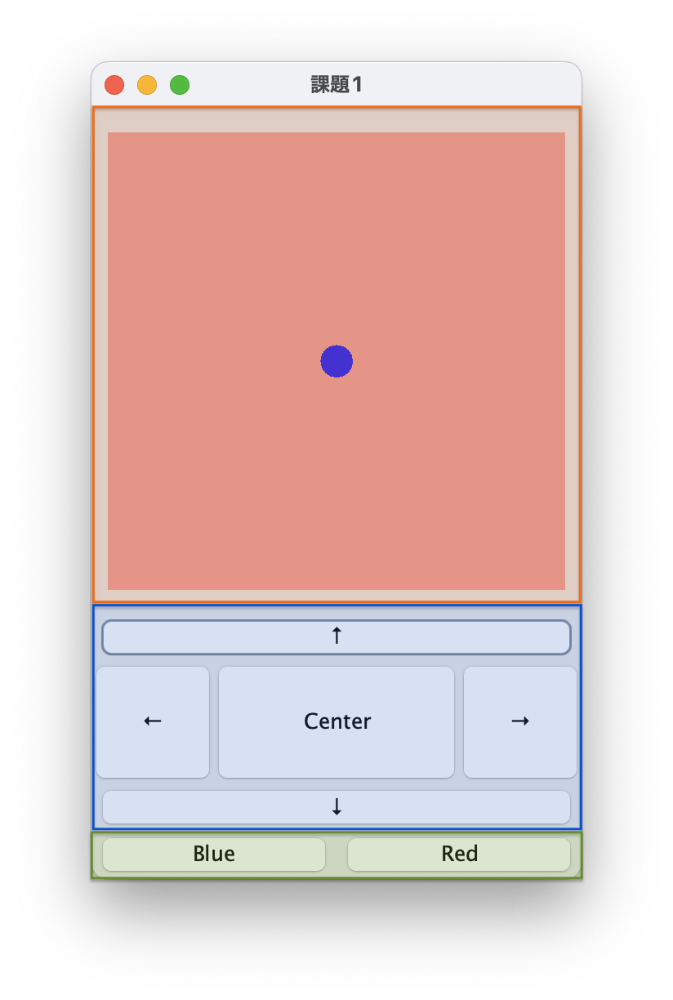

まず上の画像のように、上から Canvasを描画するパネル（赤色部分）、円の動かすボタンのパネル（青色部分）、円の色を変更するボタンのパネル（緑色部分）を作成した。そして、それぞれを、`BorderLayout`の`NORTH`, `CENTER`, `SOUTH`に配置した。

また、円を動かすボタンのパネル（青色部分）についても`BorderLayout`を使用し、円の色を変更するボタンのパネル（緑色部分）は、`GridLayout(1, 2)`を使用し要素が横に2分割されるよう設定した。

#### Canvasについて
Canvasの描画は`J12_1/src/NewCanvas.java`の`paint()`メソッドが行った。

NewCanvasクラスは、インスタンス変数として、円の座標を保存する`Point`クラスのオブジェクトと、円の色を保存する`Color`クラスのオブジェクトを持つ。これらの変数はprivate指定で保護しているため、座標や色の変更には対応するメソッドから操作することで行う。

paint()メソッドでは、`fillRect()`メソッドでピンク色の正方形と、`fillOval()`メソッドで青色の円を描画した。ただし、fillOval()メソッドの引数に渡す描画位置のx座標とy座標は、インスタンス変数のPointオブジェクトが持つ座標をそれぞれ渡した。また、円の色を`setColor(color)`メソッドで指定したが、引数にはインスタンス変数のColorオブジェクトを渡した。

座標の変更には、`translatePosition(int x, int y)`メソッドを用いる。このメソッドの引数に渡した座標だけ今の位置から相対的に座標を移動させる。また、円の座標を初期状態に戻すためには`initPosition()`メソッドを用いる。色の変更には、`setCircleColor()`メソッドを用いる。

#### ActionListenerについて
ボタンを押した時のイベント処理は`J12_1/src/CanvasListener.java`の`actionPerformed()`メソッドに記述した。

CanvasListenerクラスでは、インスタンス変数にボタンの名前を受け取る文字列変数と、フレームに描画されたNewCanvasへの参照を持つ。
全てのボタンにこのActionListenerオブジェクトを設定し、ボタンが押されると`actionPerformed()`メソッドが呼び出される。
`actionPerformed()`メソッドでは、移動ボタンが押されると、NewCanvasオブジェクトが持つ`translatePosition()`や`initPosition()`メソッドを利用して円の座標を変更する。また、色の変更ボタンが押されると、NewCanvasオブジェクトが持つ`setCircleColor()`メソッドで対応する色に変更する。

最後に、これらの変更を再描画で反映させるために`repaint()`メソッドを呼び出している。

### 実行結果
* 初期状態 => 下に移動 => 右に移動して赤色に変更

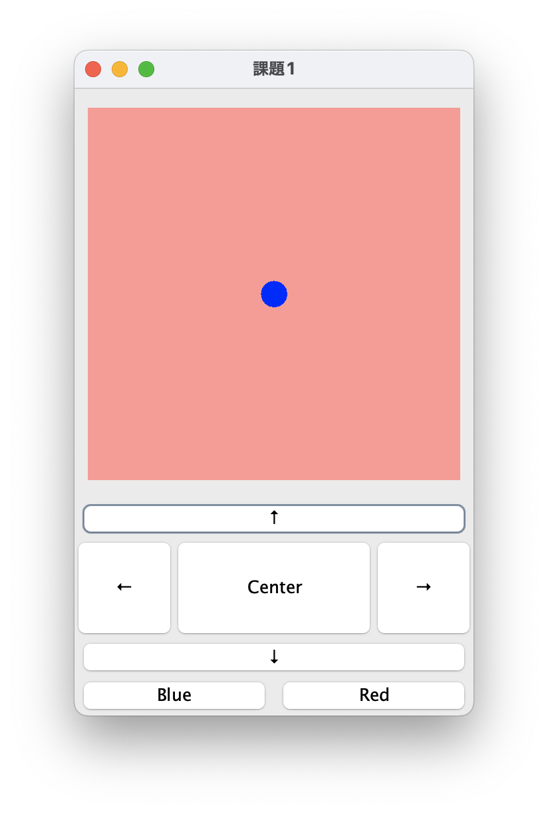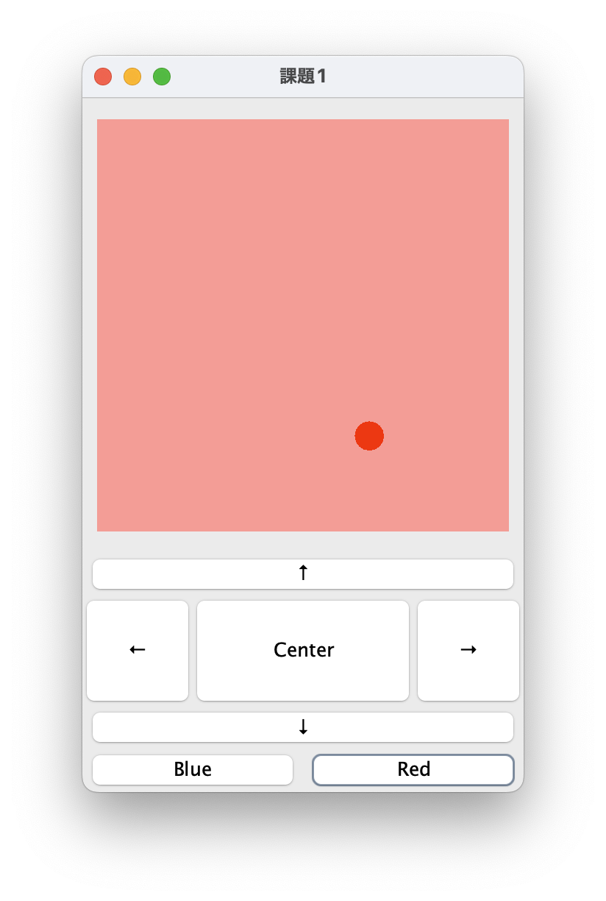


### 考察
* Swingでは、パネルとそのレイアウトをうまく組み合わせることで複雑なレイアウトも構成することができることがわかった。特に今回の課題のように、フレーム全体はBorderLayoutにより5つしか要素を配置できないが、その5つのうちの要素に、BorderLayoutやGridLayoutを持つ要素を割り当てることで、構成できる要素数やレイアウトの幅を広げることができた。

* 今回レイアウトの設計と、イベント処理とでクラス（ファイル）を分割した。これにより、デバッグやコードの修正がとても楽にできた。このようなモジュール化は、プログラミングにおいて、可読性や保守性の向上だけでなく共同開発の場面でも役に立つと思うので今後も積極的に意識したい。


<br>

---


## 課題2　電卓アプリの作成
 
<details>
<summary> ソースファイル : 

`J12_2/src/J12_2.java`

</summary>

``` Java
import javax.swing.JButton;
import javax.swing.JFrame;
import javax.swing.JLabel;
import javax.swing.JPanel;
import java.awt.*;

public class J12_2 extends JFrame {
    public static void main(String[] args) throws Exception {
        J12_2 frame = new J12_2("課題2");
        frame.setVisible(true);
    }

    public J12_2(String title) {
        // 初期設定
        setTitle(title);
        setDefaultCloseOperation(JFrame.EXIT_ON_CLOSE);
        setSize(new Dimension(200, 200));
        setLocationRelativeTo(null);

        // 入力や計算結果を表示するラベル
        JLabel resultLabel = new JLabel("0");
        resultLabel.setHorizontalAlignment(JLabel.CENTER);  // 表示される文字列を中央揃え
        
        // 結果を表示するパネル
        JPanel resultPanel = new JPanel();
        resultPanel.add(resultLabel);

        
        // ボタンの作成とアクションリスナーの追加
        JButton[] numButtons = new JButton[10];
        ButtonAction actionListener = new ButtonAction(resultLabel);

        JButton plusButton = new JButton("+");
        JButton eqButton = new JButton("=");
        plusButton.addActionListener(actionListener);
        eqButton.addActionListener(actionListener);
        for (int i = 0; i < 10; i++) {
            numButtons[i] = new JButton(Integer.toString(i));
            numButtons[i].addActionListener(actionListener);
        }
   
        
        
        // ボタンをを表示するパネル
        JPanel buttonPanel = new JPanel(new GridLayout(4, 3));
        for (int i = 0; i < numButtons.length; i++) {
            buttonPanel.add(numButtons[i]);
        }
        buttonPanel.add(plusButton);
        buttonPanel.add(eqButton);


        add(resultPanel, BorderLayout.NORTH);
        add(buttonPanel, BorderLayout.CENTER);
    }
}
```
</details>

<details>
<summary> ソースファイル : 

`J12_2/src/ButtonAction.java`

</summary>

```Java 
import java.awt.event.ActionEvent;
import java.awt.event.ActionListener;
import javax.swing.*;

public class ButtonAction implements ActionListener{
    /* インスタンス変数 */
    JLabel resultLabel;                     // 入力を表示するラベル
    String pressedButton = "";              // 今回押されたボタン
    Boolean plusButtonIsPressed = false;    // "+" ボタンが押されているか判断
    String displayedValue = "";             // 現在表示されている値
    String prevDisplayedValue = "";         // "+" ボタンが押される前に表示されていた値

    // コンストラクタでラベルを設定
    public ButtonAction(JLabel resultLabel) {
        this.resultLabel = resultLabel;
    }

    // ボタンを押した時のイベントを作成
    @Override
    public void actionPerformed(ActionEvent e) {
        pressedButton = e.getActionCommand();

        switch (pressedButton) {
            // "+" ボタンが押された場合
            case "+":
                plusButtonIsPressed = true;
                break;
                
            // "=" ボタンが押された場合
            case "=":
                // 前回入力した値と今回入力した値が両方存在する場合
                if(!prevDisplayedValue.equals("") && !displayedValue.equals("")) {
                    long result = Long.parseLong(prevDisplayedValue) + Long.parseLong(displayedValue);
                    resultLabel.setText(Long.toString(result));
                    prevDisplayedValue = displayedValue;
                    displayedValue = "";
                }
                break;
        
            // 数字のボタンが押された場合
            default:
                // "+" ボタンが押されていた場合
                // ボタンが押されるまでに表示されていた値を保存 & 画面をリセット
                if(plusButtonIsPressed) {
                    prevDisplayedValue = displayedValue;
                    displayedValue = "";
                    plusButtonIsPressed = false;
                }
                
                // 押された数字を追加して表示
                // ただし、0のみが表示されていた場合は押された数字を置換
                if(displayedValue.equals("0")) {
                    resultLabel.setText(pressedButton);
                } else {
                    resultLabel.setText(displayedValue + pressedButton);
                }
                
                displayedValue = resultLabel.getText();
                break;
        }

    }
}
```
</details>


### プログラムの説明
#### プログラムの概要
ラベルとボタンを使い足し算の計算ができる簡単な電卓アプリを作成する。ただし、ラベルには、入力中の整数や計算結果が表示されるようにした。

#### レイアウトについて
レイアウトは`J12_2/src/J12_2.java`において行った。

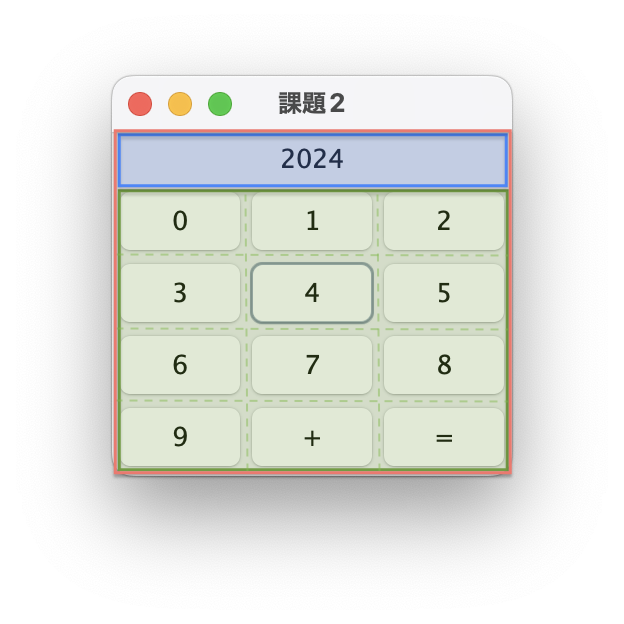

上の画像において、フレーム全体のレイアウトを赤色で示している。フレーム全体においては、`BorderLayout`を使用しており、その中の青色と緑色の要素をそれぞれ、`BorderLayout.NORTH`, `BorderLayout.CENTER`に配置することで要素を縦に並べている。  

青色の要素が入力中の整数や計算結果を表示するラベルを持つパネルである。このパネルはデフォルトの`FlowLayout`を使用しており、その要素であるラベルが中央に配置されるように設定した。また、数字を表示するラベルは、`setHorizontalAlignment(JLabel.CENTER)`により、ラベルの中で数字が中央に表示されるように設定している。

緑色の要素が電卓の計算に使うボタンを表示するパネルである。このパネルは４行３列の`GridLayout(4, 3)`を使用している。GridLayoutでは、add()メソッドにより追加した順に左上から要素が並べられる。


#### 入力した数字の表示と計算
ボタンに対するActionListenerとして`J12_2/src/ButtonAction.java`に`ButtonAction`クラスを作成した。このクラスでは、数字のボタンが押されたときに押された数字をラベルに表示したり、"+" や "=" ボタンが押されたときに計算を行いその結果をラベルに表示したりする。このクラスが持つインスタンス変数は以下の通りである。

```Java
/* インスタンス変数 */
JLabel resultLabel;                     // 入力を表示するラベル
String pressedButton = "";              // 今回押されたボタン
Boolean plusButtonIsPressed = false;    // "+" ボタンが押されているか判断
String displayedValue = "";             // 現在表示されている値
String prevDisplayedValue = "";         // "+" ボタンが押される前に表示されていた値
```

まず、"+" ボタンが押された場合には、`plusButtonIsPressed = true`のみが実行される。

次に、数字ボタンが押された場合には、押された数字を取得してその値をラベルの末尾に追加する。ここで、ラベルに初期状態として "0" が表示されている場合には、押された数字を末尾に追加するのではなく、**"0" を押された数字に置換する**。これにより、表示される値が "0123" や "080" のように0から始まることを防止した。
ただし、`plusButtonIsPressed`が`true`となって前回に "+" ボタンが押されたことがわかっている場合には、一度今表示されている値を保存した後で、表示されている値をリセットしてから上記の一連の処理を行う（この処理が終わると`plusButtonIsPressed = false`が実行される）。　　
このようにすることで常に、"+" ボタンが押される前に画面に表示されていた値と、現在画面に表示している値とが保存されるような仕組みを実変した。

最後に "=" ボタンが押された時の処理について述べる。"=" ボタンが押されると、"+" ボタンが押される前に画面に表示されていた値（文字列）と、現在画面に表示している値（文字列）とをlongの値に変換する。変換には`parseLong()`メソッドを用いた。そして変換した値同士の和をラベルに設定する。ただし、"+" ボタンが押される前に画面に表示されていた値と、現在画面に表示している値のどちらかが存在しない場合には、この処理は行わない。


### 実行結果
* 100 を入力  =>  "+" ボタンを押して 200 を入力  =>  "=" ボタンを押した結果  
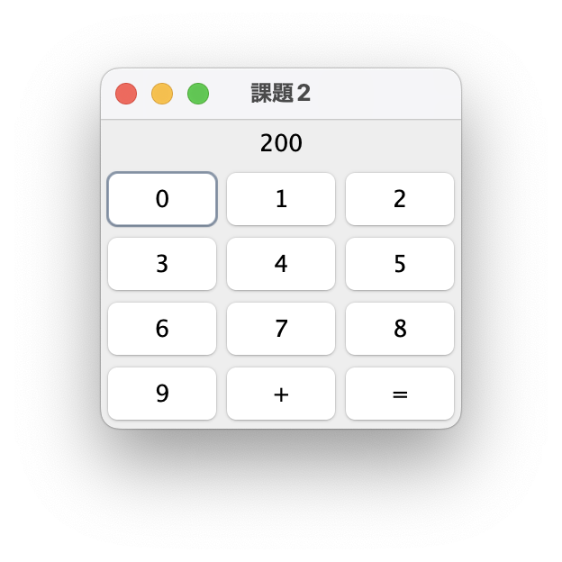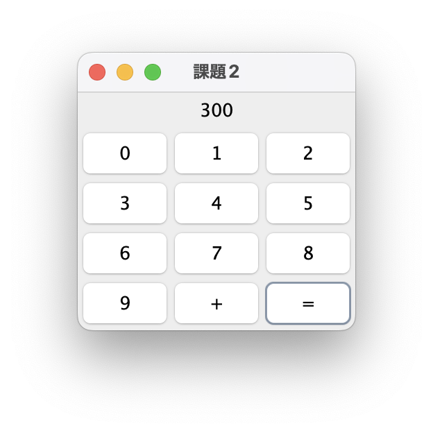


### 考察
#### 工夫した点
* 課題では、ボタンから受け取ったりラベルに表示する数字について、プログラム上では文字列として扱った。そして、計算する場面のみ`parseLong()`メソッドで数値に変換した。これは、電卓は数字の上の桁から入力するため、文字列で扱うと、今ある文字列に`append`していくだけでよく楽だと思ったからである。
* 数字を文字列として扱う以上、0 の扱いを工夫した。プログラムの説明でも書いたように、10 を入力しようとして "010" と表示されるといったことがないように注意した。

#### 反省点
* ボタンが押された時の処理について、良いアルゴリズムが思いつかず複雑になり、コードも可読性が低くなってしまった。switch文の case に書いた処理はメソッドとして抽出した方が良かったと思った。
この反省を踏まえ、コードをリファクタリングしたので以下に示す。
```Java
import java.awt.event.ActionEvent;
import java.awt.event.ActionListener;
import javax.swing.*;

public class NewButtonAction implements ActionListener{
    /* インスタンス変数 */
    JLabel resultLabel;                     // 入力を表示するラベル
    String pressedButton = "";              // 今回押されたボタン
    Boolean plusButtonIsPressed = false;    // "+" ボタンが押されているか判断
    String displayedValue = "";             // 現在表示されている値
    String prevDisplayedValue = "";         // "+" ボタンが押される前に表示されていた値

    // コンストラクタでラベルを設定
    public NewButtonAction(JLabel resultLabel) {
        this.resultLabel = resultLabel;
    }

    // ボタンを押した時のイベントを作成
    @Override
    public void actionPerformed(ActionEvent e) {
        pressedButton = e.getActionCommand();

        switch (pressedButton) {
            // "+" ボタンが押された場合
            case "+":
                plusButtonIsPressed = true;
                break;
                
            // "=" ボタンが押された場合
            case "=":
                eqButtonHandler();
                break;
        
            // 数字のボタンが押された場合
            default:
                numButtonHandler();
                break;
        }

    }

    private void numButtonHandler() {
        // "+" ボタンが押されていた場合
        // ボタンが押されるまでに表示されていた値を保存 & 画面をリセット
        if(plusButtonIsPressed) {
            prevDisplayedValue = displayedValue;
            displayedValue = "";
            plusButtonIsPressed = false;
        }
        
        // 押された数字を追加して表示
        // ただし、0のみが表示されていた場合は押された数字を置換
        if(displayedValue.equals("0")) {
            resultLabel.setText(pressedButton);
        } else {
            resultLabel.setText(displayedValue + pressedButton);
        }
        
        displayedValue = resultLabel.getText();
    }

    private void eqButtonHandler() {
        // 前回入力した値と今回入力した値が両方存在する場合
        if(!prevDisplayedValue.equals("") && !displayedValue.equals("")) {
            long result = Long.parseLong(prevDisplayedValue) + Long.parseLong(displayedValue);
            resultLabel.setText(Long.toString(result));
            prevDisplayedValue = displayedValue;
            displayedValue = "";
        }
    }
}
```


<br>


---


## 課題3　テキストエディタアプリの作成
 
<details>
<summary> ソースファイル : 

`J12_3/src/J12_3.java`

</summary>

``` Java
import java.awt.*;
import javax.swing.*;


public class J12_3 extends JFrame {

    public static void main(String[] args) throws Exception {
        J12_3 frame = new J12_3("課題3");
        frame.setVisible(true);
    }

    public J12_3(String title) {
        // 初期設定
        setTitle(title);
        setDefaultCloseOperation(JFrame.EXIT_ON_CLOSE);
        setSize(new Dimension(510, 500));
        setLocationRelativeTo(null);
        
        // TextAreaの作成
        TextArea textArea = new TextArea();
        textArea.setPreferredSize(new Dimension(300, 430));

        JPanel textareaPanel = new JPanel();
        textareaPanel.add(textArea);
        
        // メニューバーの作成
        JMenuBar menuBar = new JMenuBar();
        JMenu fileMenu = new JMenu("ファイル");
        JMenuItem open = new JMenuItem("開く");
        JMenuItem save = new JMenuItem("保存する");
        JMenuItem quit = new JMenuItem("終了");

        menuBar.add(fileMenu);
        fileMenu.add(open);
        fileMenu.add(save);
        fileMenu.add(quit);
        
        // ActionListenerを設定
        FileAction actionListener = new FileAction(this, textArea);
        open.addActionListener(actionListener);
        save.addActionListener(actionListener);
        quit.addActionListener(actionListener);


        // コンポーネントをフレームに追加
        setJMenuBar(menuBar);
        add(textareaPanel, BorderLayout.CENTER);
    }
}
```
</details>
<details>
<summary> ソースファイル : 

`J12_3/src/FileAction.java`

</summary>

```Java 
import java.awt.FileDialog;
import java.awt.TextArea;
import java.awt.event.ActionEvent;
import java.awt.event.ActionListener;
import java.io.BufferedReader;
import java.io.BufferedWriter;
import java.io.FileReader;
import java.io.FileWriter;
import java.io.IOException;
import javax.swing.*;

public class FileAction implements ActionListener{
    /* インスタンス変数 */
    JFrame frame;           // ダイアログを表示するフレーム
    FileDialog fileDialog;  // ダイアログ
    TextArea textArea;      // ファイルの中身を出力
    String selectedMenu;    // 選択されたメニューアイテムの名前

    public FileAction(JFrame frame, TextArea textArea) {
        this.frame = frame;
        this.textArea = textArea;
    }

    // メニューバーのアイテムが選択された時のイベント
    @Override
    public void actionPerformed(ActionEvent e) {
        selectedMenu = e.getActionCommand();
        
        // ファイルダイアログを開く
        switch (selectedMenu) {
            case "開く":
                openFile();     // ファイルを開いてTextAreaに内容を表示
                break;

            case "保存する":
                saveFile();     // TextAreaの内容をファイルに保存
                break;

            case "終了":
                System.exit(0);
                break;
        
            default:
                break;
        }

    }


    // ファイルを開いてTextAreaに出力するメソッド
    private void openFile() {
        // ファイルダイアログを表示
        fileDialog = new FileDialog(frame, "ファイルを開く", FileDialog.LOAD);
        fileDialog.setVisible(true);

        // ファイルダイアログからファイルを取得
        String fileName = fileDialog.getFile();
        String directoryName = fileDialog.getDirectory();
        String filePath = directoryName + fileName;
        String str = "";

        try (FileReader fr = new FileReader(filePath); BufferedReader br = new BufferedReader(fr)) {
            textArea.setText("");   // リセット
            while ((str = br.readLine()) != null) {
                textArea.append(str);
                textArea.append("\n");
            }
        } catch (IOException e1) {
            e1.printStackTrace();
        }
    }
    

    // TextAreaの内容を新規ファイルに保存するメソッド
    private void saveFile() {
        // ファイルダイアログを表示
        fileDialog = new FileDialog(frame, "ファイルを保存する", FileDialog.SAVE);
        fileDialog.setVisible(true);

        // ファイルダイアログからファイルを取得
        String fileName = fileDialog.getFile();
        String directoryName = fileDialog.getDirectory();
        String filePath = directoryName + fileName;

        try (FileWriter fw = new FileWriter(filePath); BufferedWriter bw = new BufferedWriter(fw)) {
            String str = textArea.getText();
            bw.write(str);

        } catch (IOException e1) {
            e1.printStackTrace();
        }
    }
}
```
</details>


### プログラムの説明
#### プログラムの概要
テキストファイルを開き、テキストエリアへの読み込みと、テキストエリアの内容をファイルとして保存できるアプリケーションを作成した。メニューバーからファイルを "開く", "保存する", アプリを "終了する" という操作を選択する。ファイルを "開く" あるいは "保存する" が選ばれたときには、`FileDialog`を表示し、開くファイルやファイルの保存先を指定できるようにした。

#### メニューバーとそのイベント処理について
フレームにメニューバーを設定するために次のコードを記述した。

```Java
// メニューバーの作成
JMenuBar menuBar = new JMenuBar();
JMenu fileMenu = new JMenu("ファイル");
JMenuItem open = new JMenuItem("開く");
JMenuItem save = new JMenuItem("保存する");
JMenuItem quit = new JMenuItem("終了");

menuBar.add(fileMenu);
fileMenu.add(open);
fileMenu.add(save);
fileMenu.add(quit);

setJMenuBar(menuBar);   // フレームにメニューバーを追加
```

これらのメニューアイテムに対して ActionListenerとして`J12_3/src/FileAction.java`で定義した`FileAction`オブジェクトを設定した。FileActionオブジェクトは、`getActionCommand()`により押されたメニューを取得し、"開く", "保存する" が選択されたときにはそれぞれ、`openFile()`, `savaFile()`メソッドが呼び出される。また、"終了" が選ばれたときには`exit()`メソッドによりプログラムを終了させた。

`openFile()`メソッドでは、最初に`FileDialog`（ファイルダイアログ）を生成し表示している。このファイルダイアログを通してユーザーから選ばれたファイルをストリームを作成して読み込むためには、そのファイルのパスが必要である。そこで選ばれたファイルの名前とそのファイルが位置するディレクトリのパス名をそれぞれ`getFile()`と`getDirectory()`メソッドで取得する。このふたつを文字列として合わせたものが、ユーザーが選んだファイルの絶対パスとなる。  
こうして得たファイルパスから`BufferedReader`を作成し、データの読み込みと、そのデータをテキストエリアに出力する処理を行う。テキストエリアへの出力は、データを末尾に追加する`append()`メソッドを利用した。

`SavaFile()`メソッドも、ファイルダイアログからファイルパスを取得するまでは、`openFile()`メソッドと同様である。ファイルパスを取得した後は、`BufferedWriter`を作成し、テキストエリアから取得した文字列データをBufferedReaderの`write()`メソッドでファイルに書き込んだ。テキストエリアの内容の取得には、`getText()`メソッドを利用した。


### 実行結果
* 初期状態 => "開く" を選択し `text.txt`を選択

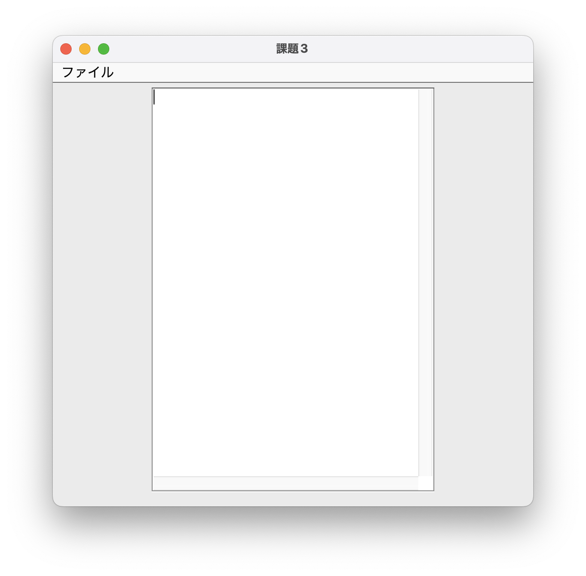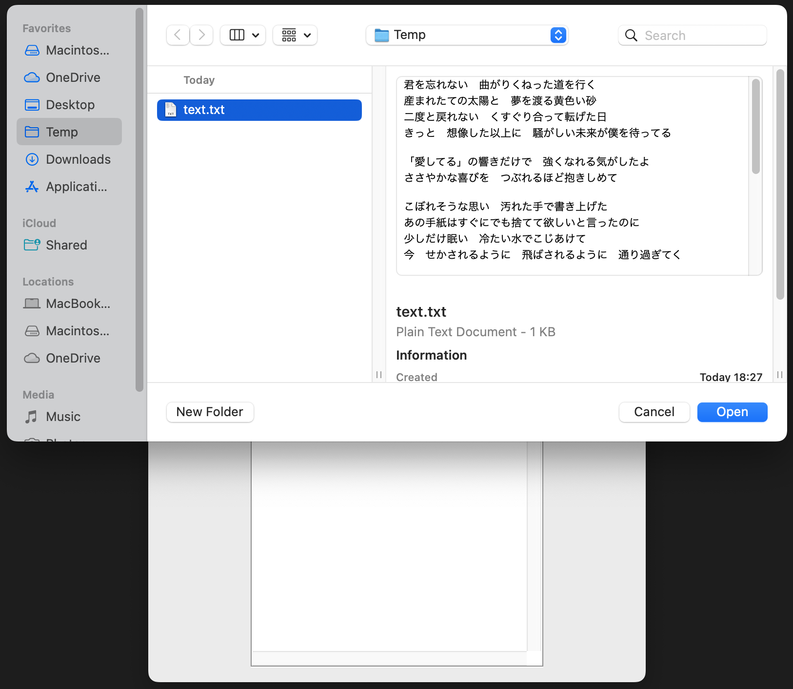

* `test.txt`を開いた状態 => "保存する" を選択し `newtext.txt`として保存

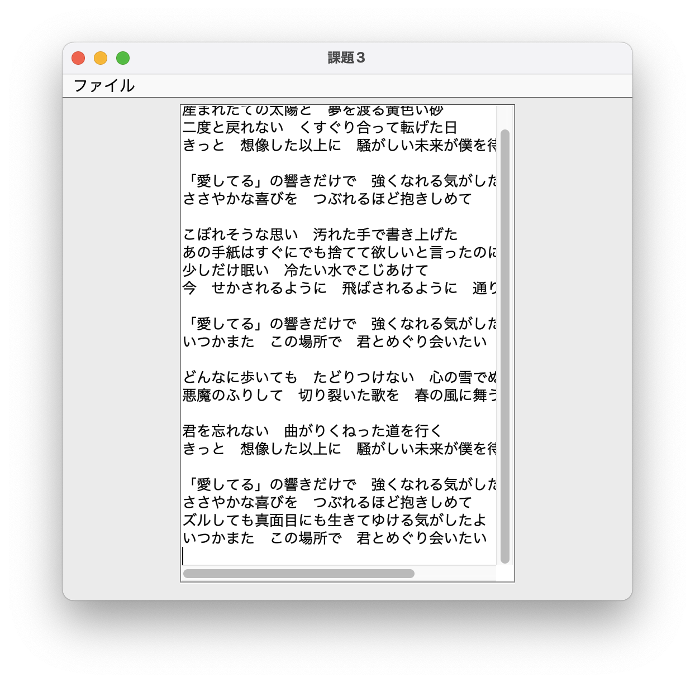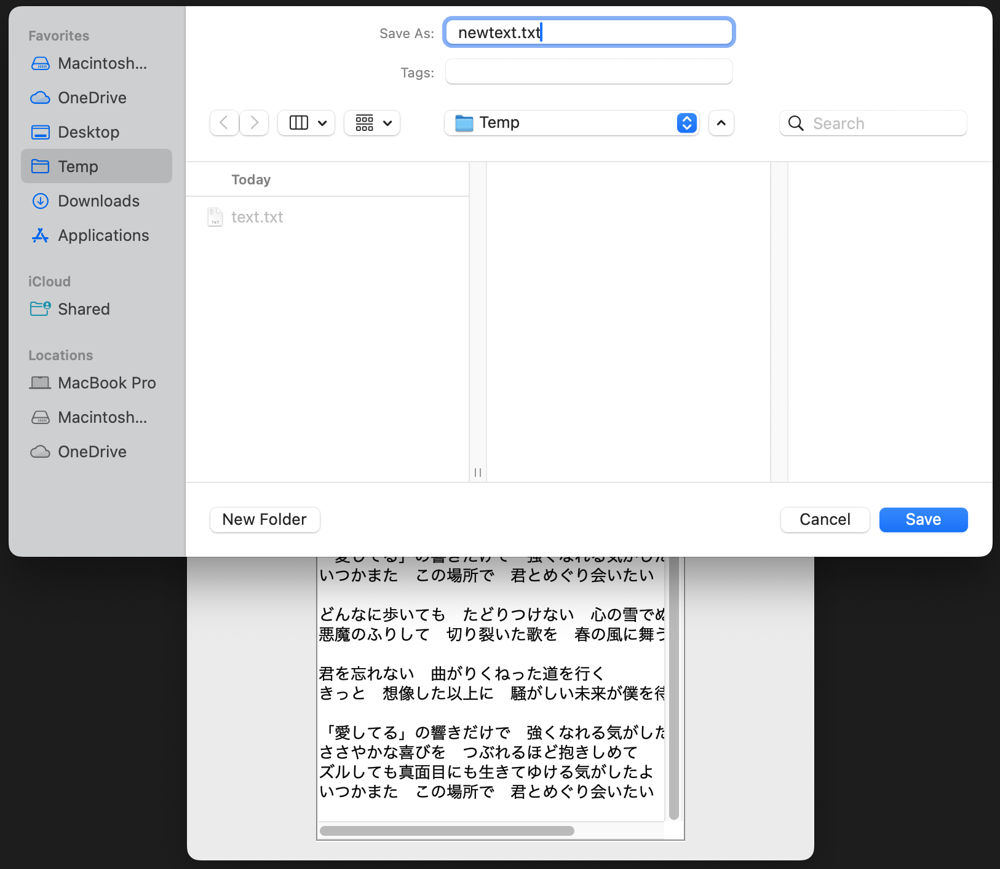

※ ここで使用したファイルは[`J12_3/src/text.txt`](/J12_3/src/text.txt), [`J12_3/src/newtext.txt`](J12_3/src/newtext.txt) に提出した。


### 考察
#### 改善点について
* 課題では`TextArea`クラスを用いてエディタ部分を作成した。しかし、実行結果を見て分かるように、1行が長い場合TextAreaではその枠からはみ出してしまう。これの解決のためのメソッドを調べたが`TextArea`では実現できなさそうだった。その代わりに、`JTextArea`を使うと、`setLineWrap(true)`メソッドにより、エリアの幅を超えた分が自動的に折り返しされるようにできるとわかった。ただし、`JTextArea`は、TextAreaと異なり、スクロールの設定が初期状態ではされていないため自身で設定を行う必要がある。
* 課題では、ファイルダイアログで選んだファイルを開くことができなかった場合には、`printStackTrace()`メソッドを呼び出してコンソールにエラーの内容を表示している。ただ、アプリケーションにおいてこのエラー内容をユーザーにGUIとして表示する必要があると考えた。
* 以上の改善点を踏まえ変更したコードと実行結果を以下に示す。

##### 実行結果
* 適切に折り返しがされており、スクロールも設定できた。

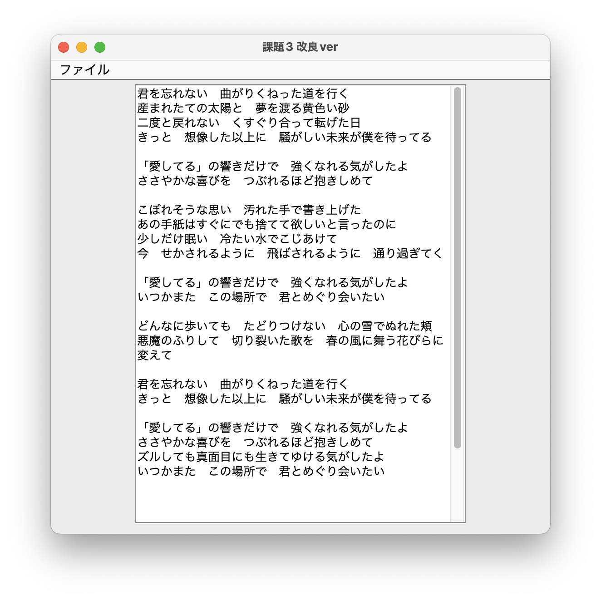

* 存在しないファイルを選択したとき

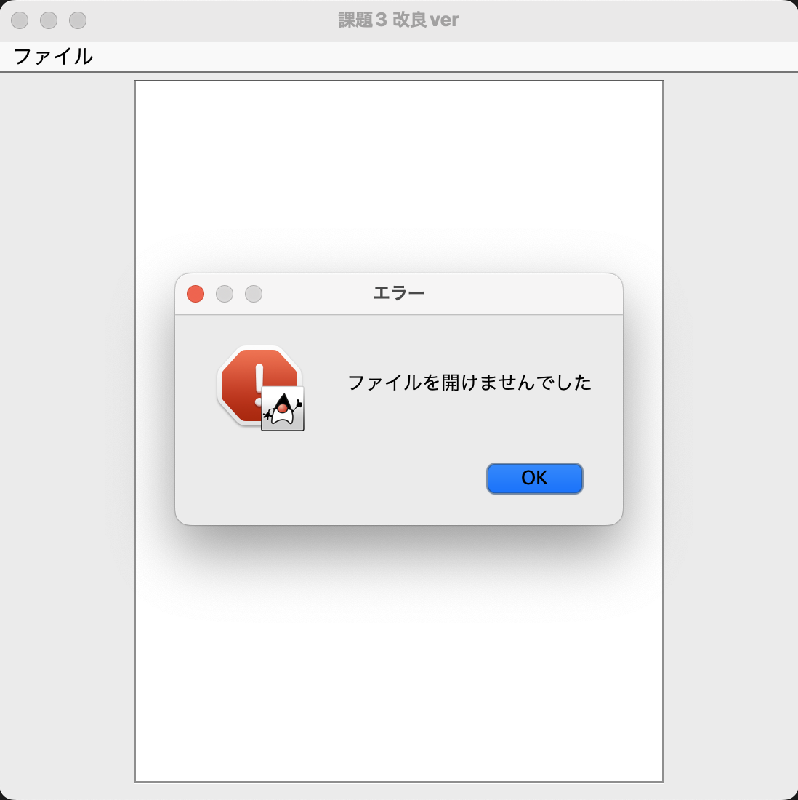


<details>
<summary> ソースファイル : 

`J12_3/src/NewJ12_3.java`

</summary>

```diff
import java.awt.*;
import javax.swing.*;


public class NewJ12_3 extends JFrame {

    public static void main(String[] args) throws Exception {
        NewJ12_3 frame = new NewJ12_3("課題3");
        frame.setVisible(true);
    }

    public NewJ12_3(String title) {
        // 初期設定
        setTitle(title);
        setDefaultCloseOperation(JFrame.EXIT_ON_CLOSE);
        setSize(new Dimension(550, 550));
        setLocationRelativeTo(null);
        
-        // TextAreaの作成
-        TextArea textArea = new TextArea();
-        textArea.setPreferredSize(new Dimension(300, 430));

-        JPanel textareaPanel = new JPanel();
-        textareaPanel.add(textArea);

+        // TextAreaの作成
+        JTextArea textArea = new JTextArea(30, 30);
+        textArea.setLineWrap(true);         // 折り返し
+        textArea.setWrapStyleWord(true);    // 英単語は単語単位で折り返し

+        // TextAreaにスクロールの実装
+        JScrollPane textAreaScrollPane = new JScrollPane(textArea);

+        // TextAreaを表示するパネル
+        JPanel textareaPanel = new JPanel();
+        textareaPanel.add(textAreaScrollPane);
        
        // メニューバーの作成
        JMenuBar menuBar = new JMenuBar();
        JMenu fileMenu = new JMenu("ファイル");
        JMenuItem open = new JMenuItem("開く");
        JMenuItem save = new JMenuItem("保存する");
        JMenuItem quit = new JMenuIactem("終了");

        menuBar.add(fileMenu);
        fileMenu.add(open);
        fileMenu.add(save);
        fileMenu.add(quit);
        
        // ActionListenerを設定
        FileAction actionListener = new FileAction(this, textArea);
        open.addActionListener(actionListener);
        save.addActionListener(actionListener);
        quit.addActionListener(actionListener);


        // コンポーネントをフレームに追加
        setJMenuBar(menuBar);
        add(textareaPanel, BorderLayout.CENTER);
    }
}
```
</details>

<details>
<summary> ソースファイル : 

`J12_3/src/NewFileAction.java`

</summary>

```diff
import java.awt.FileDialog;
import java.awt.event.ActionEvent;
import java.awt.event.ActionListener;
import java.io.BufferedReader;
import java.io.BufferedWriter;
import java.io.FileReader;
import java.io.FileWriter;
import java.io.IOException;
import javax.swing.*;

public class NewFileAction implements ActionListener{
    /* インスタンス変数 */
    JFrame frame;           // ダイアログを表示するフレーム
    FileDialog fileDialog;  // ダイアログ
    JTextArea textArea;      // ファイルの中身を出力
    String selectedMenu;    // 選択されたメニューアイテムの名前

    public NewFileAction(JFrame frame, JTextArea textArea) {
        this.frame = frame;
        this.textArea = textArea;
    }

    // メニューバーのアイテムが選択された時のイベント
    @Override
    public void actionPerformed(ActionEvent e) {
        selectedMenu = e.getActionCommand();
        
        // ファイルダイアログを開く
        switch (selectedMenu) {
            case "開く":
                openFile();     // ファイルを開いてTextAreaに内容を表示
                break;

            case "保存する":
                saveFile();     // TextAreaの内容をファイルに保存
                break;

            case "終了":
                System.exit(0);
                break;
        
            default:
                break;
        }

    }


    // ファイルを開いてTextAreaに出力するメソッド
    private void openFile() {
        // ファイルダイアログを表示
        fileDialog = new FileDialog(frame, "ファイルを開く", FileDialog.LOAD);
        fileDialog.setVisible(true);

        // ファイルダイアログからファイルを取得
        String fileName = fileDialog.getFile();
        String directoryName = fileDialog.getDirectory();
        String filePath = directoryName + fileName;
        String str = "";

        try (FileReader fr = new FileReader(filePath); BufferedReader br = new BufferedReader(fr)) {
            textArea.setText("");   // リセット
            while ((str = br.readLine()) != null) {
                textArea.append(str);
                textArea.append("\n");
            }
        } catch (IOException e1) {
            e1.printStackTrace();
+            JOptionPane.showMessageDialog(frame, "ファイルを開けませんでした", "エラー", JOptionPane.ERROR_MESSAGE);
        }
    }
    

    // TextAreaの内容を新規ファイルに保存するメソッド
    private void saveFile() {
        // ファイルダイアログを表示
        fileDialog = new FileDialog(frame, "ファイルを保存する", FileDialog.SAVE);
        fileDialog.setVisible(true);

        // ファイルダイアログからファイルを取得
        String fileName = fileDialog.getFile();
        String directoryName = fileDialog.getDirectory();
        String filePath = directoryName + fileName;

        try (FileWriter fw = new FileWriter(filePath); BufferedWriter bw = new BufferedWriter(fw)) {
            String str = textArea.getText();
            bw.write(str);

        } catch (IOException e1) {
            e1.printStackTrace();
+            JOptionPane.showMessageDialog(frame, "ファイルを保存できませんでした", "エラー", JOptionPane.ERROR_MESSAGE);
        }
    }
}
```
</details>

<br>

---


# 参考文献
* 特になし

# 謝辞
* 特になし

# 感想など
* 特になし