[](https://classroom.github.com/a/rlp2kQ9F)

# プログラミング演習 II 第 13 回

- 学籍番号：2264088
- 氏名：河原畑 宏次
- 所属：情報工学 EP

# 課題の説明

## 課題 1 　サーバー・クライアントの通信（CUI）

<details>
<summary> ソースファイル :

`src/J13_1Client.java`

</summary>

```Java
import java.io.DataInputStream;
import java.io.DataOutputStream;
import java.io.InputStream;
import java.io.OutputStream;
import java.net.*;
import java.util.Scanner;

public class J13_1Client {
    private static Scanner sc;

    public static void main(String[] args) throws Exception {

        try {
            // ホスト名とポート番号を取得
            int port = Integer.parseInt(args[0]);   // ポート番号
            String serverName = args[1];              // ホスト名

            // ソケットを作成
            Socket socket = new Socket(serverName, port);

            // サーバーに書き込むためのストリームを作成
            OutputStream os = socket.getOutputStream();
            DataOutputStream dos = new DataOutputStream(os);

            // サーバーに入力した数字を送信
            System.out.println("-----Client-----");
            dos.writeInt(getNum());
            dos.writeInt(getNum() + "\n");

            // サーバーから読み取るためのストリームを作成
            InputStream is = socket.getInputStream();
            DataInputStream dis = new DataInputStream(is);

            // サーバーから受け取った値をコンソールに出力
            System.out.println(dis.readInt());

            socket.close();     // 切断
            sc.close();

        } catch (Exception e) {
            e.printStackTrace();
        }
    }

    // ユーザーに数字を入力させてその数字を返す
    private static int getNum() {
        sc = new Scanner(System.in);
        System.out.print("num = ");
        int num = sc.nextInt();

        return num;
    }
}
```

</details>

<details>
<summary> ソースファイル :

`src/J13_1Server.java`

</summary>

```Java
import java.io.DataInputStream;
import java.io.DataOutputStream;
import java.io.InputStream;
import java.io.OutputStream;
import java.net.ServerSocket;
import java.net.Socket;

public class J13_1Server {
    public static void main(String[] args) {
        try {
            int port = Integer.parseInt(args[0]);

            ServerSocket serverSocket = new ServerSocket(port);

            while (true) {
                // クライアントからの要求を受け取る
                Socket socket = serverSocket.accept();

                // クライアントから読み取るためのストリームを作成
                InputStream is = socket.getInputStream();
                DataInputStream dis = new DataInputStream(is);

                // 数字を読み取る
                int num1 = dis.readInt();
                int num2 = dis.readInt();

                // 読み取った値はコンソールに出力
                System.out.println("----- Server -----");
                System.out.println("num1 = " + num1);
                System.out.println("num2 = " + num2 + "\n");

                // クライアントに書き込むためのストリームを作成
                OutputStream os = socket.getOutputStream();
                DataOutputStream dos = new DataOutputStream(os);

                // 読み取った2つの数字の和をクライアントに送信
                dos.writeInt(num1 + num2);

                // 切断
                socket.close();
            }
        } catch (Exception e) {
            e.printStackTrace();
        }
    }
}
```

</details>

### プログラムの説明

#### プログラムの概要

クライアントは、キーボードから入力した２つの整数をサーバーに送信する。サーバーは、クライアントから受け取った 2 つの数字の和を計算しクライアントに送信する。そしてクライアントは、サーバーから受け取った結果をコンソールに表示する。

<br>

#### クライアントのプログラム（`J13_1Client.java`）

クライアント側のプログラムでは、TCP を用いた通信を行うために、`Socket`を利用する。そして、Socket の作成に必要なポート番号とホスト名をコマンドライン引数から取得する。

次に、作成した Socket からサーバーに書き込むための出力用ストリーム（`OutputStream`）と、それをもとに`DataOutputStream`を作成する。そして、この DataOutputStream のメソッド`writeInt()`を用いて、ユーザーが入力した整数値を 2 つをサーバーに書き込む（送信する）。

すると、サーバー側では、送信した 2 つの整数の和を計算しクライアントに送信する。これを受け取るために、Socket からサーバーから読み込むための読み込み用のストリーム（`InputStream`）と、それをもとに`DataInputStream`を作成する。そして、この DataInputStream のメソッド`readInt()`を用いて、サーバーが計算しクライアントに送信した値を読み取りコンソールに出力する。

最後に、Socket の`close()`メソッドでストリームを切断している。

<br>

#### サーバーのプログラム（`J13_1Server.java`）

サーバーのプログラムもクライアントのプログラムと同様に、TCP 通信を行うために、`ServerSocket`と`Socket`を利用する。この、ServerSocket と Socket の役割の違いについては考察で述べる。

まずコマンドライン引数に与えたポート番号を用いて、ServerSocket を作成する。そして、作成した SeverSocket が持つ`accept()`メソッドでクライアントからの要求を監視し、要求があればクライアントとの通信に使う Socket をメソッドの戻り値から作成する。

Socket が作成できれば、あとはクライアントのプログラムと同様に、Socket のもつ`getInputStream()`で読み込み用のストリームを開き、さらにそれを用いて`DataInputStream`を作成する。さらに、作成した DataOutputStream の`readInt()`メソッドでクライアントがサーバーに書き込んだ２つの数字を読み取る。
その後は、この２つの数字の和を計算し、同じ手順で作成した`DataOutputStream`でクライアント側に数字の和を書き込む。

最後に、Socket の`close()`メソッドでストリームを切断している。

<br>

### 実行結果

- クライアントが指定するホスト名を "localhost" と指定した場合のサーバーとクライアントのコンソール画面。サーバー側では、確認のためにクライアントから受け取った値をコンソールに出力している
  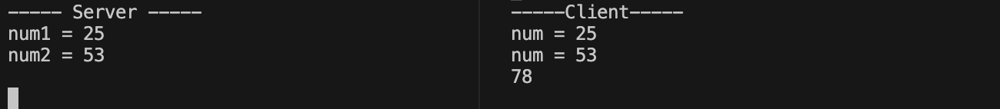

- 続けてクライアントのプログラムを起動した場合のコンソール画面
  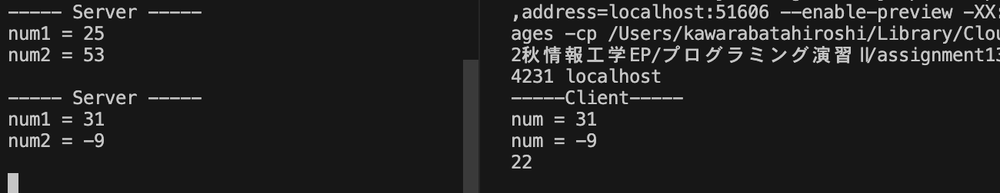

### 考察

#### ServerSocket と Socket について

TCP 通信には、`Socket`と`ServerSocket`が必要である。この違いについて調べた結果を述べる。

まず、`Socket` はサーバーとクライアントを結ぶ線のことを指す。この線はその中に、サーバーからクライアントに送信するストリームと、その逆方向のストリームの 2 つを持つ。これらのストリームを作成（開く）ためには、Socket が持つ`getInput(Output)Stream()`メソッドを用いる。
Java において、Socket を作成するためには、クライアント側でサーバーを表すホスト名と、そのサーバーのどの窓口を使うかを表すポート番号を指定する必要がある。こうして作成した Socket はサーバーの指定したポート番号に送られる。

次に、`ServerSocket`とは、サーバー側がクライアントから送られる Socket を監視し、取得するために用いる。ゆえに ServerSocket の作成には、どのポート番号（サーバーの窓口）を監視するかを指定する必要がある。
監視するためには、ServerSocket が持つ`accept()`メソッドを用いる。このメソッドは、監視しているポートにクライアントから Socket が送られてきたときには、その Socket を戻り値として返し、ServerSocket 自体は再度監視を続ける。
このようにして、サーバー側でも特定のクライアントとの通信するための Socket を得る。あとは、クライアント側と同様に Socket が持つ`getInput(Output)Stream()`からストリームを作成し、クライアントから読み込みやクライアントへの送信を行う。

#### 実行結果について

実行結果は、クライアントのプログラムを 2 回実行している。この際に、サーバー側のプログラムは最初の一度のみ実行した。これは、サーバー側のプログラムで、ServerSocket の `Close()` をプログラム内で行わず、手動（プログラムの実行終了）により ServerSocket が閉じるようにしているからである。

<br>

---

## 課題 2 　サーバー・クライアントの通信（GUI ①）

<details>
<summary> ソースファイル :

`J13_2/src/J13_2Client.java`

</summary>

```Java
import java.io.DataInputStream;
import java.io.DataOutputStream;
import java.io.InputStream;
import java.io.OutputStream;
import java.net.*;
import java.util.Scanner;
import java.awt.*;
import java.awt.event.ActionEvent;
import java.awt.event.ActionListener;

import javax.sound.sampled.Line;
import javax.swing.*;
import javax.swing.border.Border;
import javax.swing.border.LineBorder;

public class J13_2Client extends JFrame implements ActionListener{
    /* クラス変数, インスタンス変数 */
    private static int port;
    private static String serverName;
    private JTextField num1Field;
    private JTextField num2Field;
    private JLabel resultLabel;

    public static void main(String[] args) throws Exception {
        port = Integer.parseInt(args[0]);
        serverName = args[1];

        // フレームを表示
        J13_2Client frame = new J13_2Client("課題2");
        frame.setVisible(true);
    }


    // フレームの描画
    public J13_2Client(String title) {
        // 初期設定
        setTitle(title);
        setDefaultCloseOperation(JFrame.EXIT_ON_CLOSE);
        setSize(new Dimension(160, 160));
        setLocationRelativeTo(null);


        // 数字を入力するテキストフィールド
        num1Field = new JTextField("");
        num2Field = new JTextField("");
        num1Field.setHorizontalAlignment(JTextField.CENTER);
        num2Field.setHorizontalAlignment(JTextField.CENTER);

        // 数字を入力するエリアのパネル
        JPanel inputPanel = new JPanel();
        inputPanel.setLayout(new BoxLayout(inputPanel, BoxLayout.PAGE_AXIS));
        inputPanel.add(num1Field);
        inputPanel.add(Box.createRigidArea(new Dimension(0, 5)));
        inputPanel.add(num2Field);

        // サーバーから受け取った結果を表示するラベル
        resultLabel = new JLabel(" ");
        resultLabel.setAlignmentX(CENTER_ALIGNMENT);
        JPanel resultPanel = new JPanel();
        resultPanel.add(resultLabel);

        // 数字をサーバーに送信するボタン
        JButton submitButton = new JButton("送信");
        submitButton.addActionListener(this);           // アクションを追加

        JPanel buttonPanel = new JPanel();
        buttonPanel.add(submitButton);


        // フレームにコンポーネントを追加
        add(inputPanel, BorderLayout.NORTH);
        add(resultPanel, BorderLayout.CENTER);
        add(buttonPanel, BorderLayout.SOUTH);
    }


    // 送信ボタンが押された時のイベント処理
    // サーバーに入力された二つの数字を送りその和をラベルに表示する
    @Override
    public void actionPerformed(ActionEvent e) {
        try {
            // ソケットを作成
            Socket socket = new Socket(serverName, port);

            // サーバーに書き込むためのストリームを作成
            OutputStream os = socket.getOutputStream();
            DataOutputStream dos = new DataOutputStream(os);

            // サーバーに入力した数字を送信
            dos.writeInt(Integer.parseInt(num1Field.getText()));
            dos.writeInt(Integer.parseInt(num2Field.getText()));

            // サーバーから読み取るためのストリームを作成
            InputStream is = socket.getInputStream();
            DataInputStream dis = new DataInputStream(is);

            // サーバーから受け取った値をラベルに出力
            resultLabel.setText(Integer.toString(dis.readInt()));

            socket.close();     // 切断

        } catch (Exception e1) {
            e1.printStackTrace();
        }
    }
}
```

</details>

<details>
<summary> ソースファイル :

`J13_2/src/J13_2Server.java`

</summary>

```Java
import java.io.DataInputStream;
import java.io.DataOutputStream;
import java.io.InputStream;
import java.io.OutputStream;
import java.net.ServerSocket;
import java.net.Socket;

public class J13_2Server {
    public static void main(String[] args) {
        try {
            int port = Integer.parseInt(args[0]);

            ServerSocket serverSocket = new ServerSocket(port);

            while (true) {
                // クライアントからの要求を受け取る
                Socket socket = serverSocket.accept();

                // クライアントから読み取るためのストリームを作成
                InputStream is = socket.getInputStream();
                DataInputStream dis = new DataInputStream(is);

                // 数字を読み取る
                int num1 = dis.readInt();
                int num2 = dis.readInt();

                // 読み取った値はコンソールに出力
                System.out.println("----- Server -----");
                System.out.println("num1 = " + num1);
                System.out.println("num2 = " + num2);

                // クライアントに書き込むためのストリームを作成
                OutputStream os = socket.getOutputStream();
                DataOutputStream dos = new DataOutputStream(os);

                // 読み取った2つの数字の和をクライアントに送信
                dos.writeInt(num1 + num2);

                // 切断
                socket.close();
            }
        } catch (Exception e) {
            e.printStackTrace();
        }
    }
}
```

</details>

### プログラムの説明

#### プログラムの概要

課題 1 で作成したプログラムを、Swing を使った GUI で設計する。アプリでは、二つのテキストフィールド数値を入力し送信ボタンを押すことで、2 つの数値をサーバーに送りサーバーで計算された和を読み取りラベルに表示する。

<br>

#### レイアウトについて（`J13_2Client.java`　のコンストラクタ）


上の画像のように 3 つの部分に分けてレイアウトを行った。これら 3 つの部分を上から順に、`BorderLayout`の NORTH, CENTER, SOUTH に配置した。

まず一番上の青い部分は二つのテキストフィールドとその２つの間の gap として透明な Box を持つパネルである。パネルの中のコンポーネントは`BoxLayout`により縦に並べた。透明な Box については、`Box.createRigidArea(new Dimension(0, 5))`で作成した（実際は横が 0、縦が 5 ドットの Box である）。

次に、真ん中の緑色の部分は、サーバーから受け取った結果（数字の和）を表示するラベルである。

最後に、黄色の部分は送信ボタンを持つパネルである。ボタンをそのまま、`BorderLayout`の SOUTH に追加すると、下部全体にボタンが拡大してしまうのを防ぐために、ボタンの周りをパネルで覆っている。

<br>

#### クライアントのプログラム（`J13_2Client.java`　の `actionPerformed()`）

送信ボタンが押されると、2 つのテキストフィールド内の値をサーバーに送信し、その和をサーバーから受け取りラベルに表示したい。そのためサーバーとの通信は、送信ボタンに設定した ActionEvent の処理を記述する、`actionPerformed()`メソッド内に記述した。

送信ボタンが押されこのメソッドが呼ばれるとまず、ポート番号とホスト名を指定して　`Socket` 作成する。そしてその Socket からサーバーに書き込むためのストリームを作成し、テキストフィールドに入力された値を読み取り送信する。このとき、`DataOutputStream`とそのメソッド`writeInt()`を使用した。

次に、サーバーから読み取るためのストリームを同様にして作成し、サーバーから送信された内容を読み取る。このとき、`DataInputStream`とそのメソッド`readInt()`を使用した。そして、読み取った値をラベルが持つ`setText()`メソッドによりラベルに表示する。

最後に、Socket を切断した。

<br>

#### サーバーのプログラム（`J13_2Server.java`）

[`J13_1Server.java`](/J13_1/src/J13_1Server.java)と同様であるため省略する。

<br>

### 実行結果

- クライアント（アプリ）

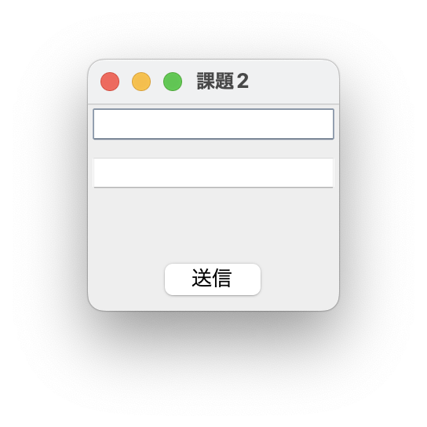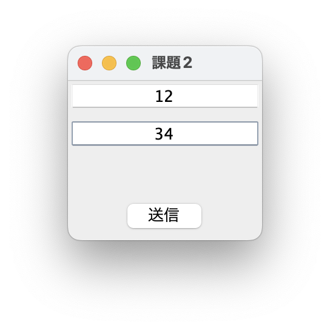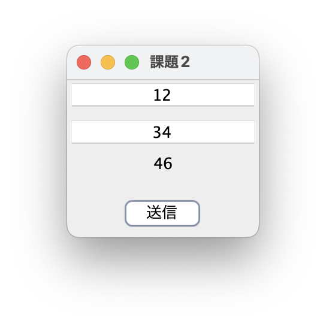

- サーバー側（コンソール）
  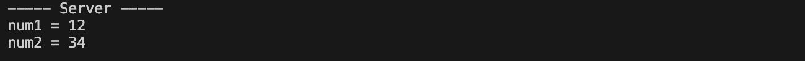

### 考察

#### 改善点について

- GUI での設計において、エラーが発生した場合には、エラーの内容をコンソールに表示するのではなく、ユーザーに分かりやすいようにフレームに表示する必要があると思った。
- Socket について、確実にクローズされるようにした方が良いと考えた。タオとえば、try-with-resources 文や、finally を追加するとよりよくなると考えた。

<br>

---

## 課題 3 　サーバー・クライアントの通信（GUI ②）

<details>
<summary> ソースファイル :

`J13_3/src/J13_3Client.java`

</summary>

```Java
import java.awt.BorderLayout;
import java.awt.Dimension;
import java.awt.event.ActionEvent;
import java.awt.event.ActionListener;
import java.io.InputStream;
import java.io.ObjectInputStream;
import java.io.ObjectOutputStream;
import java.io.OutputStream;
import java.net.Socket;

import javax.swing.Box;
import javax.swing.BoxLayout;
import javax.swing.JButton;
import javax.swing.JFrame;
import javax.swing.JPanel;
import javax.swing.JTextField;

public class J13_3Client extends JFrame implements ActionListener {
    /* クラス変数, インスタンス変数 */
    private static int port;
    private static String serverName;
    private JTextField inputField;
    private JTextField outputField;

    public static void main(String[] args) throws Exception {
        // ポートとホスト名を保存
        port = Integer.parseInt(args[0]);
        serverName = args[1];

        // フレームを表示
        J13_3Client frame = new J13_3Client("課題3");
        frame.setVisible(true);
    }

    // フレームの描画
    public J13_3Client(String title) {
        // 初期設定
        setTitle(title);
        setDefaultCloseOperation(JFrame.EXIT_ON_CLOSE);
        setSize(new Dimension(160, 160));
        setLocationRelativeTo(null);

        // キーを入力するテキストフィールドとその結果を表示するテキストフィールド
        inputField = new JTextField("");
        outputField = new JTextField("");
        inputField.setHorizontalAlignment(JTextField.CENTER); // 入力の中央揃え
        outputField.setHorizontalAlignment(JTextField.CENTER);
        outputField.setEditable(false); // 出力用は編集不可
        inputField.setToolTipText("キーを入力してください");

        // 入出力するエリアのパネル
        JPanel textFieldPanel = new JPanel();
        textFieldPanel.setLayout(new BoxLayout(textFieldPanel, BoxLayout.PAGE_AXIS));
        textFieldPanel.add(inputField);
        textFieldPanel.add(Box.createRigidArea(new Dimension(0, 5)));
        textFieldPanel.add(outputField);

        // 数字をサーバーに送信するボタン
        JButton submitButton = new JButton("送信");
        submitButton.addActionListener(this); // アクションを追加

        JPanel buttonPanel = new JPanel();
        buttonPanel.add(submitButton);

        // フレームにコンポーネントを追加
        add(textFieldPanel, BorderLayout.NORTH);
        add(buttonPanel, BorderLayout.SOUTH);
    }

    // 送信ボタンが押された時のイベント処理
    // 入力されたキーをサーバーに送り対応する値を出力用のテキストフィールドに表示する
    @Override
    public void actionPerformed(ActionEvent e) {
        try {
            // ソケットを作成
            Socket socket = new Socket(serverName, port);

            // サーバーに書き込むためのストリームを作成
            OutputStream os = socket.getOutputStream();
            ObjectOutputStream oos = new ObjectOutputStream(os);

            // サーバーに入力したキーを送信
            oos.writeUTF(inputField.getText());
            oos.flush(); // 即座に送信

            // 送信したkeyをコンソールに出力
            System.out.println("----- Client -----");
            System.out.println(inputField.getText());

            // サーバーから読み取るためのストリームを作成
            InputStream is = socket.getInputStream();
            ObjectInputStream ois = new ObjectInputStream(is);

            // サーバーから受け取った値を出力用のテキストフィールドに出力
            String result = ois.readObject().toString();
            outputField.setText(result);

            // サーバーから受け取った値をコンソールに出力
            System.out.println(result + "\n");

            socket.close(); // 切断

        } catch (Exception e1) {
            e1.printStackTrace();
        }
    }
}
```

</details>

<details>
<summary> ソースファイル :

`J13_3/src/J13_3Server.java`

</summary>

```Java
import java.io.InputStream;
import java.io.ObjectInputStream;
import java.io.ObjectOutputStream;
import java.io.OutputStream;
import java.io.Serializable;
import java.net.ServerSocket;
import java.net.Socket;
import java.util.HashMap;

// 都道府県名と人口を保存するクラス
class Prefecture implements Serializable {
    static final long serialVersionUID = 1L;
    private String pref;
    private int population;

    Prefecture(String pref, int population) {
        this.pref = pref;
        this.population = population;
    }

    public String toString() {
        return pref + " : " + population;
    }
}

public class J13_3Server {
    private static HashMap<String, Prefecture> hash;

    public static void main(String[] args) {
        // 都道府県の人口データを保存するHashMapを作成
        makeHash();

        try {
            int port = Integer.parseInt(args[0]); // ポート番号を取得

            ServerSocket serverSocket = new ServerSocket(port);

            while (true) {
                // クライアントからの要求を受け取る
                Socket socket = serverSocket.accept();

                // クライアントから読み取るためのストリームを作成
                InputStream is = socket.getInputStream();
                ObjectInputStream ois = new ObjectInputStream(is);

                // キーを読み取る
                String key = ois.readUTF();

                // 読み取った値はコンソールに出力
                System.out.println("----- Server -----");
                System.out.println("key = " + key + "\n");

                // クライアントに書き込むためのストリームを作成
                OutputStream os = socket.getOutputStream();
                ObjectOutputStream oos = new ObjectOutputStream(os);

                // keyに対応するHashMapの値をクライアントに送信
                oos.writeObject((Prefecture) searchHash(key));

                // 切断
                socket.close();
            }
        } catch (Exception e) {
            e.printStackTrace();
        }
    }

    // 都道府県の人口データを保存するHashMapを作成するメソッド
    private static void makeHash() {
        String[] pref = { "東京都", "神奈川県", "大阪府", "愛知県", "埼玉県", "千葉県", "兵庫" };
        int[] population = { 13161751, 9049500, 8862896, 7408499, 7194957, 6217119, 5589177 };
        String[] key = { "tokyo", "kanagawa", "osaka", "aichi", "saitama", "chiba", "hyogo" };
        Prefecture[] p = new Prefecture[pref.length];

        hash = new HashMap<String, Prefecture>();
        for (int i = 0; i < pref.length; i++) {
            p[i] = new Prefecture(pref[i], population[i]);
            hash.put(key[i], p[i]);
        }
    }

    // HashMapをキーで探索するメソッド
    // keyに対応する値があればその Prefectureオブジェクト を返し、
    // そうでなければ Prefecture("該当なし", 0) を返す
    private static Prefecture searchHash(String key) {
        Prefecture prefecture = new Prefecture("該当なし", 0); // 戻り値

        // keyに対応する都道府県があれば戻り値をそれに変更
        if (hash.containsKey(key)) {
            prefecture = hash.get(key);
        }

        return prefecture;
    }
}
```

</details>

### プログラムの説明

#### プログラムの概要

クライアントで探索キーを入力しサーバーに送信すると、サーバーは入力したキーに対応する`HashMap`の値を探索し、クライアントに返す。これを、GUI で設計する。  
探索する HashMap は都道府県名とその人口を保存する`Prefecture`オブジェクトである。クライアントでは、アプリのテキストフォームに都道府県名をローマ字で入力し、送信ボタンを押すことで、もう一つのテキストフォームに、対応する都道府県名と人口を表示する。

<br>

#### Prefecture クラス

`Prefecture`クラスは、インスタンス変数に、都道府県名とその都道府県の人口をも地、コンストラクタでこれらを設定する。また、`toString()`メソッドをオーバーライドし、`都道府県名 : 人口`と表示されるように変更している。さらに、Serializable インターフェースを実装し、`serialVersionUID`を付加した。

<br>

#### クライアントのプログラムについて（`J13_3Client.java`）

クライアントのプログラムは、課題 2 とほぼ同様である。ただし、サーバーに書き込みや読み取りを行うためのストリームとして、`ObjectOutputStream`を用いた。また、テキストフィールドに入力したキーをサーバーに送信するためには、ObjectOutputStream が持つ、`writeUTF()`メソッドを用いた。

サーバーから読み込みを行うときも同様にして、`ObjectInputStream`を作成し、Prefecture オブジェクトを読み取るために、`readObject()`メソッドを用いた。そして、読み取ったオブジェクトの`toString()`メソッドを使い、文字列として都道府県名と人口をテキストフィールドに設定した。

<br>

#### サーバーのプログラムについて（`J13_3Server.java`）

サーバーのプログラムも大半は課題２と同様である。ただし、こちらもストリームとして`ObjectOutputStream`と`ObjectInputStream`を使用した。

サーバー側では、HashMap の作成と、クライアントから送信されたキーで HashMap を探索する処理が必要である。これらの処理をそれぞれ、`makeHash()`, `searchHash()`メソッドとして実装した。

`makeHash()`メソッドではまず、次の都道府県名を表す配列と人口を表す配列から、`Prefecture`オブジェクトの配列を作成する。

```Java
// 都道府県名
String[] pref = { "東京都", "神奈川県", "大阪府", "愛知県", "埼玉県", "千葉県", "兵庫" };
// 人口
int[] population = { 13161751, 9049500, 8862896, 7408499, 7194957, 6217119, 5589177 };
```

さらに、その Prefecture オブジェクトの配列と次のキーから `HashMap<String, Prefecture>`を作成する。

```Java
// キー
String[] key = { "tokyo", "kanagawa", "osaka", "aichi", "saitama", "chiba", "hyogo" };
// Prefecture オブジェクトの配列　（初期化は一つ前ので行う）
Prefecture[] p = new Prefecture[pref.length];
```

`searchHash()`メソッドでは、引数に与えたキーに対応する値が HashMap に存在すれば、その値（Prefecture オブジェクト）を返し、そうでなければ、都道府県名を "該当なし"、人口を 0 で初期化した Prefecture オブジェクト`new Prefecture("該当なし", 0)`を返す。
ここで、HashMap にキーに対応する値があるかどうか判定するためには、HashMap が持つ`containKey()`メソッドを利用した。

<br>

#### レイアウトについて

レイアウトは課題 2 のラベル部分を無くしたものを利用した。

<br>

### 実行結果

- クライアント（アプリ）

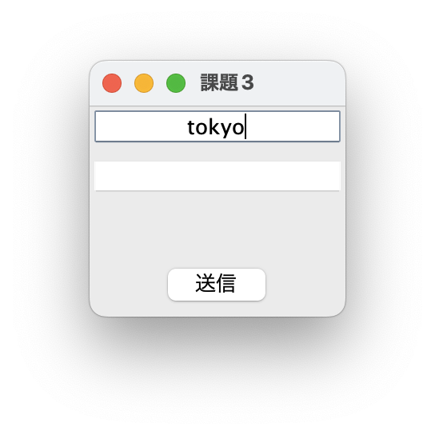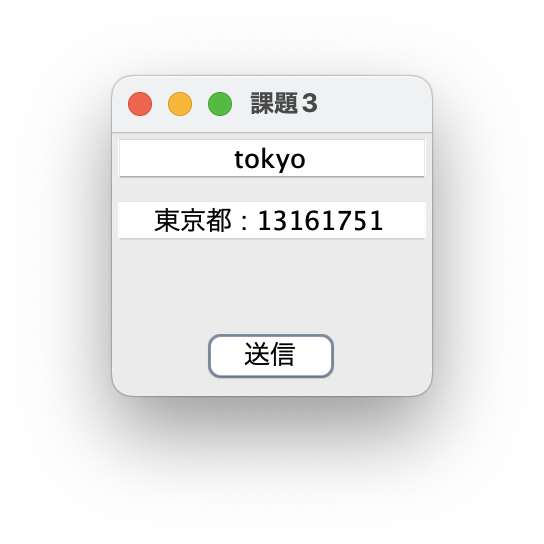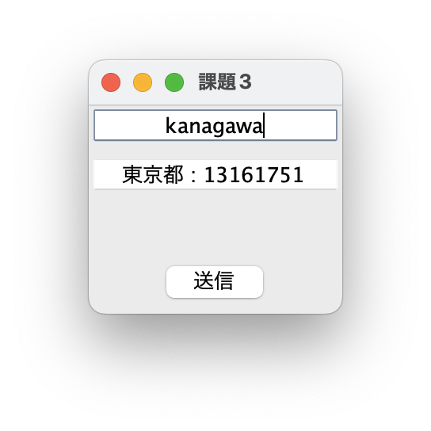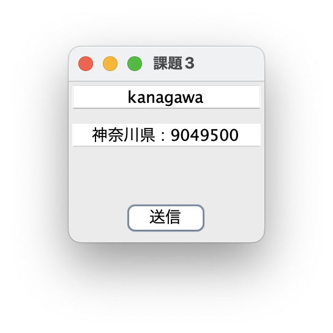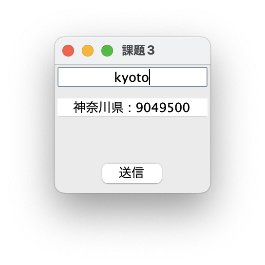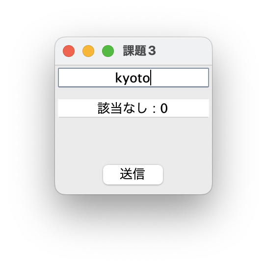

- サーバー（コンソール）

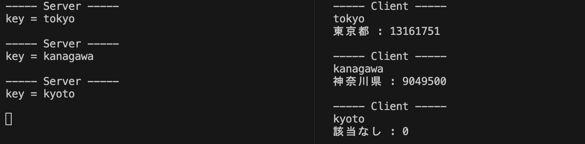

<br>

### 考察

#### `flush()`メソッドについて

クライアント側のプログラムにおいて、サーバーにキーを書き込む際に次のように記述した。

```Java
// oos は ObjectOutputStream のオブジェクト
// inputField は JTextField のオブジェクト
// サーバーに入力したキーを送信
oos.writeUTF(inputField.getText());
oos.flush();        // 即座に送信
```

課題1や課題2では、このように`flush()`メソッドを実行していなくても問題なくプログラムが動作した。しかし、課題3では、このメソッドがないとキーがいつまでも書き込まれずにプログラムが進まない。この原因について考えた。

まず、課題3 で使った　Object(Input/Output)Stream はバッファを持つが、課題1、2で使った Data(Input/Output)Stream  はバッファを持たないことがわかった。つまり、課題1や課題2では、クライアントからサーバーに　Data(Input/Output)Stream の`writeInt()`のようなメソッドを使った際に、そのあとすぐにサーバーへの書き込みが行われていた。そのため、サーバーに書き込まれないというエラーが発生しなかった。

しかし、課題3で使った Object(Input/Output)Stream はバッファを持つため、Object(Input/Output)Stream の`writeUTF()`のようなメソッドを使ったとしても、バッファに書き込まれるだけで、サーバーにすぐに書き込みが行われない。バッファに書き込まれた内容は、バッファが一杯になるか`flush()`メソッドがよばれることで初めてストリームの先へ書き込みが行われる（ストリームを閉じるときも自動的に`flush()`が実行され書き込みが行われる）。

以上が原因だと判明した。改めて、バッファ付きのストリームを扱う際には気をつけたい（ストリームの名前でバッファがついているか分かるようにしてほしい...）。

#### Object(Input/Output)Stream と Data(Input/Output)Stream

課題 1 と課題 2 では、Data(Input/Output)Stream を使用した。一方で、課題 3 では Prefecture オブジェクトを扱うために、Object(Input/Output)Stream を使用した。しかし、課題 3 を行った際に、Data(Input/Output)Stream でできることはすべて Object(Input/Output)Stream で実現できてしまう（継承関係からも明らか）ことに気づき、Data(Input/Output)Stream の必要性について疑問に思ったので調べてみた。

Java のリファレンスによると、これらの違いは、次のとおりである。  
Data(Input/Output)Stream はプリミティブ型（int や char など）と String 型のデータを解釈できるように書き込み・読み込みを行う。その一方で、Object(Input/Output)Stream は、これらプリミティブ型と String 型の他にも、自身で定義したオブジェクト型のデータも扱うことができる。

ただ、調べていると興味深い資料が見つかった。その資料によると、Java の古いバージョンでは、Object(Input/Output)Stream は Data(Input/Output)Stream に比べて、自作したオブジェクトを扱える反面効率が悪かった。しかし、最近のバージョンでは、Object(Input/Output)Stream の効率が良くなっているそうだ（[参考資料](https://copyprogramming.com/howto/difference-between-objectinputstream-and-objectoutputstream-in-java)）。

<br>

---

# 参考文献

> - 第８講・その１　 Java プログラムにおける通信のしくみを理解する. https://crew-lab.sfc.keio.ac.jp/lectures/2000s_mmb/JavaLectures/Lecture8/Lec8-1.html. (2024/1/19 参照)
> - Oracle. Java ネットワークの概要. https://docs.oracle.com/javase/jp/1.5.0/guide/net/overview/overview.html#:~:text=ServerSocket%20は、サーバ上で,エンドポイントを表します%E3%80%82. (2024/1/19 参照)
> * Oracle. ObjectOutputStream (Java Platform SE 8 ). https://docs.oracle.com/javase/jp/8/docs/api/index.html?java/io/ObjectOutputStream.html. (2024/1/19 参照)
> * CopyProgramming. Java's ObjectInputStream and ObjectOutputStream: How are They Different? - Java stream. https://copyprogramming.com/howto/difference-between-objectinputstream-and-objectoutputstream-in-java. (2024/1/19 参照)

# 謝辞
* 特になし

# 感想など
* 特になし