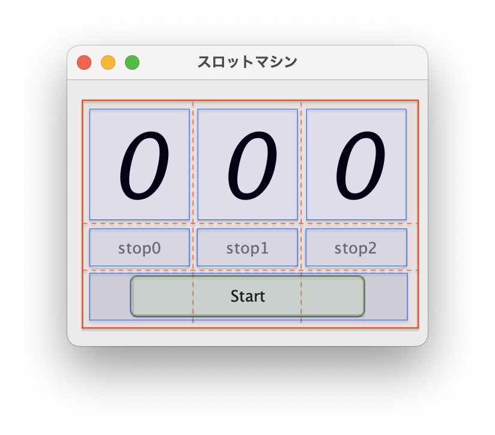
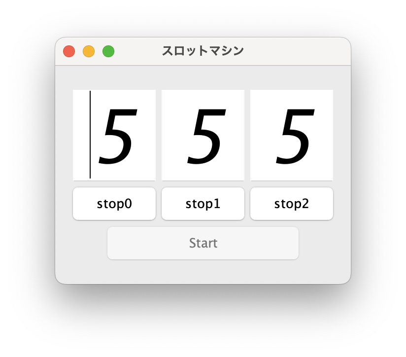

# プログラミング演習Ⅱ 第14回

- 学籍番号：2264088
- 氏名：河原畑 宏次
- 所属：情報工学 EP

# 課題の説明

## 課題 1 　円運動のシミュレーターアプリ

<details>
<summary> ソースファイル :

`J14_1/src/J14_1.java`

</summary>

```Java
import java.awt.BorderLayout;

import javax.swing.BoxLayout;
import javax.swing.JFrame;
import javax.swing.JLabel;
import javax.swing.JPanel;
import javax.swing.JSlider;
import javax.swing.event.ChangeEvent;
import javax.swing.event.ChangeListener;


public class J14_1 extends JFrame implements ChangeListener {
    /* インスタンス変数 */
    private MyCanvas canvas;        // Canvas
    private JSlider radiusSlider;   // 円運動の半径を決めるスライダー
    private JSlider speedSlider;    // 円運動する物体の速度を決めるスライダー
    private JLabel radiusLabel;     // 円運動の半径を表示するラベル
    private JLabel speedLabel;      // 円運動する物体のスピードを表示するラベル
    private int speed = 27;         // 物体のスピード（再描画の頻度）


    public static void main(String[] args) {
        new J14_1("円運動");
    }

    // フレームの描画処理
    public J14_1(String title) {
        // Canvas部分
        JPanel canvasPanel = getCanvasPanel();

        // スライダー部分
        JPanel sliderPanel = getSliderPanel();


        // フレームに追加
        add(canvasPanel, BorderLayout.NORTH);
        add(sliderPanel, BorderLayout.CENTER);

        // フレームの設定
        setTitle(title);
        setDefaultCloseOperation(JFrame.EXIT_ON_CLOSE);
        setSize(300, 450);
        setLocationRelativeTo(null);
        setVisible(true);


        // 一定間隔ごとに Canvas 内の物体を動かし再描画を行う
        drawAnimation();

    }


    // Canvas部分のパネルを生成
    private JPanel getCanvasPanel() {
        canvas = new MyCanvas();
        canvas.setSize(290, 290);
        JPanel canvasPanel = new JPanel();
        canvasPanel.add(canvas);
        return canvasPanel;
    }


    // スライダー部分のパネルを生成
    private JPanel getSliderPanel() {
        radiusSlider = new JSlider();
        speedSlider = new JSlider();

        // スライダーの値を表示するラベル
        radiusLabel = new JLabel("半径 50");   
        speedLabel = new JLabel("速度 50");

        JPanel radiusPanel = new JPanel();  // ラベルを中央揃え
        radiusPanel.add(radiusLabel);
        JPanel speedPanel = new JPanel();
        speedPanel.add(speedLabel);
        
        // リスナーの追加
        radiusSlider.addChangeListener(this);
        speedSlider.addChangeListener(this);

        // 全体を縦に並べるパネル
        JPanel sliderPanel = new JPanel();
        sliderPanel.setLayout(new BoxLayout(sliderPanel, BoxLayout.PAGE_AXIS));
        sliderPanel.add(radiusSlider);
        sliderPanel.add(radiusPanel);
        sliderPanel.add(speedSlider);
        sliderPanel.add(speedPanel);

        return sliderPanel;
    }

        // 一定間隔ごとに Canvas 内の物体を動かし再描画を行うメソッド
        private void drawAnimation() {
            // Canvasの初期設定
            canvas.init();
    
            // 一定の間隔ごとにCanvasを描画
            while (true) {
                if(speed != 0) {
                    try {
                        // 描画する速度を変更
                        Thread.sleep(300/speed);
                    } catch (InterruptedException e) {
                    }
                    canvas.increaseDegree();    // 物体の角度を1度動かす
                    canvas.changeColor();       // 物体が動くたびにCanvasの背景色を変更
                    canvas.repaint();   // Canvasの再描画
                } 
                // スピードが0の場合は 100ms 停止
                else {
                    try {
                        Thread.sleep(100);
                    } catch (Exception e) {
                    }
                }
                
            }
        }


    // スライダーの変化ごとに発生させるイベント処理
    @Override
    public void stateChanged(ChangeEvent e) {
        // 変更されたスライダーを取得
        JSlider selectedSlider = (JSlider)e.getSource();

        // 円運動の半径が変更された場合
        if (selectedSlider == radiusSlider) {
            // Canvasにて半径の変更を反映
            canvas.setRadius(selectedSlider.getValue());
            
            // 半径の値の表示を更新
            radiusLabel.setText("半径 " + String.valueOf(radiusSlider.getValue())); 
        } 
        // 円運動の速度が変更された場合
        else if(selectedSlider == speedSlider) {
            // 物体の速度（描画の頻度）の変更を反映
            speed = speedSlider.getValue();
            
            // 速度の値の表示を更新
            speedLabel.setText("速度 " + String.valueOf(speedSlider.getValue()));
        } else {
            System.err.println("Unexpected Error at stateChanged() : " + e.getSource());
        }
        
    }

}
```

</details>

<details>
<summary> ソースファイル :

`J14_1/src/MyCanvas.java`

</summary>

```Java
import java.awt.Canvas;
import java.awt.Color;
import java.awt.Dimension;
import java.awt.Graphics;
import java.awt.Image;
import java.awt.Point;

public class MyCanvas extends Canvas {
    /* インスタンス変数 */
    private Dimension size;                       // Canvasのサイズを取得
    private Image back;                           // ダブルバッファリング用のバッファイメージ
    private Graphics buffer;                      // ダブルバッファリング用のGraphicsオブジェクト
    private int c = 150;                          // Canvasの背景色のカラーコード
    private int radius = 50;                      // 円運動の半径
    private Point point = new Point(0, 0);    // 円運動する物体の座標
    private int degree = 0;                       // 円運動する物体の角度（度）


    // 円運動の半径のセッター
    public void setRadius(int radius) {
        this.radius = radius;
    }
    
    
    // 物体の角度を1増やすメソッド
    public void increaseDegree() {
        this.degree++;
        if(degree == 360) {
            degree = 0;
        }
    }
    
    // 背景の色を変更するメソッド
    // 背景の色を一周で次のように変化させる
    // Color(0 , 0, 0) => Color(255, 255, 255) => Color(0 ,0 , 0) 
    public void changeColor() {
        if(degree >= 0 && degree < 180) {
            c = degree * 225 / 180;
        } else if (degree >= 180 && degree < 360) {
            c = 225 - ((degree - 180) * 225 / 180);
        } else {
            System.err.println("Unexpected Error at changeColor() :  degree =  " + degree);
        }
    }

    // Canvasの初期設定（ダブルバッファリングの設定）
    public void init() {
        size = getSize();
        back = createImage(size.width, size.height);
        buffer = back.getGraphics();
    }

    // 背景は paint() で塗りつぶしが行われるため
    // オーバーライドし、g.clearRect(0, 0, width, height);　を呼ばせないようにして
    // 無駄な画面のクリアをしない
    public void update(Graphics g) {
        paint(g);
    }

    // Canvasの描画処理
    public void paint(Graphics g) {
        // 背景をRGB(c, c, c)で描画
        buffer.setColor(new Color(c, c, c));
        for (int i = 0; i < size.width; i++) {
            buffer.drawLine(i, 0, i, size.height - 1);
        }

        // 円運動の軌跡を表示
        buffer.setColor(Color.RED); 
        buffer.drawOval(size.width/2 - radius, size.height/2 - radius, radius*2, radius*2);

        // 円運動する物体を表示
        updatePoint();
        buffer.setColor(Color.BLUE);
        buffer.fillOval(point.x-10, point.y-10, 20, 20);

        // 円運動する物体の座標を表示
        buffer.drawString("x = " + point.x + "  y = " + point.y, 30, size.height-5);

        g.drawImage(back, 0, 0, this);  // イメージ領域をまとめて描画
    }

    // 物体の座標を更新するメソッド
    private void updatePoint() {
        double rad = Math.toRadians(degree); // 弧度法からラジアンに変換
        point.x = (int)(radius * Math.cos(rad)) + size.width/2;  // 物体のx座標
        point.y = (int)(radius * Math.sin(rad)) + size.height/2;  // 物体のy座標
    }
  
}
```

</details>

### プログラムの説明

#### プログラムの概要

円運動を描くアプリを作成した。アプリには 2 つのスライダーが存在し、それぞれ円運動の半径と速度を 0 ~ 100 の間で変更することができる。また、背景色がを円運動の動きと対応させ、物体が一周すると背景色が RGB(0,0,0) 〜 RGB(255,255,255) 〜 RGB(0,0,0) へと変化するようにした。

<br>

#### アプリのレイアウト


実際のアプリの画面を上画像のように、要素に応じてボーダーをつけてみた。  
まず全体のフレームに対して、`BorderLayout`を適用し、`BorderLayout.NORTH`に円運動を表示する Canvas が含まれるパネル（水色）を、`BorderLayout.CENTER`にスライダーやその値を表示するラベルが含まれるパネル（黄色）を配置した。

Canvas で円運動を表示するパネルについては、その子要素に Canvas のみ持つ。Canvas を直接フレームに配置するのではなく、パネルで覆った後にフレームに設置したのは、ウィンドウのサイズが変更された場合でも、Canvas が中央に描画されるようにするためである（パネルにはデフォルトで`FlowLayout`が設定されており、パネルの中の子要素がひとつの場合はその要素が中央に配置される）。

次に、スライダーやその値を表示するラベルが含まれるパネルについては、子要素を 4 つ持つ。上から順に、半径の値を変更するスライダー、半径の値を表示するラベルを覆うパネル、速度の値を変更するスライダー、速度の値を表示するラベルを覆うパネルである。これらの要素を縦に並べるために、`BoxLayout`を使用した。ここで、半径や速度の値を表示するラベルをパネルで囲ったのも、Canvas と同様に要素を中央に配置するためである（この方法は課題 2 でも利用したが、課題 2 では説明を省略する）。

<br>

#### Canvas の描画
Canvas を扱うクラスとして、Canvasを継承した　`MyCanvas`というクラスを作成した。以下は、このクラスに定義した内容について述べる。

Canvas の描画は画面のチラツキを防ぐために、ダブルバッファリングを用いて行う。そのために、`init()`メソッド内でダブルバッファリング用のイメージ領域`buffer`を生成している。

Canvas の具体的な描画処理を記述する`paint()`メソッドでは、生成した buffer を用いて背景の塗りつぶしを行う。このとき、色の指定にはインスタンス変数`c`を用いて RGB(c,c,c) とした。

```Java
// 背景の塗りつぶし。size = getSize()
buffer.setColor(new Color(c, c, c));
for (int i = 0; i < size.width; i++) {
    buffer.drawLine(i, 0, i, size.height - 1);
}
```

さらに、次のような記述で円運動の軌跡を表現した。このとき`drawOval(int x, int y, int width, int height)`メソッドの引数に関して、次の図のような指定が行われていることに注意したい。ただし、`radius`は円運動の半径を表すインスタンス変数である。


```Java
// 円運動の軌跡を表示
buffer.drawOval(size.width/2 - radius, size.height/2 - radius, radius*2, radius*2);
```

また、遠運動する物体を表示するためには、`fillOval(int x, int y, int width, int height)`メソッドを使って行うが、このときの4つの引数の指定方法も`drawOval()`メソッドと同様である。

```Java
// 遠運動する物体を表示。Point は物体の中心の座標を保存。半径は10
buffer.fillOval(point.x-10, point.y-10, 20, 20);
```

ここで、物体の座標を保存する`Point`オブジェクトについて、オブジェクトが持つｘ座標とy座標は`updatePoint()`メソッドにてその値が更新される。このメソッドは、x軸からの物体の角度を表すインスタンス変数`degree`を利用している。この degree を ラジアンに変換した値 rad を用いて次の図のような並行移動により座標を更新している。


```Java
// updatePoint() 内で 物体のx座標を更新。degree はx軸からの角度(度)
double rad = Math.toRadians(deg); // 弧度法からラジアンに変換
point.x = (int)(radius * Math.cos(rad)) + size.width/2; 
```

また、ここで扱った物体の座標を保存するPointオブジェクトと`drawString()`メソッドを利用して、Canvas 下部の適当な位置に物体の座標を文字として表示した。

最後に、buffer に描いたイメージ領域をまとめて`drawImage()`メソッドにより描画した。


<br>

#### スライダーを動かしたときのイベント
半径と速度を変更するスライダーを用意した。これらのスライダーには、`ChangeListener`を設定したため、スライダーの値が変更されるたびに`stateChanged()`メソッドが呼び出される。

このメソッドでは、最初に`getSource()`メソッドにより変更されたスライダーオブジェクトを取得する。そして取得したオブジェクトが、半径を変更するスライダーに等しい場合は、`MyCanvas`クラスが持つ `setRadius()`メソッドを使い、Canvasの円運動の半径を表すインスタンス変数`radius`をスライダーの値に更新する。また、半径の値を表示するラベルの値も同時に更新する。

取得したオブジェクトが、物体の速度を変更するスライダーに等しい場合は、`set`このクラスに定義された速度を表すインスタンス変数`speed`の値を更新する。また、速度の値を表示するラベルの値も同時に更新する。

<br>


#### アニメーションの描画
物体が動いているようなアニメーションを描画するには、物体の変化に応じて Canvas 部分を一定の間隔ごとに再描画させる必要がある。これを担っているのが J14_1 クラスのコンストラクタにおける`drawAnimation()`メソッドである。

このメソッドでは、まず最初に MyCanvas クラスのメソッド `init()`により Canvas のバッファ領域を作成し、ダブルバッファリングによる描画ができるように設定している。

次に、無限ループ処理内にて、物体の速度を表すインスタンス変数`speed`を参照しこの値が 0 でなければ、`sleep()`メソッドにより (300/speed) ミリ秒の休止を行う。その後に、`MyCanvas`が持つ物体のx軸からの角度を表すインスタンス変数`degree`を1度増やす。さらに、`MyCanvas`が持つ Canvas の背景色のカラーコードを表すインスタンス変数`c`も変更する。これらの処理は、それぞれ`increaseDegree()`, `changeColor()`として MyCanvas クラスにて定義した（説明は省略）。最後に、`repaint()`メソッドによる再描画を行う。  
ただし、変数`speed`が 0 の場合は、単に 100 ミリ秒の休止を行う。

この一連の処理はプログラムが停止されるまで繰り返し実行される。

<br>

### 実行結果


<br>

### 考察
#### `update()`メソッドをオーバーライドする理由
`MyCanvas`クラスにおいて、Canvas クラスが持つ`update()`メソッドをオーバーライドし、次のように書き換えた。

```Java
public void update(Graphics g) {
    paint(g);
}
```

このオーバーライドの意味について元の Canvas が持つ`update()`メソッドについて調べてみる。すると次のようなコードだとわかった。つまり、このオーバーライドは`g.clearRect(0, 0, width, height)`を呼び出さないために行なっている。  
`paint()`メソッドにおいて、独自に背景色を塗りつぶす処理を行った。そのため、`update()`メソッドにおいても背景色を塗りつぶす処理を行う必要がないため、`update()`メソッドをこのようにオーバーライドした。

```Java
/**
 * Updates this canvas.
 * <p>
 * This method is called in response to a call to {@code repaint}.
 * The canvas is first cleared by filling it with the background
 * color, and then completely redrawn by calling this canvas's
 * {@code paint} method.
 * Note: applications that override this method should either call
 * super.update(g) or incorporate the functionality described
 * above into their own code.
 *
 * @param g the specified Graphics context
 * @see   #paint(Graphics)
 * @see   Component#update(Graphics)
 */
public void update(Graphics g) {
    g.clearRect(0, 0, width, height);
    paint(g);
}
```

<br>

#### 工夫した点
* 全体を通してコードのリファクタリングを丁寧に行なった。特に、機能ごとにメソッドを分割することにより、可読性と保守性を高めた。
* 円運動する物体を描画する`MyCanvas`クラスは、描画処理とその描画処理に使うパラメータのセッターを提供するクラスとして設計した。よって、paint()メソッドが、MVCモデルにおけるViewの役割を担い、そのほかの MyCanvas のメソッドはModel としての役割を担っていると言える。
* カプセル化を意識して、インスタンス変数は全て`private`にした。また、インスタンス変数に対するアクセスは、`setter`を用いて行うようにした。これにより、インスタンス変数の値の変更を制限し、不正な値が設定されることを防いだ。
* if文において適切なエラーチェックを心がけた。例えば、`changeColor()`メソッドでは、現在の角度が 0 ~ 360 の範囲に収まっているかをチェックし、範囲外の場合はエラーメッセージを表示するようにした。

---


## 課題2　スロットマシンアプリ
 
<details>
<summary> ソースファイル : 

`J14_2/src/J14_2.java`

</summary>

``` Java
import java.awt.Dimension;
import java.awt.Font;
import java.awt.GridBagConstraints;
import java.awt.GridBagLayout;
import java.awt.event.ActionEvent;
import java.awt.event.ActionListener;
import java.util.Arrays;

import javax.swing.JButton;
import javax.swing.JFrame;
import javax.swing.JPanel;
import javax.swing.JTextField;

public class J14_2 extends JFrame implements ActionListener {
    /* インスタンス変数 */
    private SlotThread[] slotThreads;   // スロットのスレッド
    private JButton[] stopButtons;  // ストップボタン
    private JButton startButton;    // スタートボタン
    private Boolean[] stopButtonFlag = { false, false, false }; // 3つのストップボタンの有効/無効を保存
    private boolean isFirstPress = true;    // スタートボタンが初めて押されたかどうか

    public static void main(String[] args) throws Exception {
        J14_2 frame = new J14_2("スロットマシン");
        frame.setVisible(true);
    }

    public J14_2(String title) {
        // 初期設定
        setTitle(title);
        setSize(new Dimension(300, 250));
        setDefaultCloseOperation(JFrame.EXIT_ON_CLOSE);
        setLocationRelativeTo(null);

        // スロットの数字が回転する部分を担うテキストフィールド
        JTextField[] slotNumbers = new JTextField[3];
        for (int i = 0; i < slotNumbers.length; i++) {
            slotNumbers[i] = new JTextField("0");
            slotNumbers[i].setEditable(false); // スロットの数字は編集不可
            slotNumbers[i].setFont(new Font("SanSerif", Font.ITALIC, 75));
            slotNumbers[i].setPreferredSize(new Dimension(90, 100));
            slotNumbers[i].setHorizontalAlignment(JTextField.CENTER); // 数字を中央揃え
        }

        // スロットのスレッドを生成
        slotThreads = new SlotThread[3];
        for (int i = 0; i < slotThreads.length; i++) {
            slotThreads[i] = new SlotThread(slotNumbers[i]);
        }

        // スロットを停止させるボタンの作成
        stopButtons = new JButton[3];
        for (int i = 0; i < stopButtons.length; i++) {
            stopButtons[i] = new JButton("stop" + i);
            stopButtons[i].setEnabled(false);         // 初期状態では無効
            stopButtons[i].setPreferredSize(new Dimension(90, 40));
            stopButtons[i].addActionListener(this);     // イベントリスナーを設定
        }

        // スロットの回転を開始するボタン
        startButton = new JButton("Start");
        startButton.setPreferredSize(new Dimension(200, 40));
        startButton.addActionListener(this);    // イベントリスナーを設定
        JPanel startButtonPanel = new JPanel();
        startButtonPanel.add(startButton);


        // グリッドバッグレイアウトのパネルを生成しコンポーネントを配置
        JPanel gridBagPanel = new JPanel();
        GridBagLayout gridBagLayout = new GridBagLayout();
        gridBagPanel.setLayout(gridBagLayout);
        GridBagConstraints gbc = new GridBagConstraints();

        // スロットをパネルに追加
        for (int i = 0; i < slotNumbers.length; i++) {
            gbc.gridx = i;
            gbc.gridy = 0;

            gridBagLayout.setConstraints(slotNumbers[i], gbc);
            gridBagPanel.add(slotNumbers[i]);
        }

        // ストップボタンをパネルに追加
        for (int i = 0; i < stopButtons.length; i++) {
            gbc.gridx = i;
            gbc.gridy = 1;

            gridBagLayout.setConstraints(stopButtons[i], gbc);
            gridBagPanel.add(stopButtons[i]);
        }

        // スタートボタンをパネルに追加
        gbc.gridx = 0;
        gbc.gridy = 2;
        gbc.gridwidth = 3; // 幅3column分使う
        gridBagLayout.setConstraints(startButton, gbc);
        gridBagPanel.add(startButton);

        // ----- GridBagLayout のパネルのコンポーネントの配置ここまで -----


        // フレームにコンポーネントを追加
        add(gridBagPanel);

    }

    // ボタンが押された時の処理
    @Override
    public void actionPerformed(ActionEvent e) {
        String selectedCommand = e.getActionCommand(); // 押されたボタンの名前

        switch (selectedCommand) {
            // スタートボタンが押された場合
            case "Start":
                startSlots();
                break;

            // stop0 ボタンが押された場合
            case "stop0":
                stopSlots(0);
                break;

            // stop1 ボタンが押された場合
            case "stop1":
                stopSlots(1);
                break;

            // stop2 ボタンが押された場合
            case "stop2":
                stopSlots(2);
                break;

            default:
                break;
        }

    }

    // 3つのスロットを開始するメソッド
    private void startSlots() {
        // スロットを active に設定
        for (int i = 0; i < slotThreads.length; i++) {
            slotThreads[i].setActive(true);
        }

        // 最初に呼ばれたときのみスレッドを開始
        if (isFirstPress) {
            // 3つのスロットを回転
            for (int i = 0; i < slotThreads.length; i++) {
                slotThreads[i].start();
            }
            isFirstPress = false;
        }

        // スタートボタンを無効化
        startButton.setEnabled(false);

        // ストップボタンを有効化
        for (int i = 0; i < stopButtons.length; i++) {
            stopButtons[i].setEnabled(true);
            stopButtonFlag[i] = true;
        }
    }


    // i番目のスロットを停止するメソッド
    private void stopSlots(int i) {
        slotThreads[i].setActive(false); // 回転を停止
        stopButtons[i].setEnabled(false);
        stopButtonFlag[i] = false;

        // ストップボタンが全て無効（現在有効なストップボタンがない）の場合はスタートボタンを有効化
        if (!Arrays.asList(stopButtonFlag).contains(true)) {
            startButton.setEnabled(true);
        }
    }

}
```
</details>

<details>
<summary> ソースファイル : 

`J14_2/src/SlotThread.java`

</summary>

```Java 
import javax.swing.JTextField;

public class SlotThread extends Thread {
    /* インスタンス変数 */
    private JTextField slotField;       // 0 ~ 9 の数字が回転する部分
    private boolean isActive = true;    // スロットが回転しているかどうか 

    // セッター
    public void setActive(boolean isActive) {
        this.isActive = isActive;
    }

    // コンストラクタ
    public SlotThread(JTextField slotField) {
        this.slotField = slotField;
    }

    // スレッド処理
    // 数字を回転させる
    @Override
    public void run() {
        int i = Integer.parseInt(slotField.getText());

        while (true) {
            // isActive が true の間は回転
            // そうでなければ数字は固定（更新しない）
            if (isActive) {
                i++;
                if (i > 9)
                    i = 0;
                slotField.setText(Integer.toString(i));
            }

            try {
                Thread.sleep(100);
            } catch (InterruptedException e) {
            }

        }
    }
}
```
</details>

### プログラムの説明
#### プログラムの概要
スロットマシンを模したアプリを作成した。アプリには、3つのスロットがあり、それぞれのスロットには数字が表示されている。スタートボタンを押すと、3つのスロットが回転し始め、ストップボタンを押すとそのスロットの回転が停止する。  
最初はスタートボタンのみが有効である。スタートボタンを押すと、3つのスロットが回転し始め、ストップボタンが有効になる。ストップボタンを押すと、そのスロットの回転が停止し、そのスロットのストップボタンが無効になる。3つのストップボタンが全て無効になると、スタートボタンが再度有効になるように設計した。

<br>

#### アプリのレイアウト



実際のアプリの画面を上画像のように、要素に応じてボーダーをつけてみた。  
画像で赤色に囲われている部分は、`GridBagLayout`を使用したパネルである。このパネルには、3つのスロットと、それぞれのスロットの回転を停止させるボタン、スタートボタンを覆うパネルを配置した。このパネルをフレームに`BorderLayout.CENTER`として追加した（add(component) としレイアウトを明示しない場合、レイアウトに`BorderLayout.CENTER`が採用される）。

`GridBagLayout`は、グリッド状にコンポーネントを配置するレイアウトマネージャである。このレイアウトマネージャを使用すると、コンポーネントをグリッドのように配置することができる。また、コンポーネントの配置に関しては、`GridBagConstraints`クラスのインスタンスを用いて制御することができる。このクラスのインスタンスを用いて、コンポーネントの配置位置やサイズ、配置するグリッドの位置などを指定する。  
今回のアプリでは、`GridBagConstraints`クラスのインスタンス`gbc`を用いて、コンポーネントの配置位置やサイズを指定した。具体的には、`(gbc.gridx, gbc.gridy) = (0, 0), (1, 0), (2, 0)`において（つまり、1行目の３列にそれぞれ）3つのスロットを配置した。また同様にして、`(gbc.gridx, gbc.gridy) = (0, 1), (1, 1), (2, 1)`において（つまり、2行目の３列にそれぞれ）3つのストップボタンを配置した。  
さらに、`(gbc.gridx, gbc.gridy) = (0, 2)`にスタートボタンを配置した。ただし、スタートボタンは横幅を3列分使うようにするため、`gbc.gridwidth = 3`としている。


<br>


#### スロットの回転
スロット（`JTextField` の値）を回転させるために、専用のスレッド`SlotThread`クラスを作成した。このクラスは、`JTextField`オブジェクトをインスタンス変数として持ち、そのオブジェクトの値を 0〜9 の数字で回転させる。また、`isActive`というインスタンス変数を持ち、この変数が`true`の間は回転を続け、`false`の間は回転を停止するようにした。  
具体的には、`run()`メソッド内で、`Thread.sleep(100)`というメソッドを無限ループで呼び出す。ただし、このメソッドの呼び出しの前に、`isActive`が`true`であるかどうかを判定し、`true`の場合は`JTextField`オブジェクトの値を 0〜9 の数字で回転させる。つまり、スレッド処理はプログラムの実行開始から終了まで sleep() メソッド以外で停止することはなく、スロットの停止はスロットの数字を増やさず固定することで実現している。

<br>

#### ボタンを押したときのイベント
スタートボタンとストップボタンを押したときのイベント処理は、`actionPerformed()`メソッドにて行なっている。このメソッドでは、`ActionEvent`オブジェクトの`getActionCommand()`メソッドにより、押されたボタンの名前を取得している。そして、取得した名前に応じて、スタートボタンが押された場合は`startSlots()`メソッドを、ストップボタンが押された場合は`stopSlots()`メソッドを呼び出している。

`startSlots()`メソッドは、スロットを回転させるために`SlotThread`オブジェクトの`setActive()`メソッドを使い変数`isActive`を`true`に設定し、スロットの回転を開始する。また、最初に呼ばれたときのみスレッド処理を開始する。このために`isFirstPress`というインスタンス変数を用いて一番最初の呼び出しかどうか判定している。最後に、スタートボタンを無効化し、ストップボタンを有効化する。

`stopSlots()`メソッドは、引数により停止するスロットを指定し、そのスロットの回転を停止する。例えば、`stopSlots(0)`と呼び出された場合は、スロット 0 の回転を停止させる。そのために、指定したスロットに対応する`SlotThread`オブジェクトの変数`isActive`を、`setActive()`メソッドを使い`false`に設定する。また、停止したスロットのストップボタンを無効化し再度押せないようにする。  
最後に、現在有効なストップボタンがない場合はスタートボタンを有効化する。現在有効なストップボタンがない場合というのは、3つのすべてのスロットが停止している状況のことである。この状況では、スタートボタンを有効化することで再度スロットを回転させることができるようになる。


<br>

### 実行結果
* プログラム起動時 => スタートボタンを押した直後 => 3つのボタンを押した直後




<br>

### 考察
#### 工夫した点
* 変数`isActive`を介してスロットの回転を制御することで、他のスレッドとの競合を防ぎ、スロットの回転を停止させることができた。
* スレッドの処理においては、クラス変数は使わず、インスタンス変数を用いている。これにより、スレッド処理によるデッドロックのような副作用を起こさないようにした。
* 見本として提示されていたアプリのレイアウトに限りなく近い精度でレイアウトを再現できた。`GridBagLayout`は、コンポーネントの配置に関して細かく制御できるため、このようなレイアウトを実現することができたと考える。

<br>

#### 反省点・課題
* このプログラムにはスレッドの終了処理がない。強制的にスレッドの終了処理を行うには、`stop()`メソッドを使うことができるが、このメソッドは非推奨であったため使用しなかった。フラグを利用した終了処理については思いついたが、アプリの閉じるボタンがおされたときにスレッドの終了処理を行う方法がわからなかった。このため、スレッドの終了処理については課題としたい。
* `J14_2.java`のファイルが長くなってしまった。そのため、イベント処理とレイアウトの処理を分割したいと考えた。しかし、イベント処理を分割し他のファイルとすると、イベント処理に関わるコンポーネントもそのファイルに移動しなければならない。これを実現するためには、次の二つの方法を思いついた。
  1. コンポーネントの参照をコンストラクタで渡す。
  2. コンポーネントのアクセス修飾子を`public`にする。  
ただし、これらの方法は分割したファイルで冗長なコードが増えたり、カプセル化ができず、不正な値が設定される可能性があったりするため、採用しなかった。
このような場合の対処法については、今後の課題としたい。

---


# 参考文献
> * JavaDrive. GridBagLayoutクラス - Swing. https://www.javadrive.jp/tutorial/gridbaglayout/. (2024/1/20 参照)

# 謝辞
* 特になし

# 感想など
全14回の講義を受けて、C言語とは異なるJavaの様々な特徴を学ぶことができた。課題がどれもやりがいがあり、楽しみながら取り組むことができた。特に今まで学習してこなかったGUIの設計に関しては、とても興味が湧きもう少し深く学習したいと思った。
