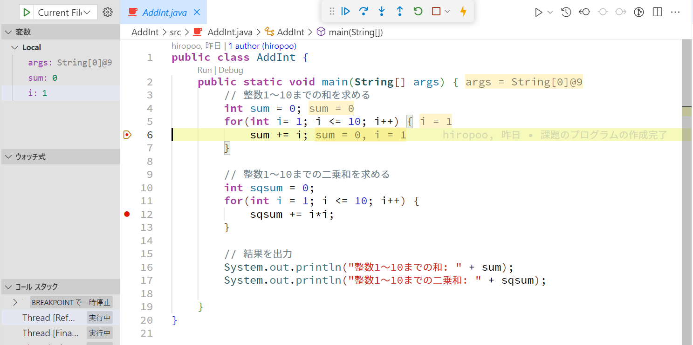

[](https://classroom.github.com/a/OX5pGmWo)
# プログラミング演習II 第２回
* 学籍番号：2264088
* 氏名：河原畑 宏次
* 所属：情報工学EP


# 課題の説明

## 課題1　配列の全要素の値の合計を計算

<details>
<summary> ソースファイル : 

`Array/src/Array.java` 

</summary>


```java
public class Array {
    public static void main(String[] args) throws Exception {

        // 配列を定義
        int[] a = {2,5,3,8,9,7,6,1,4,10};
        int sum = 0;

        // 配列の全要素の合計を計算
        for(int i = 0; i < a.length; i++) {
            sum += a[i];
        }

        System.out.println("配列の全要素の合計は" + sum + "です");
    }
}

```    
</details>

### プログラムの説明
* int型の配列に初期値を与えて宣言・初期化を行い、全要素の値の合計を求める。

### 実行結果
* 実行結果は以下の画像のようになった。


### 考察
* 今回の課題では配列の宣言と初期化を同時に行っている。  

* 配列の要素数の取得には`配列名.length`を用いる。ここで、この書き方と配列の宣言時の`new演算子`との関係から、lengthは配列という**インスタンス**が持つひとつの**フィールド**(メンバ変数)と考えられる。

---

## 課題2　３次元ベクトルの大きさを計算
<details>
<summary> ソースファイル : 

`Vector/src/Vector.java` 

</summary>


```java
public class Vector {
    public static void main(String[] args) {
        // 3次元ベクトルを格納するための配列を宣言
        double[] vec = new double[3];
        vec[0] = 3; vec[1] = 4; vec[2] = 5;

        // ベクトルの大きさを計算
        double size = Math.sqrt(Math.pow(vec[0], 2) + Math.pow(vec[1], 2) + Math.pow(vec[2], 2));

        System.out.printf("ベクトルの大きさは%.3fです\n", size);
    }   
}

```    
</details>

### プログラムの説明
* ３次元ベクトルを格納するためのdouble型の配列を`new演算子`を用いて宣言した後、各要素に値を代入しそのベクトルの大きさを求める。


### 実行結果
* 実行結果は以下の画像のようになった。


### 考察
* 今回のプログラムでは、配列の宣言と代入を別々に行った。しかし、次のようなコードを書くことで、配列の宣言と代入を同時に行うことができる。

```Java
データ型[] 変数名 = new データ型[] {要素１, 要素2, ...};
double[] vec = new double[]{3, 4, 5};
```

*　この構文は`new データ型[]`を省略することができる。つまり、課題1で用いた配列の初期化方法は、この構文の省略形であったことがわかる。

---


## 課題3　モンテカルロ法で円周率を求める
 
<details>
<summary> ソースファイル : 

`MonteCarlo/src/MonteCarlo.java`

</summary>

``` Java
public class MonteCarlo {
    public static void main(String[] args) {
        
        // in: 扇形(第一象限における円)の内部に生成された点の数を記憶
        int in = 0;

        // (x, y) の組を1000組発生させて、円の1/4の内部に生成された座標の組の個数を計算
        for(int i = 1; i <= 1000; i++) {
            // (x, y)の組を格納する変数を定義
            double x; 
            double y;

            // x, y ともに、[0, 1]の範囲でランダムな座標を割り当て -> 第1象限のみを考える
            x = Math.random() / Math.nextDown(1.0);
            y = Math.random() / Math.nextDown(1.0);

            // 原点からの距離を計算
            double dis = Math.sqrt(Math.pow(x, 2) + Math.pow(y, 2));

            // 円の内部に生成されたかどうかを判断しカウント
            if(dis <= 1) {
                in++;
            }
        }

        // π/4 = (扇形の内部に存在する点の個数) / (前端の点の個数) からπを計算
        double myPI = (double) 4 * in / 1000;

        // 静的変数πと求めたπとの誤差の割合を計算
        double errorRate = Math.abs(Math.PI - myPI) / 100;

        // 結果を出力
        System.out.println("モンテカルロ法で求めたπ: " + myPI);
        System.out.printf("静的変数πと求めたπの誤差: %.5f%%", errorRate);

    }
}


```
</details>

### プログラムの説明
* モンテカルロ法により半径一円の面積を求め、面積からπの値を計算する。

* 具体的には、次のような手順で計算する。
  1. 半径２の正方形中にランダムに点を1000組生成する。
  2. 正方形に内接する円の内側に生成された点の数を数える。
  3. 次の式のように点の数と、円と正方形面積比の関係からπを求める。
  4. `(円の内側に生成された点の数) : (すべての点の数)  =  (円の面積) : (正方形の面積)`より、円の内側に生成された点の数を $x$ とすると次の式が成り立つ。

$$
\begin{align*}
    x : 1000 &= (\pi \times 1^2) : 2^2\\
\therefore \quad \pi &= \frac{4x}{1000}
\end{align*}  
$$  
  


### 実行結果
* 実行結果は以下の画像のようになった。


* 乱数の発生回数を増やした場合　(10,000回)


* さらに乱数の発生回数を増やした場合 (1,000,000回)


### 考察
* モンテカルロ法について、今回は $xy$ 平面上で、0 $\leq x$ $\leq$ 1, 0 $\leq y$ $\leq$ 1 の範囲でランダムな座標を生成した。モンテカルロ法のように面積比を扱う際は、第一象限のみで考えても比率は変化しないため計算を楽することができる。

* また、`x = Math.random() / Math.nextDown(1.0);`というコードについて、Mathクラスの`random()`メソッドは、0以上1**未満**のdouble型の数値を与える。よって、今回の課題のように、0以上１**以下**のランダムなdouble型の数値の生成するためには、乱数の範囲の最大値を１にスケーリングする必要がある。`nextDown()`メソッドで、1未満の最大値 (= 0.99999…) を取得し、0以上１未満のランダム値をこの取得した値で割ることで、乱数の範囲を0以上１以下の範囲にスケーリングした。

* 求めたπと実際のπの値との誤差(`errorRate`)を求める際に、Mathクラスの`abs()`メソッドを利用した。これは、求めたπと実際のπの値との差が正負両方の値を取り得るので、その差の絶対値をとるためである。

* 乱数の発生回数を増やすと、求まるπの値の精度が高まった。
---

## 課題4　整数の和と二乗和を求めるプログラムのデバッグ
 
<details>
<summary> ソースファイル : 

`AddInt/src/AddInt.java`

</summary>

``` Java
public class AddInt {
    public static void main(String[] args) {
        // 整数1～10までの和を求める
        int sum = 0;
        for(int i= 1; i <= 10; i++) {
            sum += i;
        }

        // 整数1～10までの二乗和を求める
        int sqsum = 0;
        for(int i = 1; i <= 10; i++) {
            sqsum += i*i;
        }

        // 結果を出力
        System.out.println("整数1～10までの和: " + sum);
        System.out.println("整数1～10までの二乗和: " + sqsum);

    }
}

```
</details>


### プログラムの説明
* ループ処理を用いて、整数1～10までの輪と二乗和を求める。

* ループ処理内にブレークポイントを設定し、デバッグを行う。

### 実行結果
* 実行結果は以下の画像のようになった。


* ブレークポイントを設定しデバッグを開始した結果


ブレークポイントでプログラムが止まった。

* ステップオーバーによるデバッグ


変数のリアルタイムな値を確認しながら、コードを一行ずつプログラムを実行することができた。

### 考察
* 実行結果に含めたステップオーバーの機能のほかに、ステップイン、ステップアウトなどの機能を利用した。これらのデバッグの実行方法の種類を以下にまとめた。

| デバッグ方法 | 説明　|
:------------:|-------
| ステップイン | コードを一行実行する。実行する行が関数の場合は、次のデバッグ位置は関数の一行目となる。 |
| ステップオーバー | コードを一行実行する。実行する行が関数の場合は関数全体を実行し、次のデバッグ位置は関数の呼び出し直後の行である。|
| ステップアウト | 現在の関数の実行を終了し関数の外に出る。次のデバッグ位置は関数呼び出し直後の行である。 |
| 続行 | 次のブレークポイントまで実行する。 |

* デバッグを行うと変数の状況がリアルタイムで更新されるため、プログラムが正しいかどうか確認するのに非常に便利である。

* また、環境変数やコマンドライン引数を変更することも可能である。

* 今回の課題ではVisual Studio Codeを用いてデバッグを行ったが、eclipseではステップアウトではなくステップリターンと表記されている。その違いについて調べたがわからなかった。ただ、その動作が上に記したステップアウトの動作と全く同じであったため、名前だけの違いだと予想する。

---


# 参考文献
>【Java】配列についてまとめた. https://zenn.dev/miya_akari/articles/8f03bda9313e55. (2023/10/17 参照)
>
> ITのおもちゃ箱. Eclipseを使ったJavaのデバッグ方法を解説. https://ittoybox.com/archives/341. (2023/10/18 参照)


# 謝辞
* 特になし

# 感想など
デバッガーについては使ってみたいと思いつつ、いまだに使ったことがなかった。今回課題を通してデバッガーを初めて使い、以外にも簡単に使え、また非常に便利であることに気づいた。特に、VSCodeでは、コード上に変数のリアルタイムの値が表示され、わざわざソースファイルとは別の画面を見なくても済むのがよかった。これからの課題では、デバッグをうまく活用したい。