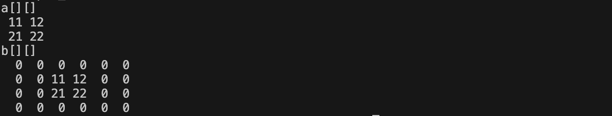

[](https://classroom.github.com/a/891zPY7r)
# プログラミング演習II 第3回
* 学籍番号：2264088
* 氏名：河原畑 宏次
* 所属：情報工学EP


# 課題の説明

## 課題1　コマンドライン引数と進数の変換
 
<details>
<summary> ソースファイル : 

`Ex1/src/Ex1.java`

</summary>

``` Java
public class Ex1 {
    public static void main(String[] args) {

        // エラー表示
        if(args.length < 1) {
            System.out.println("コマンドラインに入力してください");
            System.exit(-1);
        }
        
        // コマンドライン引数として与えられた数字を出力
        System.out.println("コマンドラインから入力された数字: " + args[0]);

        // コマンドライン引数で与えられた文字列をint型の値に変換
        int cmdArgInt = Integer.parseInt(args[0]);

        // 10進数、２進数、16進数の値をそれぞれ出力
        // public static String toString(int i, int radix)
        // １番目の引数の値(10進数)を、(２番目の引数)進数にし、その文字列を返す
        System.out.println("10進数: " + args[0]);
        System.out.println("2進数表記: " + Integer.toString(cmdArgInt, 2));
        System.out.println("16進数表記: " + Integer.toString(cmdArgInt, 16));

    }
}
```
</details>


### プログラムの説明
* `Integer`クラスのメソッド`parseInt()`, `toString()`を使い、コマンドライン引数から与えた10進数の整数を、2進数、16進数に変換して表示する。


### 実行結果
* コマンドライン引数に`68`を入力して実行した場合


* コマンドライン引数に`43`を入力して実行した場合


### 考察
* コマンドライン引数は、`Sting args[]`という文字列で与えられる。ゆえに、数字として扱うために`int`型にキャストするために、`Integer.parseInt()`メソッドを用いた。このメソッドは、引数に与えられた文字列をint型に変換しその値を返す。

* `Integer.toString()`メソッドを使うことで、正しく進数の基数を変換することができている。このメソッドは、第１引数に変換前の10進数のint型の値を与え、第2引数に変換後の進数の基数の値をint型で与えることで、変換した値をString型で得ることができる。今回は、2進数と16進数に変換するので、第2引数はそれぞれ2と16を与えた。

* また、このメソッドは第２引数を省略することで元の10進数の値をString型に変換した値を得ることができる。

* 進数の変換には、`toString()`メソッド以外に、２進数に変換する`toBinaryString()`メソッドや、8進数に変換する`toOctalString()`メソッド、16進数に変換する`toHexString()`メソッドなどがある。
---


## 課題2　コマンドライン引数と四則演算
 
<details>
<summary> ソースファイル : 

`Ex2/src/Ex2.java`

</summary>

``` Java
public class Ex2 {
    public static void main(String[] args) throws Exception {
        
        // エラー処理
        if(args.length < 3) {
            System.err.println("正しいコマンドライン引数を設定してください");
            System.exit(-1);
        }

        // 第１引数と第３引数を保存
        double num1 = Double.parseDouble(args[0]);
        double num2 = Double.parseDouble(args[2]);

        // 第２引数の一文字目を演算子として保存
        // public char charAt(int index)
        // 指定されたインデックスのchar値を返す
        char operator = args[1].charAt(0);

        double result = 0;  // 計算結果を保存

        // 入力された演算子による四則演算を実行
        switch(operator) {
            // 足し算
            case '+':  
                result = num1 + num2;
                break;

            // 引き算
            case '-':  
                result = num1 - num2;
                break;

            // 掛け算
            case 'x':  
                result = num1 * num2;
                break;
            
            // 割り算
            case '/':  
                result = num1 / num2;
                break;
            
            // その他の場合のエラー処理
            default: 
                System.err.println("正しく演算子が入力されませんでした");
                System.exit(-1);
        }

        // 計算過程と結果を出力
        // public static String format(String format, Object... args)
        // formatメソッドでdouble型の変数の桁数を調整
        System.out.println(args[0] + " " + (operator=='/' ? '÷':args[1]) + " " + args[2] + " = " +      String.format("%5f", result));

    }
}

```
</details>


### プログラムの説明
* コマンドライン引数として、`[数字] [演算子] [数字]`のように与え、この四則演算を行う。

* 第2引数には、`"+", "-", "x", "/"`を使用する。


### 実行結果
* 足し算の結果


* 引き算の結果


* 掛け算の結果


* 割り算の結果


全て正確に計算できている。

### 考察
* 課題１と同様に、`String`型のコマンドライン引数を`double`型に変換するために、`Double.parseDouble()`メソッドを用いた。使い方は、`parseInt`と同様である。

* 第２引数に入力される演算子は、`charAt()`メソッドによって引数の１文字目を保存した。`charAt()`メソッドは、その引数に入力された`index`の値を取得する。今回は１文字目を取得するために、引数に0を代入した(Stringのindexが0の要素charを取得)。

* `switch`文を使い、入力された演算子によって行う四則演算を切り替えた。

* 計算結果を出力する際に、`３項演算子`を用いた。C言語のときと同様に、`[条件文] ? [真の時に実行] : [負の時に実行]`で表せた。

---


## 課題3　StringBufferクラスとScannerクラス
 
<details>
<summary> ソースファイル : 

`Ex3/src/Ex3.java`

</summary>

``` Java
import java.util.Scanner;

public class Ex3 {
    public static void main(String[] args) {

        // StringBufferクラスのオブジェクトを初期値 "横浜学部学EP"で作成
        StringBuffer strb = new StringBuffer("横浜学部学EP");

        // 標準入力からの入力を受け取るスキャナ
        Scanner sc = new Scanner(System.in);

        // "国立大学理工"と"情報工/数理科"の入力を受け付け
        System.out.print("文字を入力してください: ");
        String str1 = sc.next();
        System.out.print("文字を入力してください: ");
        String str2 = sc.next();

        sc.close(); // スキャナをクローズ

        // 入力された文字をStringBufferクラスのオブジェクトに挿入
        strb.insert(strb.indexOf("学"), str1);
        strb.insert(strb.lastIndexOf("学"), str2);


        // 完成した文字列、文字数、StringBufferの容量を出力
        System.out.println("完成した文字列: " + strb);
        System.out.println("文字数: " + strb.length());
        System.out.println("容量: " + strb.capacity());

    }
}
```
</details>


### プログラムの説明
* `StringBuffer`クラスのオブジェクトを初期値"横浜学部学EP"で作成する。"国立大学理工"と"情報工"という文字列をキーボードから入力し、"横浜国立大学理工学部情報工学EP"という文字列を完成させる。

* 完成した文字列と、文字数、StringBufferの容量を出力する。

### 実行結果
* 正しく完成した文字列、文字数、StringBufferの容量を出力できた。


### 考察
* `Scanner`クラスのオブジェクトを、引数`System.in`を用いてインスタンス化し、`next()`メソッドなどを使うことで、標準入力からの入力を取得することができる。

* 今回使用した`Scanner`クラスのメソッドと代表的なメソッドを以下の表にまとめた。

|メソッド | 説明|
|:-----:|-------|
| next()  | 次の空白文字まで読み取る。|
| nextLine() | 1行全体を読み取る。空白文字も読み取る。|
| next*() | 次の空白文字までを*型に変換して読み取る。|
| hasNext() | 読み取ることができる値があるかどうかを判断しboolean型を返す|
| close() | スキャナをクローズし、リソースを確保する |

* `Scanner`クラスの`close()`メソッドについて、その必要性について調べたが、具体的に書いてある資料を見つけられなかった。例えば、ファイル操作を扱う際には、リソースの確保のために意識して`close()`する必要があるとの意見や、標準入出力のみを扱う際は必要ないといった意見があった。ただ、しておいてデメリットのないものではあるので、`close()`する習慣をつけたいと思う。

* `StringBuffer`クラスは、`String`クラスとは異なり、文字列を変更するような処理が行われても、そのインスタンスの参照先は変化しない。一方で、`String`クラスでは、`concat()`メソッドなどで文字列の変更があると、新しくインスタンスを作成しそのインスタンスの参照先を保存する。よって、文字列を何度も変更する可能性がある場合は、`String`クラスではなく`StringBuffer`クラスを使う方が、余計なインスタンスの生成やそれによるリソースの無駄遣いを避けることができる。

* `StringBuffer`に対する文字列の挿入は、`insert()`メソッドを利用した。このメソッドは、第１引数に指定された`index`に第2引数の文字列を挿入する。  
今回、第1引数のindex指定に、`indexOf()`メソッドと`lastIndexOf()`メソッドを用いた。それぞれ、第2引数の部分文字列を、文字列の先頭または末尾から検索し最初に登場した位置indexをを返す。  
課題では、入力した2つの文字列を挿入する先は、どちらも**最初と最後に登場する"学"のindex**であったので、そのindexをこれらのメソッドで取得している。

---


## 課題4　2次元配列のコピー
 
<details>
<summary> ソースファイル : 

`Ex4/src/Ex4`

</summary>

``` Java
public class Ex4 {
    public static void main(String[] args) {
        
        // 2次元配列a(2x2), b(4x6)を定義
        int[][] a = {{11,12}, 
                     {21,22}};
        int[][] b = new int[4][6];      // bは初期値を与えない = 全要素が0

        // aをbにコピー
        cpyArray(a, b);

        // 配列を出力
        System.out.println("a[][]");
        printArray(a);
        System.out.println("b[][]");
        printArray(b);
        
    }


    // ２次元配列aを2次元配列bに次のようにコピーする静的メソッド
    public static void cpyArray(int [][] a, int [][] b) {
        System.arraycopy(a[0], 0, b[1], 2, 2);
        System.arraycopy(a[1], 0, b[2], 2, 2);
    }


    // 2次元配列arrを出力する静的メソッド
    public static void printArray(int [][] arr) {

        // 行数分の繰り返し処理 <i>
        for(int i = 0; i < arr.length; i++) {

            // 列数分の繰り返し処理 <j>
            for(int j = 0; j < arr[i].length; j++) {
                System.out.printf(" %2d", arr[i][j]);
            }

            System.out.println();   // 改行
        }
    }

}

```
</details>


### プログラムの説明
* 初期値が定められた2行２列の二次元配列aと、0で初期化された4行６列の2次元配列bを宣言する。

* 次のようになるように、行列aの内容を行列bに`System.arraycopy()`と使いコピーする。
```
a[][]
 11 12
 21 22
b[][]
  0  0  0  0  0  0
  0  0 11 12  0  0
  0  0 21 22  0  0
  0  0  0  0  0  0
```


### 実行結果
* 仕様通りに出力できている



### 考察
* 二次元配列をコピーする静的メソッド`cpyArray()`と、二次元配列を出力する静的メソッド`printArray()`を定義した。`cpyArray()`では、`System.arraycopy()`メソッドを用いて引数に渡された配列aの値を配列bにコピーしている。

* `System.arraycopy()`メソッドは、第１引数と第3引数にコピー元とコピー先のの配列を指定する。第2引数と第5引数にはそれぞれ、コピー元の配列の"どのindex"から"どれだけのindex分"コピーするかを指定する。ここで取得した要素は、第4引数で指定された、コピー先の配列のindexから順に置換される。

* ここで、引数に配列を渡してその配列を操作することで、引数の元となった配列自体を操作することができている。 C言語で同様のことを行うには、配列の形で渡すのではなくその配列を指すポインタを渡す必要があった。Javaでは、ポインタのように直接メモリにアクセスできる操作をできるだけさせないようになっていると感じた。

* 初期値を与えずに配列の宣言のみ行うことで、2次元配列の全ての要素を0で初期化できた。1次元配列でもこの方法を利用できることを確認した。


---

## 課題5　文字列に含まれる部分文字列の個数を計算
 
<details>
<summary> ソースファイル : 

`Ex5/src/Ex5.java`

</summary>

``` Java
import java.util.Scanner;

public class Ex5 {
    public static void main(String[] args) {
        
        //　Stringクラスのオブジェクトを定義
        String str = "東京特許許可局許可局長";

        // Scannerクラスのインスタンスscを生成
        Scanner sc = new Scanner(System.in);

        // 文字列の入力を受付 => 文字列keyに保存
        System.out.print("文字列を入力してください: ");
        String key = sc.next();

        sc.close(); 

        // strの中にkeyが何個含まれるかを調べる => countに保存
        int count = countKey(str, key);

        System.out.print("\"" + str + "\" の中に");
        System.out.println("\"" + key + "\" は");
        System.out.println(count + "個ありました。");
    }


    // strの中にkeyが何個含まれるかを調べる静的メソッド
    // カウントした個数を返す
    public static int countKey(String str, String key) {

        // StringBufferクラスのインスタンスstrbにstrの中身を代入
        StringBuffer strb = new StringBuffer(str);

        // カウンター 
        int count = 0;

        // strbの中にkeyが含まれていた時の位置(index)を保存
        int index;

        // strb.indexOf(key) でstrb(= str)の中にkeyが含まれているか探索
        // 含まれていた場合は、それを最初に見つけた位置をindexに保存し、含まれていなければ-1を返す
        while((index = strb.indexOf(key)) != -1) {
            count++;

            // 今発見した文字列を取り除いた新たな文字列strbを生成
            strb.delete(0, index+1);
        }

        return count;
    }

}
```
</details>


### プログラムの説明
* `String`クラスのオブジェクトを初期値 "東京特許許可局許可局長" で指定し、キーボードで入力した文字列がこの中にいくつ含まれているかを計算する。

* 二つの文字列 ( "東京特許許可局許可局長" とキーボードから入力された値 ) を引数として戻り値を数えた数とする静的メソッドを定義した。

### 実行結果
* "許可" を入力した場合


* "東京都" を入力した場合


### 考察
* 文字列`strb`の中にある部分文字列`key`の個数`count`を調べるメソッドの作成にあたって、次のようなアルゴリズムを考えた。


* 課題３の考察で述べたように、文字列自体を何度も変更する可能性があるので、メソッド内では`String`クラスではなく、`StringBuffer`クラスを利用している。

* `StringBuffer`クラスの`delete()`メソッドは、第1引数のindexから第2引数の**index-1**までの文字列を削除することに注意した。


---

# 参考文献
> * 【Java】文字列格納後に変更可能！？StringBufferクラスとStringBuilderクラス！. https://workteria.forward-soft.co.jp/blog/detail/10081. (2023/10/26 参照)
> 
>*  Javaコード入門. formatメソッド. https://java-code.jp/173. (2023/10/26 参照)
>
>*  Javaコード入門. indexOf／lastIndexOfメソッド. https://java-code.jp/187. (2023/10/26 参照)
>
> * 侍エンジニアブログ. 【Java入門】2次元(多次元)配列の使い方(宣言、初期化). https://www.sejuku.net/blog/39718. (2023/10/26 参照)

# 謝辞
* 特になし

# 感想など
JavaはC言語に比べて、多くのメソッドを利用することになると思う。メソッドの内容については、色々使いながら習得していきたい。