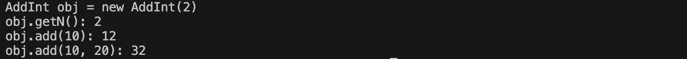
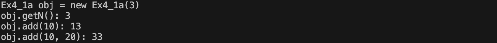
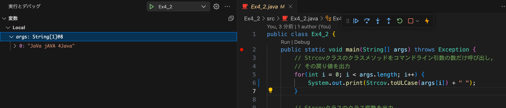
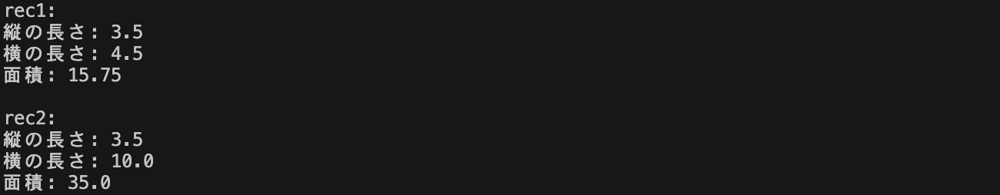
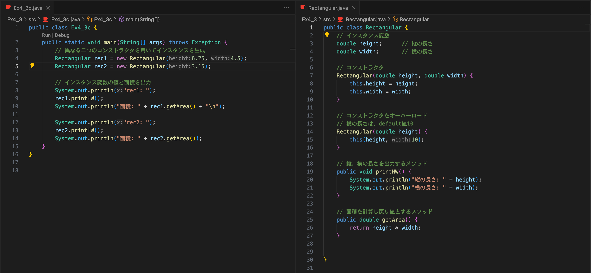
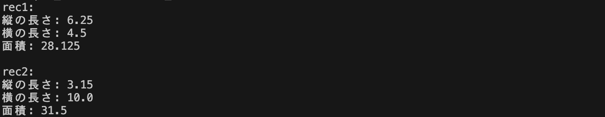

[](https://classroom.github.com/a/tw9xgj7_)
# プログラミング演習II 第４回
* 学籍番号：2264088
* 氏名：河原畑 宏次
* 所属：情報工学EP


# 課題の説明

## 課題1　整数の足し算を行うAddIntクラス
 
<details>
<summary> ソースファイル : 

`Ex4_1/src/Ex4_1.java`

</summary>

``` Java
public class Ex4_1 {
    public static void main(String[] args) throws Exception {
        // AddIntクラスのインスタンスを作成
        AddInt obj = new AddInt(2);

        // メソッドの動作の確認
        System.out.println("AddInt obj = new AddInt(2)");
        System.out.println("obj.getN(): " + obj.getN());
        System.out.println("obj.add(10): " + obj.add(10));
        System.out.println("obj.add(10, 20): " + obj.add(10, 20));
    }
}


class AddInt {
    // インスタンス変数
    private int n;

    // インスタンス変数ｎを初期化するコンストラクタ
    AddInt(int n) {
        this.n = n;
    }

    // インスタンス変数ｎのゲッター
    public int getN() {
        return this.n;
    }

    // インスタンス変数ｎにnumを加算した結果を戻り値とするメソッド
    public int add(int num) {
        return this.n + num;
    }

    // add()をオーバーロード (仮引数２個を他した結果を戻り値とするメソッド)
    public int add(int num1, int num2) {
        return this.n + num1 + num2;
    }
}


```
</details>


### プログラムの説明
* 整数の足し算を行う`AddInt`クラスの中で、
  * ひとつのインスタンス変数ｎを持ち、コンストラクタはこれを初期化する。
  * インスタンスメソッドとして、ｎの値を戻り値とするゲッター`getN()`と、ｎに一個の仮引数の値を加算した結果を戻り値とするメソッド`add()`を定義した。
  * また、メソッド`add()`は、仮引数を２個を足した結果を戻り値とするメソッドをオーバーロードして定義した。

* main()メソッドでは、`AddInt`クラスのインスタンスを作成し、3つのインスタンスメソッドを呼び出し、その動作を確認した。

### 実行結果
* 実行結果は以下のようになり、正しく実行できた。



### 考察
* メソッド`add()`の定義の際に**オーバーロード**を行った。javaでオーバーロードを行うには、ジェネリクスが異なる必要がある。つまり、引数の型や数、順番、データ型が異なれば、オーバーロードすることができる。ここで、戻り値による違いではオーバーロードを行うことができない点に注意が必要である。これは、呼び出し元からは、戻り値のみが異なるメソッド同士を区別することができないためである。

* オーバーロードを行うことで、同様の処理を行うメソッドを、わざわざ名称を変更する必要がなくなるというメリットがある。これにより、メソッドの作成者以外に、メソッドの使用者からしてもわかりやすくなるという利点があると考える。

* Javaにおける`this`について、大きく分けて次のような意味を持つ。
  * コンストラクタ内から、別のコンストラクタを呼び出し
  * 自分自身のインスタンスを指す変数

* 上記の2について、課題のコードでは次のように用いた。Javaでは、同一の名前の変数では、ローカル変数が優先されてしまう。よって、引数の`n`とインスタンスフィールド(クラスフィールド)の`n`を区別するには、インスタンスフィールドの`n`であることを明示する必要があるためである。
```Java
class AddInt {
    private int n;  // インスタンス変数

    // コンストラクタ
    AddInt(int n) {
        this.n = n;
    }
    ~~~ 省略 ~~~
}

```

* 故に、次のようなコードでは、`this`が省略可能であり、実際に実行結果に影響を与えなかった。しかし、今回の課題のコードでは、変数`n`がインスタンス変数であることをわかりやすくするために、あえて省略しなかった。
```Java
class AddInt {
    private int n;  // インスタンス変数

    public int add(int num) {
        return this.n + num;
    }
}

```

---

## 課題1a　 課題１の処理をMainクラスで行う
 
<details>
<summary> ソースファイル : 

`Ex4_1/src/Ex4_1a.java`

</summary>

``` Java
// Ex4_1.java と同様の処理を、main()メソッドを持つクラスのみで実現

public class Ex4_1a {
    public static void main(String[] args) {
        // Ex4_1aクラスのインスタンスを作成
        Ex4_1a obj = new Ex4_1a(3);

        // メソッドの動作の確認
        System.out.println("Ex4_1a obj = new Ex4_1a(3)");
        System.out.println("obj.getN(): " + obj.getN());
        System.out.println("obj.add(10): " + obj.add(10));
        System.out.println("obj.add(10, 20): " + obj.add(10, 20));

    }

    // インスタンス変数
    private int n;

    // インスタンス変数ｎを初期化するコンストラクタ
    Ex4_1a (int n) {
        this.n = n;
    }

    // インスタンス変数ｎのゲッター
    public int getN() {
        return this.n;
    }

    // インスタンス変数ｎにnumを加算した結果を戻り値とするメソッド
    public int add(int num) {
        return this.n + num;
    }

    // add()をオーバーロード (仮引数２個を他した結果を戻り値とするメソッド)
    public int add(int num1, int num2) {
        return this.n + num1 + num2;
    }

}

```
</details>


### プログラムの説明
* 課題１と同様の処理を、AddIntクラスを作成せず、main()メソッドを持つクラス`Ex4_1a`で同様の処理ができるようにした。


### 実行結果
* 実行結果は以下のようになり、確かに課題１と同様の処理を行うことができている。



### 考察
* 課題１では、整数の足し算の計算を行う`AddInt`クラスとは別に、`Ex4_1`クラスを用意し、その中に`main()`メソッドを定義した。しかし、**javaにおいて`main()`メソッドが属する先のクラスの条件は存在しない**。つまり、`main()`メソッドを`AddInt`クラスに配置することで、ひとつのクラスで課題１と同様の処理を行うことができた。

* 課題1aでは、課題１の`AddInt`クラス内に`main()`メソッドを設置し、全体のクラス名を`AddInt`から`Ex1_a`に変更した（課題内容が、`AddInt`クラスを作成しないことが条件であったため）。


---


## 課題2　大文字と小文字に変換するメソッド
 
<details>
<summary> ソースファイル : 

`Ex4_2/src/Ex4_2.java`

</summary>

``` Java
public class Ex4_2 {
    public static void main(String[] args) throws Exception {
        // Strcovクラスのクラスメソッドをコマンドライン引数の数だけ呼び出し,
        // その戻り値を出力
        for(int i = 0; i < args.length; i++) {
            System.out.print(Strcov.toULCase(args[i]) + " ");
        }

        // Strcovクラスのクラス変数を出力
        System.out.println("\n" + Strcov.END);

    }
}


class Strcov {
    // 静的変数
    static String END = "Goodbye";

    // 静的メソッド
    static String toULCase(String str) {
        // 引数の文字列strの１文字目が大文字か小文字かを判断
        // 大文字ならばstrの全ての文字を大文字に変換
        if(Character.isUpperCase(str.charAt(0))) {
            str = str.toUpperCase();
        }
        // 小文字ならばstrの全ての文字を小文字に変換
        else if(Character.isLowerCase(str.charAt(0))) {
            str = str.toLowerCase();
        } 

        return str;
    }

}
```
</details>


### プログラムの説明
* 静的変数`END`と、次のような特徴を持つ静的メソッド`toULCase()`を持つ`Strcov`クラスを作成した。
  * 引数の先頭の文字が大文字ならば、全ての文字を大文字に変換した引数の文字列を戻り値とする。 
  * 引数の先頭の文字が小文字ならば、全ての文字を小文字に変換した引数の文字列を戻り値とする。 
  * 引数の先頭の文字が大文字でも小文字でもないならば、引数の文字列をそのままを戻り値とする。 

* メソッド`toUPCase()`について、
  * 引数の先頭の文字を取得するために、Stringクラスの`charAt()`メソッドを用いた。このメソッドは、引数に取得したい文字列中のindexを指定する。よってここでは、`str.charAt(0)`とすることで文字列strの先頭文字を取得している。
  * そして取得した文字が大文字か小文字か判断するために、Characterクラスの`isUpperCase()`, `isLowerCase()`メソッドを使用した。これらのメソッドは、引数に渡した文字が、大文字(小文字)ならば、`true`を、そうでないなら`false`を戻り値として返す。この戻り値を、if文の条件式として条件分岐を行った。
  * 最後に、全ての文字列を大文字(小文字)にするために、Characterクラスの`toUpperCase()`, `toLowerCase()`メソッドを使った。

* main()メソッドでは、コマンドラインに入力された文字列を、`Strcov`クラスの`toUPCase()`の引数に渡した。この時、コマンドライン引数の数が変化しても対応できるように、`args.length`を用いて、for文の繰り返し回数がコマンドライン引数の数に一致するようにした。

### 実行結果
* コマンドライン引数として、`JaVa jAVA 4Java`を設定して実行した場合


* コマンドライン引数として、`"JaVa jAVA 4Java"`を設定して実行した場合


### 考察
* ２つの実行結果の違いについて、ひとつ目は、このプログラムの使用通りの実行結果が得られた。一方で、２つ目については、`"JaVa jAVA 4Java"`というコマンドライン入力によって、main()メソッドの引数`args[]`が、`args[0] = "JaVa jAVA 4Java"`となり、引数全体がひとつの文字列として認識された。そして、1文字目の'J'が大文字であることから、`toULCase()`メソッドによって、文字列全体が大文字に変換されたと予想される。

* そこで、`"JaVa jAVA 4Java"`というコマンドライン入力で実行した際の、`args[0]`の値をデバッガーを用いて調べてみる。

確かに、`args[0]`が`"JaVa jAVA 4Java"`という文字列であることが確認できた。
---


## 課題3　四角形を表すRectangularクラス
 
<details>
<summary> ソースファイル : 

`Ex4_3/src/Ex4_3.java`

</summary>

``` Java
public class Ex4_3 {
    public static void main(String[] args) throws Exception {
        // 異なる二つのコンストラクタを用いてインスタンスを生成
        Rectangular rec1 = new Rectangular(3.5, 4.5);
        Rectangular rec2 = new Rectangular(3.5);
        
        // インスタンス変数の値と面積を出力
        System.out.println("rec1: ");
        rec1.printHW();
        System.out.println("面積: " + rec1.getArea() + "\n");
        
        System.out.println("rec2: ");
        rec2.printHW();
        System.out.println("面積: " + rec2.getArea());
    }
}


class Rectangular {
    // インスタンス変数
    double height;      // 縦の長さ
    double width;       // 横の長さ

    // コンストラクタ
    Rectangular(double height, double width) {
        this.height = height;
        this.width = width;
    }

    // コンストラクタをオーバーロード
    // 横の長さは、default値10
    Rectangular(double height) {
        this(height, 10);
    }

    // 縦、横の長さを出力するメソッド
    public void printHW() {
        System.out.println("縦の長さ: " + height);
        System.out.println("横の長さ: " + width);
    }

    // 面積を計算し戻り値とするメソッド
    public double getArea() {
        return height * width;
    }


}

```
</details>


### プログラムの説明
* 次の機能を持つ四角形を表す`Rectangular`クラスを作成した。
  * 四角形の縦と横の長さを表すインスタンス変数`height`, `width`を定義した。
  * コンストラクタは、これらのインスタンス変数を、二つの引数からそれぞれ初期化するものと、ひとつの引数を持ち縦の値`height`を定め、横の値`width`はdefault値10で定めるものの二つを定義した。
  * インスタンスメソッドとして、盾と横の長さを出力するメソッド`printHW()`と、面積を計算し戻り値とするメソッド`getArea()`を用意した。


### 実行結果
* 実行結果は以下のようになり、確かに仕様を満たしている。



### 考察
* 課題のコードでは、ふたつのクラスをひとつのファイルにまとめて記述した。しかしこの書き方では、両方のクラスのアクセス修飾子を`public`にすることができなかった。これは、Javaでは、**クラス名の前にpublicをつけて良いのはファイル名とクラス名が一致する時のみ**と決められているからである。

* よって、ひとつのファイルにファイルにふたつのクラスがある時、両方のクラスのアクセス修飾子をpublicに指定したいときは、ふたつのクラスをそれぞれ独立したファイルに記述する必要がある。実際にクラスをファイル単位で分けて実行した様子を次に示す。

↓ 実行結果は課題で示したものと同様になった。


* また、課題のソースコードのように、ファイルを分割しなかった場合、片方のクラスにはアクセス修飾子をつけることができない。このように、アクセス修飾子が何もつかなかった場合(デフォルト設定)は、同一パッケージからのみアクセス可能となる。一方で、`public`のアクセス修飾子がつくと、アクセスの制限はかからない。

---

## 課題4　テストの点数を扱うクラスとObject型の配列の操作
 
<details>
<summary> ソースファイル : 

`Ex4_4/src/Ex4_4.java`

</summary>

``` Java
import java.util.Random;

public class Ex4_4 {
    public static void main(String[] args) throws Exception {
        // 5人のテスト結果を扱うために5つのTestインスタンスを配列として宣言
        Test tests[] = new Test[5];

        // ランダムな数値の生成のためのRandomクラスのインスタンス
        Random rand = new Random(); 

        // 学籍番号とテストの結果をインスタンスに代入して初期化
        // テストの点数は、0 ~ 100 でランダムに生成
        for(int i = 0; i < tests.length; i++) {
            tests[i] = new Test(i+1, rand.nextInt(101), rand.nextInt(101), rand.nextInt(101));
        }

        // 5人全員の学籍番号、３教科の点数と合計、平均点を出力
        System.out.println("学籍番号 国語 数学 合計 平均");
        for(int i = 0; i < tests.length; i++) {
            // 学籍番号、国語、数学、合計を出力
            tests[i].print();
            // 平均を出力
            System.out.println(String.format("%10.6f", tests[i].average()));
        }

        // 総合計を出力
        System.out.println("総合計: " + Total.total(tests));

    }
}
```
</details>

<details>
<summary> ソースファイル : 

`Ex4_4/src/Test.java`

</summary>

``` Java
// テストの点数を扱うクラス
public class Test {
    // インスタンス変数
    int studentID;
    int JapScore;
    int EngScore;
    int mathScore;
    int totalScore;

    // コンストラクタ
    Test(int studentID, int JapScore, int  EngScore, int mathScore) {
        // インスタンス変数の初期化
        this.studentID = studentID;
        this.JapScore = JapScore;
        this.EngScore = EngScore;
        this.mathScore = mathScore;
        this.totalScore = this.sum();
    }


    // ３科目の合計点を計算するメソッド
    private int sum() {
        return this.JapScore + this.EngScore + this.mathScore;
    }

    // 合計点(totalScore)を返すゲッター
    public int getSum() {
        return this.totalScore;
    }

    // インスタンス変数を5つ出力するメソッド
    public void print() {
        System.out.printf("%7d %4d %4d %4d ", studentID, JapScore, EngScore, mathScore, totalScore);
    }

    // ３科目の平均点を計算し、戻り値とするメソッド
    public double average() {
        return (double)(JapScore + EngScore + mathScore) / 3;
    }
}
```
</details>

<details>
<summary> ソースファイル : 

`Ex4_4/src/Total.java`

</summary>

``` Java
// Testクラスの配列を受け取り、全員の合計点を総合計するクラス
public class Total {
    // Test[]を引数として、総合計を求める静的メソッド
    public static int total(Test[] tests) {
        // 総合計を保存するローカル変数
        int sum = 0;

        for(int i = 0; i < tests.length; i++) {
            sum += tests[i].totalScore;
        }

        // 総合計を返す
        return sum;
    }

}
```
</details>


### プログラムの説明
* テストの点数を扱う`Test`クラスをについて
  * int型で、学籍番号、国語、英語、数学の点数と、３教科の合計点を保存する5つのインスタンス変数を定義した。
  * コンストラクタとして、4つの引数を受け取り、上に記したインスタンス変数を初期化した。ここで、３教科の合計点を保存するインスタンス変数については、後述するインスタンスメソッド`sum()`と引数の値を用いて計算し初期化した。
  * 次の4つのメソッドを定義した。
    * ３科目の合計点(各インスタンス変数の値の和)を計算し、その値を戻り値とする`sum()`。
    * 合計点のインスタンス変数`totalScore`のゲッター`getSum()`。
    * 5つのインスタンス変数を出力する`print()`。
    * ３科目の平均点をdouble型にキャストして計算し、その値を戻り値とする`average()`。

* `Total`クラスでは、Testクラス型の配列を受け取り、受け取った各インスタンスが持つ合計点`totalScore`を合計し、総合計を計算し戻り値とするメソッド`total()`を定義した。

* main()メソッドでは、5人のテスト結果を扱うために、人数分のTestインスタンスを配列として生成した。このとき、インスタンス変数を初期化するためにコンストラクタに渡す引数の値は、学籍番号は1 ~ 5とし、３科目の点数は、0 ~ 100のランダムな整数とした。そしてインスタンスを生成後、5人全員の学籍番号、３教科の点数と合計、平均点をTestクラスのインスタンスメソッド`print()`, `average()`を用いて出力した。また、Totalクラスのインスタンスメソッド`total()`を用いて、5人の点数の総合計も出力した。

* ランダムな0 ~ 100の数値の生成には、`Random`クラスのメソッド`nextInt()`を用いた。このメソッドは、0から引数に渡された整数**未満**のランダムな整数を返す。ただし、このメソッドで生成される乱数は擬似乱数であり、そのシード値は、インスタンス生成時のコンストラクタの引数に依存する。ただし今回のコードのように、引数を指定しなかった場合は、現在時刻がシード値として使用される。

### 実行結果
* 実行結果は以下のようになり、仕様を満たしている。また、何度か実行しテストの点数が０以上100以下でランダムに生成されていることを確認できた。


### 考察
* object型の配列は、データ型の配列のように、new演算子で要素数を確保しただけではインスタンスが生成されず使用できない。そのため次のように、要素を確保した後、さらにnew演算子とコンストラクタによってインスタンスを生成する必要がある。

```Java
Test[] test = new Test[3];

test[0] = new Test (…);
test[1] = new Test(…);
test[2] = new Test(…);
```

* また、配列の初期化の場合も、new演算子とコンストラクタを用いて次のように記述する必要がある。

```Java
Test[] tests = {
    new tests(…), 
    new tests(…), 
    new tests(…)
};
```

* `Total.java`について、引数に受け取った`Test`クラスのインスタンスに対して、そのインスタンス変数を直接操作している。このように、他クラスからインスタンス変数を直接操作できてしまうとセキュリティに問題がある。よって、インスタンス変数は`private`指定子を付けて、セッターとゲッターを介してインスタンス変数を操作する、カプセル化を行う必要があった。
よって、これを踏まえカプセル化を行なったソースコードを以下に示す。

```Java
public class Ex4_4 {
    // [変更]　インスタンス変数にprivate指定子を付与
    private int studentID;
    private int JapScore;
    private int EngScore;
    private int mathScore;
    private int totalScore;

     ~~~~~~

    // [追加]　インスタンス変数totalScoreのゲッター
    public int getTotalScore() {
        return this.totalScore;
    }
}
```

```Java
public class Total {

    ~~~~~~

    // [変更] ゲッターから合計点を取得
    for(int i = 0; i < tests.length; i++) {
        sum += tests[i].getTotalScore();
    }
}
```
---


# 参考文献
> * ENGINEER.CLUB. Javaのthisを総ざらい! this/this()の意味・使い方. https://www.bold.ne.jp/engineer-club/java-this. (2023/11/2 参照)
> 
> * ENGINEER.CLUB. Javaの実行に欠かせないmainメソッド、その仕組みからしっかり解説. https://www.bold.ne.jp/engineer-club/java-main. (2023/11/2 参照)  
>
> * 【Java】アクセス修飾子についてまとめた. https://zenn.dev/miya_akari/articles/7012029ec5455d. (2023/11/3 参照)
>
> * workteria. 【Java】ランダムな値を生成してみよう！Randomクラスの使い方！　java.util.Random. https://workteria.forward-soft.co.jp/blog/detail/10071. (2023/11/2 参照)
>
> * UX MILK. Javaで指定範囲の乱数を生成する：Random.nextInt(). https://uxmilk.jp/47989. (2023/11/3 参照)
>
> * オブジェクトの配列. http://www.dicre.com/java/array/. (2023/11/3 参照)


# 謝辞
* 特になし

# 感想など
* 課題とは別に、gitにおいて、大文字と小文字の区別がされない設定になっていたためその変更に時間がかかった。
