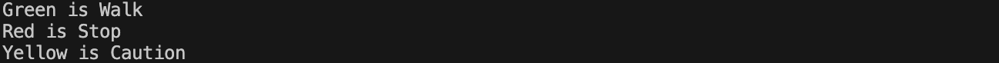

[](https://classroom.github.com/a/LdT8K2_x)
# プログラミング演習II 第５回
* 学籍番号：2264088
* 氏名：河原畑 宏次
* 所属：情報工学EP


# 課題の説明

## 課題1　クラスの継承とキャスト
 
<details>
<summary> ソースファイル : 

`J5_1/src/J5_1.java`

</summary>

``` Java
public class J5_1 {
    public static void main(String[] args) throws Exception {
        ClassA a = new ClassC();
        a.print();
        
        a = new ClassB();
        a.print();

        a = new ClassA();
        a.print();
    }
}
```
</details>

<details>
<summary> ソースファイル : 

`J5_1/src/ClassA.java`

</summary>

``` Java
public class ClassA {
    public void print() {
        System.out.println("ClassA");
    }
}
```
</details>

<details>
<summary> ソースファイル : 

`J5_1/src/ClassB.java`

</summary>

``` Java
public class ClassB extends ClassA {
    // スーパークラスのprint()メソッドをオーバーロード
    public void print() {
        // スーパークラス (= ClassA) のprint()メソッドを呼び出し
        super.print();

        System.out.println("ClassB");
    }
}
```
</details>

<details>
<summary> ソースファイル : 

`J5_1/src/ClassC.java`


</summary>

``` Java
public class ClassC extends ClassB {
    // スーパークラスのprint()メソッドをオーバーロード
    public void print() {
        // スーパークラス (= ClassB) のprint()メソッドを呼び出し
        super.print();

        System.out.println("ClassC");
    }
}
```
</details>


### プログラムの説明
クラス`ClassA`を継承するクラス`ClassB`とそのクラスClassBを継承する`ClassC`を作成した。

各クラスは、自身のクラス名`Class*`を表示する`print()`メソッドを持つ。ただし、サブクラスでオーバーライドしたprint()メソッドでは、スーパークラスのprint()メソッドを呼び出すために、`super.print()`を記述した。


### 実行結果
*  main()メソッドで、次のように記述した場合
```Java
ClassA a = new ClassC();
a.print();
a = new ClassB();
a.print();
a = new ClassA();
a.print();
```


これは、下記の手順により各`print()`メソッドが実行されたためだと考える
1. `ClassA a = new ClassC()`によって、オブジェクト`a`には`ClassC`のインスタンスへの参照が保存される。
2. よって、その次の行の`a.print()`では、`ClassC`のメソッドが呼び出される。
   1. ClassCのprint()メソッドでは、最初に、`super.print()`と記述することで、スーパークラスである`ClassB`のprint()メソッドが呼び出される。
   2. 呼び出された`ClassB`のprint()メソッドは、同様に`ClassA`のprint()メソッドを呼び出す。
   3. 呼び出された`ClassA`のprint()メソッドでは、自身のクラス名である**ClassAを出力**し、呼び出しもとの`ClassB`に戻る。
   4. `ClassB`では、自身のクラス名である**ClassBを出力**し、呼び出しもとの`ClassC`に戻る。
   5. `ClassC`では、自身のクラス名である**ClassCを出力**する。
3. `a = new ClassB()`によって、オブジェクト`a`には`ClassB`のインスタンスへの参照が保存される。
4. よって、その次の行の`a.print()`では、`ClassB`のメソッドが呼び出される。
5. 以下同様。  
  

* main()メソッドで、次のように記述した場合
```Java
ClassC c = new ClassA();
c.print();
```


### 考察
  
#### アップキャストについて
  * `ClassA a = new ClassC()`のように、サブクラス`ClassC`のインスタンスへの参照を、スーパークラス`ClassA`の型の変数に保存することを、**アップキャスト**という。
  * サブクラスはスーパークラスの持つメソッドやフィールドは全て持つため、明示的な括弧()を用いたキャストは必要ない。また**アップキャスト後は、スーパークラスの継承によって受け継いだフィールドとメソッドのみを使用可能**である。
  * ただし、クラスが持つメソッドについては、実際は**クラスはメソッドの実態を持つのではなく、どこかに保存されたメソッド本体への参照を持つ**。さらに、サブクラスでオーバーライドされたメソッドは、スーパークラスから継承したメソッドとして認識され、アップキャスト後も使用可能である。しかし、**オーバーライドしたサブクラスのメソッドの参照先は、オーバーライドによって新しく定義したメソッドとなっている**ということに注意する必要がある。
  * メソッドはオーバーライドしても、スーパークラスから継承したものと認識され、アップキャスト後も使用可能なのに対して、スーパークラスで定義した変数と同じ名前と型の変数をサブクラスで定義したとしても、それはスーパークラスから継承したものと認識されず、アップキャスト後はこの新しくサブクラスで定義した変数は使用できず、スーパークラスで定義され、サブクラスに継承された変数は使用可能である。
  * まとめると、スーパークラスの型にアップキャストを行うと、スーパークラスから継承したものしか使えなくなり、同じ名前のフィールド変数はスーパークラスのものを扱い、同じ名前のメソッドはサブクラスのものを扱う。
  * これらは下記のサイトの画像を見ると理解しやすかった。


> 
> <br>
> 出典: 回りながら進む. Javaにおけるクラスのアップキャストについて分かったこと. https://1iyui.hatenablog.com/entry/2020/04/17/192344
> 

<br>

#### ダウンキャストについて
  * アップキャストとは逆に、スーパークラスのインスタンスへの参照をサブクラスの型の変数に保存することを、**ダウンキャスト**という。
  * スーパークラスはサブクラスが持つフィールドや変数などを持たない場合がほとんどである。よってダウンキャストは、括弧()を用いて明示的に行い、さらに、**一度アップキャストしたオブジェクトにのみ使用可能**である。
  * 実行結果においては、エラーとなったのは、明示的に括弧()を用いずにアップキャストしていたり、一度アップキャストしたオブジェクトに対してダウンキャストを行ったわけではないことが原因だと考える。
  * 実際に、次のようにmain()メソッドを変更すると、エラーなくダウンキャストを行うことができた。
     ```Java
        public static void main(String[] args) throws Exception {
            // アップキャスト
            ClassA a = new ClassC();
            a.print();
            
            // 一度アップキャストしたaを明示的にダウンキャスト
            ClassC c = (ClassC)a;
            c.print();
        }
     ```
    実行結果は次のようになった。
    


---


## 課題2　抽象クラスとアクセス修飾子
 
<details>
<summary> ソースファイル : 

`J5_2/src/J5_2.java`

</summary>

``` Java
public class J5_2 {
    public static void main(String[] args) throws Exception {
        // Light型のインスタンス保存する配列 lights を生成
        Light[] lights = new Light[3];
        lights[0] = new Green("Walk");
        lights[1] = new Red("Stop");
        lights[2] = new Yellow("Caution");

        // 拡張for文を使って、lights[]の各インスタンスのprint()メソッドを呼び出し
        for(Light light: lights) {
            light.print();
        }
    }
}
```
</details>

<details>
<summary> ソースファイル : 

`J5_2/src/Light.java`

</summary>

``` Java
abstract class Light {
    // 指示の文字列を保持する変数
    protected String str;

    // インスタンス変数strを初期化するコンストラクタ
    Light(String str) {
        this.str = str;
    }

    // 指示を出力する抽象メソッド
    abstract void print();
}
```

</details>

<details>
<summary> ソースファイル : 

`J5_2/src/Red.java` `J5_2/src/Green.java` `J5_2/src/Yellow.java` 

</summary>

```Java
public class Red extends Light {
    // インスタンス変数
    // String str;  (Light class)

    public Red(String str) {
        // スーパークラス Light のコンストラクタを使用して文字列strを初期化
        super(str);        
    }

    @Override
    // 指示を出力するprint()メソッドを実装
    void print() {
        System.out.println("Red is " + str);
    }        
}
```
</details>


### プログラムの説明
抽象クラス`Light`として、指示の文字列を保持するインスタンス変数`str`と、それを初期化するコンストラクタ、その指示を出力する抽象メソッド`print()`を定義した。
この抽象クラスLightを継承するクラス`Red, Green, Yellow`を作成し、これらのクラスは共通して、指示を初期化するコンストラクタと、抽象メソッドをオーバーライドし実装した`print()`メソッドを持つ。具体的には、各クラスで、指示の内容を表す変数`str`を用いて、"[クラス名] is str"と出力するようにした。

main()メソッドでは、Greenクラスには"Walk"、Redクラスには"Stop"、Yellowクラスには"Caution"の指示を与えてインスタンスを作成した。その際、各クラスのスーパークラスである`Light`型の配列として各インスタンスの参照を保存した。そしてこの配列と拡張for文を用いて、各インスタンスで`print()`メソッドを実行した。

### 実行結果
* クラスLightの`str`の修飾子が`private`の場合
次のようなエラーが発生した。


* クラスLightの`str`の修飾子が`protected`の場合
正しく実行できた。


* クラスLightの`str`の修飾子が`修飾子なし`の場合
同じく正しく実行できた。


### 考察
#### アクセス修飾子と実行結果の関係について
  * 提出したコードの中で、RedクラスやGreenクラス、Yellowクラスの`print()`メソッドにおいて、スーパークラスのインスタンス変数`str`に直接アクセスさせている。しかし、アクセス修飾子`private`スーパークラスのを変数strにつけると、そのクラスのコードからしかアクセスできないように制限される。その結果、サブクラス出るこれらのクラスからは、変数strを直接アクセスすることができなくなり、これがエラーの原因である。
  * 一方で、変数strに`protected`修飾子をつけた場合は、エラーが起きなかった。protectedで修飾された変数は、そのクラスとサブクラスまでアクセスを許すため、サブクラスからスーパークラスの変数strを直接アクセスしてもエラーが出なかった。
  * 同様に、アクセス修飾子をつけなかった場合もエラーが起きなかったが、エラーが起きなかったが、これは、アクセス修飾子がない場合は、現在のクラスと同じパッケージ内のクラスからのみアクセスできるように制限するためである。
  * 今回のコードでは、全てパッケージの宣言は行なっていないが、パッケージの宣言を行わなかった場合でも、名前のないパッケージとして扱われる。そしてパッケージは一般的には、同一ディレクトリ中のソースコードのことを指すために、今回のソースコードは全て同一パッケージに含まれていることとなる。

<br>
  
 #### `@Override`について
  * Javaのソースコードにおいて、`@ ~ `と書かれるものを、アノテーションと呼び、注釈、注記といった意味を持つ。この中で、`@Override`は、記述するメソッドがスーパークラスのメソッドをオーバーライドしていることを明示的にさせるために用いられる。また、このアノテーションの記述をしたのにも関わらず、スーパークラスにないメソッドを記述するとエラーを発生してくれるため、メソッド名の誤記などからオーバーライドができていない、というような事態を防ぐことができる。

---


## 課題3　円を表すクラスを継承する球、円柱、円錐を表すクラス
 
<details>
<summary> ソースファイル : 

`J5_3/src/J5_3.java`

</summary>

``` Java
public class J5_3 {
    public static void main(String[] args) throws Exception {
        // 改行コードを取得
        final String BR = System.getProperty("line.separator");

        // Circle, Sphere, Cylinder, Cone の各クラスのインスタンスを作成
        Circle circle = new Circle(4.0);
        Sphere sphere = new Sphere(4.0);
        Cylinder cylinder = new Cylinder(4.0, 3.5);
        Cone cone = new Cone(4.0, 3.5);

        // 円の半径と面積を出力
        System.out.println("円の半径: " + circle.getRadius());
        System.out.println("円の面積: " + String.format("%6.3f", circle.getArea()) + BR);
        
        // 球の半径と体積を出力
        System.out.println("球の半径: " + sphere.getRadius());
        System.out.println("球の体積: " + String.format("%6.3f", sphere.getVol()) + BR);
        
        // 円柱の半径と面積を出力
        System.out.println("円柱の半径: " + cylinder.getRadius());
        System.out.println("円柱の高さ: " + cylinder.getHeight());
        System.out.println("円柱の体積: " + String.format("%6.3f", cylinder.getVol()) + BR);

        // 円錐の半径と面積を出力
        System.out.println("円錐の半径: " + cone.getRadius());
        System.out.println("円錐の高さ: " + cone.getHeight());
        System.out.println("円柱の体積: " + String.format("%6.3f", cone.getVol()));        
        
    }
}

```
</details>

<details>
<summary> ソースファイル : 

`J5_3/src/Circle.java`

</summary>

```Java
public class Circle {
    // 半径を保持するインスタンス変数。protectedによりサブクラス以外のアクセスを制限
    protected double radius;

    // 半径 radius を初期化するコンストラクタ
    Circle(double radius) {
        this.radius = radius;
    }

    // 円の面積を計算し、その値を戻り値とするインスタンスメソッド
    public double getArea() {
        return Math.PI * radius * radius;
    }

    // 半径の値を戻り値とするインスタンスメソッド
    public double getRadius() {
        return radius;
    }

}
```
</details>

<details>
<summary> ソースファイル : 

`J5_3/src/Sphere.java`

</summary>

```Java 
public class Sphere extends Circle {
    // 半径 radius を初期化するコンストラクタ
    Sphere(double radius) {
        super(radius);
    }

    // 球の体積を計算し、その値を戻り値とするインスタンスメソッド
    public double getVol() {
        return 4 / 3.0 * Math.PI * Math.pow(radius, 3);
    }
}

```
</details>

<details>
<summary> ソースファイル : 

`J5_3/src/Cylinder.java`

</summary>

``` Java
public class Cylinder extends Circle {
    // 高さを保持するインスタンス変数
    protected double height;
    
    // 半径radiusと高さheightを初期化するコンストラクタ
    Cylinder(double radius, double height) {
        super(radius);
        this.height = height;
    }

    // 高さheightを戻り値とするメソッド
    public double getHeight() {
        return height;
    }

    // 円柱の体積を計算し、その値を戻り値とするメソッド
    public double getVol() {
        // スーパークラスのgetArea()メソッドで円の面積 (= 底面積) を取得
        return super.getArea() * height;
    }

}

```
</details>

<details>
<summary> ソースファイル : 

`J5_3/src/Cone.java`

</summary>

```Java 
public class Cone extends Circle {
    // 高さを保持するインスタンス変数
    protected double height;

    // 半径radiusと高さheightを初期化するコンストラクタ
    Cone(double radius, double height) {
        super(radius);
        this.height = height;
    }

    // 高さheightを戻り値とするメソッド
    public double getHeight() {
        return height;
    }

    // 円錐の体積を計算し、その値を戻り値とするメソッド
    public double getVol() {
        // スーパークラスのgetArea()メソッドで円の面積 (= 底面積) を取得
        return super.getArea() * height / 3.0;
    }
    
}

```
</details>

### プログラムの説明
円を表すクラス Circle とそのサブクラスとして球を表すクラスSphere、円柱を表すクラス Cylinder、円錐を表すクラス Cone を作成した。
クラス `Cirlce` では
* 半径を保持するインスタンス変数 `radius` 
* 引数を１つとり radius を初期化するコンストラクタ
* 円の面積を計算し、その値を戻り値とするインスタンスメソッド `getArea()`
* 半径の値を戻り値とするインスタンスメソッド `getRadius()`

を定義した。

クラス `Sphere` は　Circle をスーパークラスとするサブクラスで

* 引数を１つとりスーパークラスから継承したインスタンス変数 `radius` を初期化するコンストラクタ
* 球の体積を計算し、その値をを戻り値とするインスタンスメソッド `getVol()`

を定義した。

クラス `Cylinder` は Circle をスーパークラスとするサブクラスで

* 高さを保持する変数 height
* 引数を２つとり `radius` と `height` を初期化するコンストラクタ
* 高さの値を戻り値とするインスタンスメソッド `getHeight()`
* 円柱の体積を計算し、その値を戻り値とするインスタンスメソッド `getVol()`

を定義した。

クラス `Cone` は Circle をスーパークラスとするサブクラスで

* 高さを保持する変数 `height`
* 引数を２つとり `radius` と `height` を初期化するコンストラクタ
* 高さの値を戻り値とするインスタンスメソッド `getHeight()`
* 円錐の体積を計算し、その値を戻り値とするインスタンスメソッド `getVol()`
 
を定義した。

main()メソッドでは、各クラスのインスタンスを１つずつ生成し、円は半径と面積を、球は半径と体積を、円柱、円錐に関しては、半径と高さと体積を出力した。


### 実行結果
* 実行すると以下のように仕様通りの出力を得た。


### 考察
#### 工夫した点
* Circleクラスで定義した、半径を表すインスタンス変数`radius`は、サブクラスでも使用するため、`protected`修飾子をつけ、セキュリティ面の対策を行なった。
* 工夫した点として、円柱を表す`Cylinder`クラスの体積を求める`getVol()`メソッドにおいて、底面積の計算は、スーパークラス`Circle`の円の面積を求める`getArea()`メソッドを利用した。
* また、円錐を表`Cone`クラスは、円柱を表す`Cylinder`クラスとメソッドと変数が一致している。よって、ConeクラスはCylinderクラスを継承することで、より簡潔にコードを書くことができると考えた。

<br>

#### ダウンキャストの実装
* 課題3では、main()メソッドで扱った全てのクラスが`Circle`クラスを継承している。そこで、main()メソッドで、それぞれ別々のクラスの型を用いてインスタンスを生成した処理を、Circleクラス型の配列で処理してみることにする。実装したコードと実行結果を以下に示す。

<details>
<summary> ソースファイルと実行結果

`J5_3/src/J5_3c.java`

</summary>

```Java 
public class J5_3c {
    public static void main(String[] args) throws Exception {
        // 改行コードを取得
        final String BR = System.getProperty("line.separator");

        // アップキャスト
        // Circle, Sphere, Cylinder, Cone の各クラスのインスタンスを作成
        Circle[] objects = {
            new Circle(4.0),
            new Sphere(4.0),
            new Cylinder(4.0, 3.5),
            new Cone(4.0, 3.5),
        };

        // 円の半径と面積を出力
        System.out.println("円の半径: " + objects[0].getRadius());
        System.out.println("円の面積: " + String.format("%6.3f", objects[0].getArea()) + BR);
        
        // 以下、ダウンキャストを使用
        
        // 球の半径と体積を出力
        System.out.println("球の半径: " + ((Sphere)objects[1]).getRadius());
        System.out.println("球の体積: " + String.format("%6.3f", ((Sphere)objects[1]).getVol()) + BR);
        
        // 円柱の半径と面積を出力
        System.out.println("円柱の半径: " + ((Cylinder)objects[2]).getRadius());
        System.out.println("円柱の高さ: " + ((Cylinder)objects[2]).getHeight());
        System.out.println("円柱の体積: " + String.format("%6.3f", ((Cylinder)objects[2]).getVol()) + BR);

        // 円錐の半径と面積を出力
        System.out.println("円錐の半径: " + ((Cone)objects[3]).getRadius());
        System.out.println("円錐の高さ: " + ((Cone)objects[3]).getHeight());
        System.out.println("円柱の体積: " + String.format("%6.3f", ((Cone)objects[3]).getVol()));
        
    }
}
```
実行結果 :
変更前と同じように動作した。

</details>

* 課題１の考察でも述べたように、「**クラス型のアップキャスト後は、スーパークラスから継承したメソッドや変数しか使えなくなり、サブクラスで同名の変数やオーバーライドによって同名のメソッドを定義している場合は、同名の変数はスーパークラスのものを扱い、同名のメソッドはサブクラスのものを扱う**」とのことだった。
* このコードでは、クラスのアップキャストを利用している。よって、上記に当てはまる、SphereクラスやConeクラスなどサブクラスで独自に定義された`getVol()`メソッドや`getHeight()`メソッドなどは、アップキャスト後の`objects[i]`では使用できない。よって、これらを利用するために、ダウンキャストを行った。
* ダウンキャストについて、課題１の考察で述べたように、次のような条件を満たす必要がある。このコードではこれらに注意してダウンキャストを行った。
  * 括弧()を用いて明示的にキャストを行う必要がある。
  * 一度アップキャストしたものに限り、ダウンキャストを行うことができる。
 

---
## 課題4　縦横３×３の９マスに記号①、②、③を交互にランダムな場所に置くプログラム

<details>
<summary> ソースファイル : 

`J5_4/src/J5_4.java`

</summary>

``` Java
public class J5_4 {
    public static void main(String[] args) throws Exception {
        // Computerクラスのインスタンスを3つ作成
        Computer[] computers = {
            new Computer('①'),
            new Computer('②'),
            new Computer('③')
        };

        // 3x3のボードの初期化
        Board.clear();

        int index = 0;  // 配列computersのindexに使用

        // 3つのComputerクラスのインスタンスが交互にBoardのマスに自身のシンボルを置くようにする
        while(computers[index].put()) {
            Board.print();
            // indexが0 ~ 2をループするようにインクリメント
            index = (index == 2) ? 0 : index+1;
        }
    }
}
```
</details>

<details>
<summary> ソースファイル : 

`J5_4/src/Board.java`

</summary>

``` Java
abstract class Board {
    // 3x3のボードを模した静的なchar型の配列
    static protected char[][] board = new char[3][3]; 

    // 3x3のマスに記号を置くための抽象メソッド
    abstract boolean put();

    // 全マスを'○'で初期化する静的メソッド
    static public void clear() {
        for(int i = 0; i < board.length; i++) {
            for(int j = 0; j < board[i].length; j++) {
                board[i][j] = '〇';
            }
        }
    }

    // 全マスの内容を表示する静的メソッド
    static public void print() {
        for(char[] row : board) {
            for(char col : row) {
                System.out.print(col);
            }

            // 行ごとに改行
            System.out.println("");   
        }

        // 3x3のボードごとに改行
        System.out.println(""); 
    }
    
}
```
</details>

<details>
<summary> ソースファイル : 

`J5_4/src/Computer.java`

</summary>

``` Java
import java.util.Random;

public class Computer extends Board {
    // 記号用の変数を保存するインスタンス変数
    private char symbol;

    // 記号用の変数を初期化するコンストラクタ
    public Computer(char symbol) {
        this.symbol = symbol;
    } 

    @Override
    // 3x3のマス（board[][]）の空いているマスのうちランダムな箇所に記号を置くメソッド
    // どこにも置く場所がなかった場合は false を戻り値として返す  
    public boolean put() {
        Random rd = new Random();
        int randNum = -1;     // ランダムに決められた数(0 ~ 8)を保存
        int rowIndex = -1;    // 2次元配列boardの行のindex
        int colIndex = -1;    // 2次元配列boardの列のindex

        // ボードに記号を置くことができるかどうかを判断
        if(check()) {
            // 置くことができるならば、置ける場所が見つかるまで試行
            do {
                randNum = rd.nextInt(9);    // 0 ~ 8
                rowIndex = randNum / 3;     // 行のindex
                colIndex = randNum % 3;     // 列のindex
            } while(board[rowIndex][colIndex] != '〇');

            // 見つけた置ける場所に、記号（symbol）を代入
            board[rowIndex][colIndex] = symbol;

            return true;    // 置くことができたのでtrueを返す
        } else {
            return false;   // 置く場所がないのに呼ばれたのでfalseを返す
        }

    }

    // 3x3のボード上にまだ置ける場所が残っているか確認するメソッド
    // 置くことができればtrue, これ以上置く場所がなければfalseを返す
    private boolean check() {
        boolean flag = false;

        for(int i = 0; i < board.length; i++) {
            for(int j = 0; j < board[i].length; j++) {
                // 置くことができる場所があった時点で戻り値trueを確定させる
                if(board[i][j] == '〇') {
                    flag = true;
                    return flag;
                }
            }
        }

        return flag;
    }
}
```
</details>

### プログラムの説明
抽象クラス `Board` には、９マス用の３×３の静的な 静的なchar型の2次元配列`board`をを定義した。
また、抽象メソッドとして、マスに記号を置くための `put()` を定義し、静的メソッドとして、全マスを'〇'で、初期化する `clear()` と、全マスの内容を表示する `print()` を作成した。

`print()`メソッドでは、拡張for文を二重にネストさせて使っており、一つ目の拡張for文では、`board[3][3]`のうち、変数`row`で`board[i][*] (i = 1 ~ 3)`にアクセスし、二つ目の拡張for文では、変数`col`で`board[*][j] (j = 1 ~ 3)` にアクセスしている。

Board クラスを継承する `Computer` クラスでは、記号用の変数を初期化するコンストラクタと Board クラスで定義された抽象メソッド `put()` を実装した。

`put()`メソッドでは、乱数を用いてマスの空いたところ(`board[][] == 〇`)に記号を置くために、`check()`メソッドを呼び出し、その戻り値によってマスに置くことができる場所が残っているかを確認した。そして、置く場所があるのならば、おける場所が見つかるまで乱数を発生させ、見つけた場所に記号`symbol`を代入して、置くことができたことを呼び出し元に示すために戻り値`true`を返す。また、`check()`メソッドによって、マスにこれ以上置く場所がないのにput()メソッドが呼び出されたと分かった際には、戻り値として`false`を返すようにしている。

`main()`メソッドでは、Computer クラスのオブジェクトを３つ作成し、それぞれに記号'①'、'②'、'③'をもたせ、各オブジェクトが交互に`put()`メソッドを呼び、オブジェクトが持つ記号をマス`board`に置くようにした。また、この一連の処理をwhile文によってループさせているが、その終了条件は、マスに記号を置くことができたかを表す`put()`メソッドの戻り値に設定することで制御している。


### 実行結果
* 以下のように、仕様通りに実行できた。


### 考察
#### 工夫した点
* プログラムの説明にて述べたように、メソッド`put()`の実装のために、`check()`メソッドを定義した。このcheck()メソッドは、外部で使用されることはなく、同じComputerクラスのput()メソッド内でしか使用されない。よって、メソッドに`private`修飾子をつけて、アクセスの制限を設けた。

#### 効率的な重複しない乱数の発生について
* このコードでは、乱数を発生させてchar型の2次元配列`board[][]`に記号を代入しているが、その際に、記号が入っておらず新たに記号を置くことができるマスを探し出すために、何度もランダムな値を発生させてさせて試行している。つまり、**数を打つことでマスを探し出しており、非常に効率が悪い**。このような、「数撃ちゃ当たる」アルゴリズムではない効率的なアルゴリズムを考えたい。

* そこで、課題で用いる 0 ~ 8 の乱数について、次のような手順を使うことで、一度発生した数を避けて乱数を生成できると考えた。一連のアルゴリズムを以下に示す。
  1. 0 ~ 8 の数値を`ArrayList <Integer>`のリストにひとつずつ保存する。
  2. ArrayList のサイズを用いて、0 ~ (リストのサイズ − 1) の乱数を発生させる。
  3. 発生した乱数に対応する　index　のリストの要素を、乱数としてput()メソッドなどに使用する。
  4. 発生した乱数の index に対応するリストの要素を削除する。
  5. 以降、手順iiから手順ivの繰り返し
  6. ArrayList のサイズが０になったら終了


* 実際に、このアルゴリズムを用いて改善したソースコードを以下に示す（ソースコードの変更は、`Computer`クラスのみである）。また、クラス変数としての`ArrayList`を初期化するにあたって、`staticイニシャライザ`を用いた。

<details>
<summary> ソースファイル : 

`J5_4_new/src/Computer_new.java`

</summary>

```Java
import java.util.ArrayList;
import java.util.Random;

public class Computer_new extends Board_new {
    // 記号用の変数を保存するインスタンス変数
    private char symbol;

    // [追加] 乱数のベースを保存するリスト
    static private ArrayList<Integer> list = new ArrayList<>();
    // [追加] listの初期化
    static {
        for(int i = 0; i < 9; i++) {
            list.add(i);
        }
    }

    // 記号用の変数を初期化するコンストラクタ
    public Computer_new(char symbol) {
        this.symbol = symbol;
    } 

    @Override
    // 3x3のマス（board[][]）の空いているマスのうちランダムな箇所に記号を置くメソッド
    // どこにも置く場所がなかった場合は false を戻り値として返す  
    public boolean put() {
        // ボードに記号を置くことができるかどうかを判断
        if(check()) {
            // [変更] 置くことができる場合はランダムな場所に記号を設置
            // [変更] ランダムな数値は、getRandNum()メソッドを通じて、重複なく取得
            int randNum = getRandNum();
            int rowIndex = randNum / 3;
            int colIndex = randNum % 3;
            board[rowIndex][colIndex] = symbol;

            return true;    // 置くことができたのでtrueを返す
        } else {
            return false;   // 置く場所がないのに呼ばれたのでfalseを返す
        }

    }


    // [追加] 重複なく乱数を返すメソッド
    private int getRandNum() {
        Random rd = new Random();
        int index = 0;
        
        // 0 ~ (listのサイズ - 1) で乱数を発生
        if(list.size() > 1) {
            index = rd.nextInt(list.size() - 1);
        }
        
        // 発生した乱数をindexとしてlistの中身を取得
        int retNum = list.get(index);

        // 取得した位置のlistの要素を削除
        list.remove(index);

        return retNum;
    }


    // 3x3のボード上にまだ置ける場所が残っているか確認するメソッド
    // 置くことができればtrue, これ以上置く場所がなければfalseを返す
    private boolean check() {
        boolean flag = false;

        for(int i = 0; i < board.length; i++) {
            for(int j = 0; j < board[i].length; j++) {
                // 置くことができる場所があった時点で戻り値trueを確定させる
                if(board[i][j] == '〇') {
                    flag = true;
                    return flag;
                }
            }
        }

        return flag;
    }
}
```
</details>

---


# 参考文献
> * 回りながら進む. Javaにおけるクラスのアップキャストについて分かったこと. https://1iyui.hatenablog.com/entry/2020/04/17/192344. (2023/11/9 参照)
> * 侍エンジニアブログ. 【Java入門】キャスト(型変換)とアップキャスト、ダウンキャスト. https://www.sejuku.net/blog/22975. (2023/11/9 参照)
> * 侍エンジニアブログ. 【Java入門】オーバーライド(Override)の使い方. https://www.sejuku.net/blog/22798. (2023/11/9 参照)
> 
> * Workteria. 【Java】 イニシャライザとは？コンストラクタとの関係も解説. https://workteria.forward-soft.co.jp/blog/detail/10106. (2023/11/11 参照)
>
>


# 謝辞
課題４の考察で述べた、重複しない乱数の生成アルゴリズムについて、長谷川令さんに助言をいただきましたので、ここに感謝の意を表します。

# 感想など
 * クラスのアップキャスト、ダウンキャストについては自分の中で整理しきれていなかったので、今回改めてきちんと調べてみて、仕様を正確に把握する良い機会になった。
 * RandomクラスのnextInt()メソッドは、その引数に０と負の数を取ることができないと知らず、そのエラーの対処に手間がかかった。

