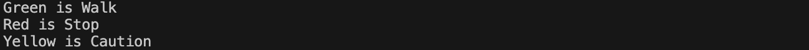

[](https://classroom.github.com/a/3JJHL7H1)
# プログラミング演習II 第6回
* 学籍番号：2264088
* 氏名：河原畑 宏次
* 所属：情報工学EP


# 課題の説明

## 課題1　インターフェース型の変数
 
<details>
<summary> ソースファイル : 

`J6_1/src/J6_1.java`

</summary>

``` Java
public class J6_1 {
    public static void main(String[] args) throws Exception {
        // 各インスタンスを発生
        // Green green = new Green();
        // Red red = new Red();
        // Yellow yellow = new Yellow();

        // 各インスタンスのprint()メソッドを呼び出し
        // green.print();
        // red.print();
        // yellow.print();

        // Light型のインスタンス保存する配列 lights を生成
        Light[] lights = {
            new Green(),
            new Red(),
            new Yellow(),
        };

        // lights[]の各インスタンスのprint()メソッドを呼び出し
        for (Light light : lights) {
            light.print();
        }
    }
}
```
</details>
<details>
<summary> ソースファイル : 

`J6_1/src/Light.java`

</summary>

``` Java
public interface Light {
    // 指示を示す文字列定数配列」
    String[] INSTRUCTION = {"Walk", "Stop", "Caution"};

    // 指示を出力する抽象メソッド
    void print();
}
```
</details>
<details>
<summary> ソースファイル : 

`J6_2/src/Red.java` `J6_2/src/Green.java` `J6_2/src/Yellow.java`

</summary>

``` Java
public class Red implements Light {
    // 指示を示すメソッドオーバーライド
    @Override
    public void print() {
        System.out.println("Red is " + INSTRUCTION[1]);
    }
}
```
</details>

### プログラムの説明
インターフェース`Light`として、指示の文字列を保持する文字列配列定数`INSTRUCTION`と、その指示を出力する抽象メソッド`print()`を定義した。
このインターフェースLightを実装するクラス`Red, Green, Yellow`を作成し、これらのクラスは共通して、抽象メソッドをオーバーライドし実装した`print()`メソッドを持つ。具体的には、各クラスで指示の内容を表す文字列定数を参照して、"[クラス名] is [指示内容]"と出力するようにした。

main()メソッドでは、Red, Green, Yellowクラスの3つのインスタンスを作成した。その際、各クラス型変数でインスタンスの参照を保存する場合と、インターフェース`Light`型の配列変数として各インスタンスの参照を保存する場合の２種類のコードを用意した。インターフェース型変数を利用する場合、この配列と拡張for文を用いて、各インスタンスで`print()`メソッドを実行した。


### 実行結果
* 各クラス型の変数で参照した場合


* インターフェース型変数で参照した場合
上の場合と全く同じ結果となった。


### 考察
#### インターフェースと抽象クラス
* インターフェースと実装の関係について、その性質は非常にスーパークラスとサブクラスの継承関係に似ていると感じた。特に、インターフェース型の変数として、そのインターフェースを実装したクラスのインスタンスを保存するときは、スーパークラスとサブクラスにおけるアップキャストの関係と同じであると考えた。ゆえに、インターフェースは、メンバに定数と抽象メソッドしか扱うことのできない特殊な抽象クラスで、実装とは、その特殊な抽象クラスの継承と考えるとその仕様を覚えやすいと思った。

<br>

#### インターフェースの特徴
* インターフェースは、変数には、`public static final`という修飾子が、メソッドには、`public abstract`という修飾子がわざわざ明記しなくても暗黙的に自動的につくと学んだ。しかし、あえてこれら以外の修飾子をつけるとどうなるのか気になった。
* 結果として、エラーになるものとならないものがあることがわかった。まずエラーにならないのは、メソッドに対して、`(private) static`もしくは`default`のどちらかをつけた婆愛である。逆にエラーになるのは、これら以外の修飾子をメソッドや変数につけた場合である。次にこれらの修飾子の効果をまとめた。

| インターフェースメソッドの種類 | 効果                                                                                                                  |
| ------------------------------ | -------------------------------------------------------------------------------------------------- |
| staticメソッド                 | 通常のstatic修飾子のようにクラスから直接呼び出すことが可能となる。ただし、次に説明するdefault修飾子と併用はできない。 |
| defaultメソッド                | 実装するクラス側でオーバーライドをしなかった場合に実行される処理を持たせることができる。多重継承では注意が必要。      |


---


## 課題2　人とコンピュータがじゃんけんするプログラム
 
<details>
<summary> ソースファイル : 

`J6_2/src/J6_2.java`

</summary>

``` Java
import java.util.Scanner;

public class J6_2 {
    private static int goalNum; // 目標勝利数

    public static void main(String[] args) throws Exception {
        Scanner sc = new Scanner(System.in);

        System.out.println("あなたは何回勝つまでプレイしますか?");
        goalNum = sc.nextInt();
        System.out.println("");

        int wins = 0;
        int losses = 0;
        int draws = 0;

        // じゃんけんを行うプレイヤーとコンピュータを用意
        Human you = new Human();
        Computer com = new Computer();

 
        while (wins < goalNum) {
            // 人とコンピュータでじゃんけんを行う
            // 行った結果をjudge()で判断して、結果を保存
            int result = Judge.judge(you.play(), com.play());

            // 結果を表示
            switch (result) {
                case -1:
                    System.out.println("あなたの負けです");
                    losses++;
                    break;
            
                case 0:
                    System.out.println("あいこです");
                    draws++;
                    break;
            
                case 1:
                    System.out.println("あなたの勝ちです");
                    wins++;
                    break;
            
                default:
                    break;
            }
            
            System.out.printf("あなたの %d 勝 %d 負 %d あいこ です\n\n", wins, losses, draws);

        }

        sc.close();

    }
}
```
</details>
<details>
<summary> ソースファイル : 

`J6_2/src/Jyanken.java`

</summary>

``` Java
public interface Jyanken {
    // じゃんけんの手の形を表す文字列を保管する定数
    String[] HANDSHAPE = {"グー", "チョキ", "パー"};

    // じゃんけんを行うメソッド
    int play();
}
```
</details>
<details>
<summary> ソースファイル : 

`J6_2/src/Human.java` `J6_2/src/Computer.java`

</summary>

``` Java
import java.util.Scanner;

public class Human implements Jyanken {
    Scanner sc = new Scanner(System.in);

    // じゃんけんを行うメソッド
    // キーボードから、“0:グー” ,“1:チョキ”, “2:パー” に対応する整数が入力できるようにし、その値を戻り値とする。
    @Override
    public int play() {

        // キーボードから数字を読み取る
        System.out.println("0:グー ,1:チョキ, 2:パー");
        int yourChoice = sc.nextInt();
        while(yourChoice < 0 || yourChoice > 2) {
            System.out.println("0 ~ 2 の整数を入力してください");
            System.out.println("0:グー ,1:チョキ, 2:パー");
            yourChoice = sc.nextInt();
        }
        
        // 出した手を表示
        switch (yourChoice) {
            case 0:
                System.out.println("あなたは" + HANDSHAPE[0]);
                break;
            case 1:
                System.out.println("あなたは" + HANDSHAPE[1]);
                break;
            case 2:
                System.out.println("あなたは" + HANDSHAPE[2]);
                break;
        }

        return yourChoice;
    }
}
```
```Java
import java.util.Random;

public class Computer implements Jyanken {
    Random rd = new Random();

    // じゃんけんを行うメソッド
    // “0:グー” ,“1:チョキ”, “2:パー” に対応する整数を乱数を用いて発生させてその値を戻り値とする
    @Override
    public int play() {
        // 乱数を発生(0~2)
        int comChoice = rd.nextInt(3);

        // 出した手を表示
        switch (comChoice) {
            case 0:
                System.out.println("コンピュータは" + HANDSHAPE[0]);
                break;
            case 1:
                System.out.println("コンピュータは" + HANDSHAPE[1]);
                break;
            case 2:
                System.out.println("コンピュータは" + HANDSHAPE[2]);
                break;
        
            default:
                System.err.println("想定外の乱数の発生エラー");
                break;
        }
         
        return comChoice;
    }
}
```
</details>
<details>
<summary> ソースファイル : 

`J6_2/src/Judge.java`

</summary>

``` Java
public class Judge {
    // 勝敗の結果を表すクラス変数
    private static int result;
    
    // 引数のじゃんけんで出された手に対して、その勝敗を次の戻り値として返す
    // 勝ちの場合: 1, あいこの場合: 0, 負の場合: -1
    static int judge(int yourChoice, int comChoice) {
    
        // 勝敗を判断
        switch (yourChoice) {
            // あなたがグーを出した場合
            case 0:
                switch (comChoice) {
                    // あいこ
                    case 0:
                        result = 0;
                        break;
                    // 勝ち
                    case 1:
                        result = 1;
                        break;
                    // 負け
                    case 2:
                        result = -1;
                        break;
                }
                break;
            
            // あなたがチョキを出した場合
            case 1:
                switch (comChoice) {
                    // 負け
                    case 0:
                        result = -1;
                        break;
                    // あいこ
                    case 1:
                        result = 0;
                        break;
                    // 勝ち
                    case 2:
                        result = 1;
                        break;
                }
                break;

            // あなたがパーを出した場合
            case 2:
                switch (comChoice) {
                    // 勝ち
                    case 0:
                        result = 1;
                        break;
                    // 負け
                    case 1:
                        result = -1;
                        break;
                    // あいこ
                    case 2:
                        result = 0;
                        break;
                }
                break;
            
            default:
                break;
        }


        return result;
    }
    
}
```
</details>


### プログラムの説明
人とコンピュータが「じゃんけん」をするプログラムを作成した。

インターフェース `Jyanken`には、"グー", “チョキ”, “パー” の文字列を保管する定数`HANDSHAPE`とじゃんけんをする`play()`メソッドを定義した。そして、このインターフェースを実装する`Human`クラスと`Computer`クラスを作成し、play()メソッドを実装した。

`Human`クラスのplay()メソッドでは、キーボードから“0:グー” ,“1:チョキ”, “2:パー”に対応する整数が入力できるようにし、その値を戻り値とした。ただし、0 ~ 2の整数以外が入力された場合は、再度入力を求めるように設計した。さらに、入力された数字を元にswitch文で、“グー”, “チョキ”, “パー”の対応するもの (人が選んだ手) を出力した。

`Computer`クラスのplay()メソッドでは、“グー”, “チョキ”, “パー”に対応する整数を乱数で発生させ、その値を戻り値とした。ただし、Humanクラスと同様に、発生した乱数を元にswitch文で、“グー”, “チョキ”, “パー”の対応するもの (コンピュータが選んだ手) を出力した。

`Judge`クラスを作成し、静的メソッド`judge()`にじゃんけんで出された2つ整数を引数とし、戻り値を勝敗（あいこ）の整数とするメソッドを作成した。戻り値は、勝ちの場合: 1, あいこの場合: 0, 負の場合: -1 である。勝敗の判定については、まずswitch文によって、人が出した手の種類で場合分けを行い、さらにその場合分けの中にswitch文で、コンピュータが出した手の種類で場合分けを行った。そして、勝敗に応じて、戻り値を保存する変数`result`の値を先の定義通りに変更した。

`main()`メソッドでは、作成したクラスを利用して、ユーザーとコンピュータがじゃんけんを行い、勝敗の結果に応じて、勝ち、負け、あいこに対応したint型変数をインクリメントさせて、その数をカウントし出力した。そしてこれらの処理は、最初にユーザーに入力させた、「勝ち数 `goalNum`」に勝ち数が等しくなるまで繰り返す。


### 実行結果
* 実行結果は以下のようになった。仕様通りに実行できた。


### 考察
#### じゃんけんの勝敗判定アルゴリズムの改良
* `Judge`クラスの`judge()`メソッドでじゃんけんの勝敗の判断を行った。ここでは、プログラムの説明で述べたように、switch文を入れ子にさせて場合分けを行った。しかし、switch文はその条件分岐が多いと文が見づらい。そこで、調べていると、switch文の代わりに配列を用いることで、コードが簡潔になりわかりやすくなることがわかった。よって、`judge()`メソッドを次のように配列を用いて書いてみた。確かにみやすいコードとなった。以後、条件分岐が複雑になるときにはこの手法を使いたいと思う。

<details open>
<summary> ソースファイル : 

`J6_2/src/Judge_new.java`

</summary>

```Java 
public class Judge_new {

    // 勝敗の結果を表す配列
    // [あなたの手][相手の手]
    private static int[][] results = {
        {0, 1, -1},     // {[グー][グー], [グー][チョキ], [グー][パー]},
        {-1, 0, 1},     // {[チョキ][グー], [チョキ][チョキ], [チョキ][パー]},
        {1, -1, 0}      // {[パー][グー], [パー][チョキ], [パー][パー]}
    };;
    
    // 引数のじゃんけんで出された手に対して、その勝敗を次の戻り値として返す
    // 勝ちの場合: 1, あいこの場合: 0, 負の場合: -1
    static int judge(int yourChoice, int comChoice) {
        return results[yourChoice][comChoice];
    }
    
}
```

実行結果: 

変更前と同様に実行できた。
</details>

---


## 課題3　instanceof演算子を用いたコード
 
<details>
<summary> ソースファイル : 

`J6_3/src/j6_3.java`

</summary>

``` Java
public class j6_3 {
    public static void main(String[] args) throws Exception {
        // オブジェクトを生成
        Facility[] fac = {
            new Zoo("ズーラシア"),
            new Aquarium("エノスイ"),
            new Zoo("野毛山動物園"),
            new Zoo("金沢動物園"),
            new Aquarium("カワスイ"),
            new Aquarium("シーパラ"),
        };

        // 動物園のみ出力
        for (Facility facility : fac) {
            if(facility instanceof Zoo) 
                facility.print();
        }

        // 水族館のみ出力
        for (Facility facility : fac) {
            if(facility instanceof Aquarium) 
                facility.print();
        }

    }
}
```
</details>
<details>
<summary> ソースファイル : 

`J6_3/src/Facility.java`

</summary>

```Java 
abstract public class Facility {
    // 施設名を保存するインスタンス変数
    protected String name;

    // nameを初期化するコンストラクタ
    public Facility(String name) {
        this.name = name;
    }

    // nameを出力する抽象メソッド
    abstract void print();
}
```
</details>
<details>
<summary> ソースファイル : 

`J6_3/src/Zoo.java` `J6_3/src/Aquarium.java`

</summary>

```Java 
public class Zoo extends Facility {
    public Zoo(String name) {
        super(name);
    }
    
    @Override
    void print() {
        System.out.println("動物園: " + name);
    }
}
```
```Java
public class Aquarium extends Facility {
    public Aquarium(String name) {
        super(name);
    }
    
    @Override
    void print() {
        System.out.println("水族館: " + name);
    }
}
```
</details>

### プログラムの説明
抽象クラス`Facility`は、施設名を保存するインスタンス変数`name`と、nameを初期化するコンストラクタ、施設の種類とnameを表示する抽象メソッド`print()`を定義した。

このFacilityクラスを継承する`Zoo`, `Aquarium`クラスは、`print()`メソッドを実装し、それぞれ動物園、水族館という施設の種類を出力する。

`main()`メソッドでは、下記のように初期値を与えてインスタンスを生成し、`instanceof`演算子を用いて、最初に`Zoo`クラスに所属するインスタンスのprint()メソッドを使用して内容を出力し、次に`Aquarium`クラスに所属するインスタンスのprint()メソッドを使用して内容を出力した。
```Java
Facility[] fac = {
    new Zoo("ズーラシア"),
    new Aquarium("エノスイ"),
    new Zoo("野毛山動物園"),
    new Zoo("金沢動物園"),
    new Aquarium("カワスイ"),
    new Aquarium("シーパラ"),
};
```


### 実行結果
* 実行結果は以下のようになった。


### 考察
#### `instanceof`演算子の特徴
* `A instanceof B`と書くことで `true` を返すのは次のような場合のみである（それ以外は`false`を返す）。
  1. A が B クラスのインスタンスであるとき
  2. A が B クラスのサブクラスのインスタンスであるとき
  3. A が B インターフェースを実装したクラスのインスタンスであるとき
  4. A が B インターフェースを実装したクラスのサブクラスのインスタンスであるとき

* instanceof演算子が使えるのは、参照型の変数のみであり、intやdouble, booleanのようなプリミティブ型の変数には用いることができない。
* instanceof演算子は、ダウンキャストができるかどうか判断するためによく用いられる。ダウンキャストの復習も兼ねて、`instanceof`演算子とダウンキャストを用いた次にようなコードを作成した。ダウンキャストについては、前回のレポートにまとめたのでここでは省略した。

<details open>
<summary> ソースファイルと実行結果

</summary>

``` Java
public class Main {
    public static void main(String[] args) {
        Super obj = new Super();
        obj.print();

        obj = new Sub();    // アップキャスト
        obj.print();        // スーパークラスから継承したメソッドを使用(中身(参照先)はオーバーライド後のもの)
        // obj.newPrint();     // [エラー]　スーパークラスから継承していないものは、スーパークラスの型では使えない

        // objがサブクラスにダウンキャストできるのならば
        // ダウンキャストをして、サブクラス独自のメソッドを使用
        if(obj instanceof Sub)
            ((Sub)obj).newPrint();  
    }
}

class Super {
    void print() {
        System.out.println("Super Method");
    }
}

class Sub extends Super {
    @Override
    void print() {
        System.out.println("Sub Method");
    }

    void newPrint() {
        System.out.println("New Sub Method");
    }
}

```
実行結果: 

</details>

---

## 課題4　パッケージとimport
 
<details>
<summary> ソースファイル : 

`J6_4/src/J6_4.java`

</summary>

``` Java
import p.ClassP;
import p1.p2.ClassP1P2;

public class J6_4 {
    public static void main(String[] args) {
        // オブジェクトを生成
        ClassP p = new ClassP();
        ClassP1P2 p1p2 = new ClassP1P2();

        // 各オブジェクトでクラス名を出力するメソッドを呼び出し
        p.print();
        p1p2.print();
    }
}
```
</details>
<details>
<summary> ソースファイル : 

`J6_4/src/J6_4c.java`

</summary>

``` Java
// import p.ClassP;
// import p1.p2.ClassP1P2;

public class J6_4c {
    public static void main(String[] args) {
        // オブジェクトを生成
        p.ClassP p = new p.ClassP();
        p1.p2.ClassP1P2 p1p2 = new p1.p2.ClassP1P2();

        // 各オブジェクトでクラス名を出力するメソッドを呼び出し
        p.print();
        p1p2.print();
    }
}
```
</details>
<details>
<summary> ソースファイル : 

`J6_4/src/p/ClassP.java`

</summary>

``` Java
package p;

public class ClassP {
    // クラス名を出力するインスタンスメソッド
    public void print() {
        System.out.println("ClassP");
    }
}
```
</details>
<details>
<summary> ソースファイル : 

`J6_4/src/p1/p2/ClassP1P2.java`

</summary>

``` Java
package p1.p2;

public class ClassP1P2 {
    public void print() {
        System.out.println("ClassP1P2");
    }
}
```
</details>


### プログラムの説明
ソースファイルのディレクトリ構造が以下のようになるようにした。
```console
J6_4
└── src
    ├── J6_4.java
    ├── J6_4c.java
    ├── p
    │   └── ClassP.java
    └── p1
        └── p2
            └── ClassP1P2.java
```

`ClassP`、`ClassP1P2`クラスでは、クラス名を出力する`print()`メソッドを用意した。

`default`パッケージには、`main()`メソッドを持つクラス`J6_4`を作成し、ClassP, ClassP1P2のオブジェクトを生成し、各print()メソッドを実行した。

ただし、`import`を使用した場合のソースコードが`J6_4.java`で、使用しなかった場合のソースコードが`J6_4c.java`である。

### 実行結果
* importを使用した場合と使用しなかった場合のどちらにおいても以下のような実行結果を得た。


### 考察
#### パッケージ化について
* パッケージ化を行うには、ソースの先頭に`import`宣言を行う必要がある。また、宣言したパッケージ名と同じ名前のディレクトリにソースファイルを置く必要がある。
* パッケージ化を行うことで次のような利点があると考える。
   * パッケージごとに機能の分割を行うことができる
   * パッケージが違う場合、同じ名前のクラスが作成できる
   * アクセス制限によるセキュリティを高めることができる
* パッケージ名は、重複すると、呼び出す際に競合が起きてしまう。そのため、パッケージ名は他と重複しないように命名する必要がある。また、命名に関して、Javaでは慣習的に、名前が大文字から始まるクラス名と区別するために、パッケージ名は全て小文字にするのが一般的だと知った。

<br>

#### `import`宣言の有無による違い
* `import`宣言をすることで、他のパッケージで定義されたクラスを使うときに、完全就職名ではなく単にクラス名の記述で使用することができるようになる。
* よって、`import`宣言を行った`J6_4.java`では、他パッケージである`ClassP`や`ClassP1P2`をそのクラス名のみの記述で使用している。
* 一方で、`import`宣言を行わなかった`J6_4c.java`では、他パッケージで定義された`ClassP`や`ClassP1P2`をそのままの記述では使えない。そこでこれらを使用する際には、パッケージ名とクラス名を明記した完全修飾名を利用している。
* ここで、クラスClassP1P2については、パッケージp1の中にパッケージp2があり、さらにパッケージp2の中にClassP1P2が定義されている。このような場合は、階層順にピリオドで区切って全てのパーケージを指定する必要がある。


---


## 課題5　toString()メソッドのオーバーライド

<details>
<summary> ソースファイル : 

`J6_5/src/J6_5.java`

</summary>

``` Java
public class J6_5 {
    public static void main(String[] args) throws Exception {
        // オブジェクトを生成
        ExtoString obj = new ExtoString(10, 20);

        System.out.println(obj);
    }
}
```
</details>
 
<details>
<summary> ソースファイル : 

`J6_5/src/ExtoString.java`

</summary>

``` Java
public class ExtoString {
    private int x, y;

    public ExtoString(int x, int y) {
        this.x = x;
        this.y = y;
    } 

    // toString()メソッドを改良
    @Override
    public String toString() {
        return "オーバーライド toString x = " + this.x + ", y = " + this.y;
    }
}
```
</details>


### プログラムの説明
クラス`ExtoString`を作成し、int型のx, yの２つのインスタンス変数と、これらを初期化するコンストラクタ、オブジェクトの情報を返す`toSting()`メソッドを定義した。

`main()`メソッドでは、`ExtoString`のオブジェクト`obj`を x, y にそれぞれ　10, 20 を与えて生成した後、`System.out.Println(obj)`を実行した。
このとき、実行結果は以下のようになるようにした。
```Java
オーバーライド toString x = 10, y = 20
```


### 実行結果
* 確かに仕様通りに実行できた


* main()メソッドはそのままで、ExtoStringクラスのtoString()のメソッド名を変更した場合


### 考察
#### 実行結果の違いについて
* `System.out.println()`のような、String型の引数を取るメソッドの引数に、String型以外の変数を与えると、実際の処理としては引数の変数xに対して、`System.out.println(x.toString())`が行われる。このように、Stringの変数への型変換が行われる。
* このことを利用して、toSrting()メソッドをオーバーライドすることで、ユーザーにとって使いやすいように、String型への変換を行うことができる。これが、一つ目の実行結果の原因である。
* ここで、Object型のtoString()メソッドについて、その定義を調べてみると次のようになっていた。つまり、オーバーライドせずにtoString()メソッドを使用すると、"クラス名+@+ハッシュ値"が戻り値となることがわかる。これが、2つ目の実行結果の原因である。
```Java
public class Object {
    ~~~ 省略 ~~~
    
    public String toString() {
        return getClass().getName() + "@" + Integer.toHexString(hashCode());
    }

    ~~~ 省略 ~~~
}
```

<br>

#### toString()メソッドのオーバーライドを行うメリットについて
* 実行結果の違いでも少し述べたように、toSrting()メソッドをオーバーライドすることで、ユーバーにとって使いやすいように変更できる。オーバーライドせずに使用すると、2つ目の実行結果のようにハッシュ値が返され使いずらい。
* 例えば`toSrtin(クラス名)`としたときに、そのクラスのメンバの中身を得ることができれば、使いやすいだろう。他にも、デバッグの際に利用することも可能である。
* このようにtoString()メソッドをオーバーライドすることで、そのクラスが使いやすくなったり、他の人がデバッグなどで利用しやすくなるため、特に他の人と共同でプロジェクトを作成するときには、積極的に利用することが望ましいと考えた。

---


# 参考文献
> * workteria. 【Java】インターフェースの default と static それぞれの使い方. https://workteria.forward-soft.co.jp/blog/detail/10126. (2023/11/16 参照)
> * Switch文　いつ使う？ #TypeScript - Qiita. https://qiita.com/ehika/items/a2cca1349c3a3db8f161. (2023/11/18 参照)
> * 侍エンジニアブログ. 【Java入門】instanceof演算子で型を判定(クラス/インターフェース). https://www.sejuku.net/blog/42216. (2023/11/17 参照)
> * 【Java】パッケージの利点 - 疲れたらやすむ. https://chibicat.hatenablog.jp/entry/2018/04/17/000949. (2023/11/19 参照)


# 謝辞
* 特になし

# 感想など
* 特になし