[](https://classroom.github.com/a/Glv4vROh)
# プログラミング演習II 第７回
* 学籍番号：2264088
* 氏名：河原畑 宏次
* 所属：情報工学EP


# 課題の説明

## 課題1　例外オブジェクトとtry-catch
 
<details>
<summary> ソースファイル : 

`J7_1/src/J7_1.java`

</summary>

``` Java
import java.util.InputMismatchException;
import java.util.Scanner;

public class J7_1 {
    public static void main(String[] args) {
        a();
        System.out.println("main : 終了");
    }

    static void a() {
        b();
    }

    static void b() {
        // スキャナーのインスタンスを生成
        Scanner sc = new Scanner(System.in);

        try {
            // 二つの整数を入力
            System.out.print("１つ目の整数を入力してください : ");
            int n1 = sc.nextInt();
            System.out.print("２つ目の整数を入力してください : ");
            int n2 = sc.nextInt(); 

            // 0 による除算で ArithmeticException が発生
            n1 = n1 / n2;
            
        } catch (ArithmeticException e) {
            // e.printStackTrace();
            // System.out.println(e);
            // System.out.println(e.getMessage());
            System.out.println("0で割っています");
            
        } catch (Exception e) {     // 上で拾いきれなかった例外の処理
            System.out.println(e);

        } finally {
            System.out.println("b : finally");
            sc.close();     // スキャナをクローズ
        }
    }
}
```
</details>


### プログラムの説明
main() メソッドから、静的メソッド `a()` を呼び、a() から　静的メソッド `b()` を呼んだ。

このとき、b() メソッドで　整数を0で割る算術例外(`ArithmaticException`)を起こし、それを b() 内で捕獲し、例外オブジェクト e を次のような４種類の出力を用いて出力すると、それぞれどのような出力になるかを確認した。

また、main() メソッドの最後に、"main：終了" のメッセージを出力するようにし、例外が起きた場合でも実行されていることも確認した。

さらに、b()メソッドに `finally` ブロックを追加し、そこで “b：finally” のメッセージを出力するようにし、第3回解説のScannerクラスを使い、b() メソッドでキーボードから２つの整数を入力できるようにし、入力したデータによって算術例外が起きた場合、起きない場合でも finallyブロックが実行されることを確認した。


### 実行結果
* 例外を発生させなかった場合
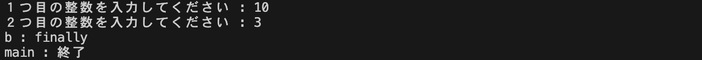

* `e.printStackTrace()`を利用した場合
例外が発生した時のスタックが表示された。
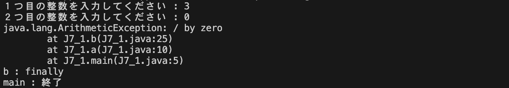

* `System.out.println(e)`を利用した場合
例外クラスとそのメッセージが表示された。
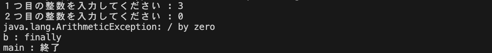

* `System.out.println(e.getMessage())`を利用した場合
例外クラスのメッセージのみが表示された。
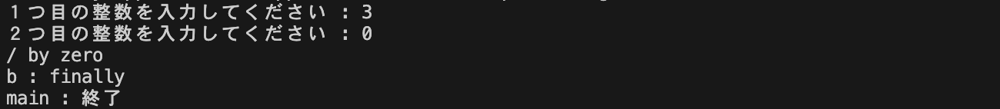

* `System.out.println("0で割っています")`を利用した場合
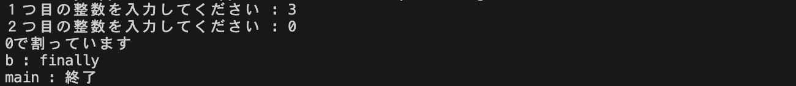

### 考察
#### 実行結果について
* 全ての実行結果において、`try-catch`分で例外が発生した場合は、例外が`catch`された後、`finally`ブロックが実行され、その後プログラムが終了することなく呼び出し元に戻っていることがわかる。
<br>

#### 工夫した点
* このプログラムでは、課題で指定されている`ArithmeticException`以外にも、整数の入力箇所において整数値を入力しなかった場合に、`InputMismatchException`が発生する可能性がある。この例外を含むその他の例外オブジェクトが発生した場合に、プログラムが強制終了しないように、次のような全ての例外オブジェクトをcatchする構造を設けた。
```Java
catch (Exception e) {     // 上で拾いきれなかった例外の処理
    System.out.println(e);
}
```
実行結果: 整数値以外を入力し、`ArithmeticException`以外の例外を発生させた場合
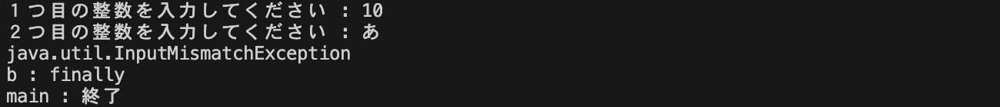
  
<br>

#### `try-with-resources`文について
* `Scanner`クラスのインスタンス`sc`をクローズするコードについて、エラーが発生しても正しくクローズが行われるために、`try`ブロックの中ではなく、finallyブロックの中に`sc.close()`記述した。
* しかし、`try-with-resources`文を用いることでこの手間を省くことができる。書き方は次のとおりである。
```Java
try (resources) {
    ~~~
} catch (Exception e) {
    ~~~
} finally {
    ~~~
}
```
* ここで、resourcesは、AutoCloseableもしくはCloseableインターフェースを実装したクラスのオブジェクトを表す（大まかにはclose()メソッドを持つクラスのオブジェクトの意味）。
* tryブロックを抜けた瞬間に、リソースが自動的にcloseされる。
* resourcesを複数記述することも可能であり、その際は、セミコロン「;」で区切る。
* resourcesにおいて、オブジェクトをコンストラクタを用いて直接生成した場合、コンストラクタで例外が発生するとリソースが解放されないので、オブジェクトの生成においてネストは避けた方が良い。
良い例: 
```Java
try (
    FileReader fr = new FileReader("sample.txt");
    BufferedReader br = new BufferedReader(fr)
) {
    ~~~
} catch {}
```
悪い例: 
```Java
try (
    BufferedReader br = new BufferedReader(new FileReader("sample.txt"))
) {
    ~~~
} catch {}
```
---

## 課題2　コマンドライン引数と例外
 
<details>
<summary> ソースファイル : 

`J7_2/src/J7_2.java`

</summary>

``` Java
import java.util.InputMismatchException;
import java.util.Scanner;

public class J7_2 {
    public static void main(String[] args) {
        // 変数の宣言
        int n = 0;
        Scanner sc = new Scanner(System.in);

        try {
            try {
                // コマンドラインの第１引数をint型変数 n に代入
                n = Integer.parseInt(args[0]);

            } catch (ArrayIndexOutOfBoundsException e) {    // 引数がない場合: ArrayIndexOutOfBoundsException
                System.out.println(e);
                System.out.println("引数がありません");
                throw e;

            } catch (NumberFormatException e) {     // int型に変換できないとき: NumberFormatException
                System.out.println(e);
                System.out.println("int型ではありません");
                throw e;
            }

        } catch (Exception e) {     // 引数がない、もしくはint型に変換できないとき
            // int型変数 n が正しく入力されるまでループ処理
            while (true) {
                try {
                    System.out.println("int型を入力してください");
                    n = sc.nextInt();
                    break;

                } catch (InputMismatchException ee) {
                    // nextInt() のバッファを消去
                    sc.nextLine();
                }
            }
            
        } finally {
            sc.close();     // スキャナを閉じる
        }

        // n の値を出力
        System.out.println(n);
    }
}

```
</details>


### プログラムの説明
コマンドライン引数から、int型の数をひとつ受け取り出力するプログラムを作成した。

ただし、コマンドライン引数が与えられなかった場合の、`ArrayIndexOutOfBoundsException`や、整数値以外が与えられた場合の`NumberFormatException`に対応するための`try-catch`処理を行った。
このtry-catchのcatch部分では、それぞれの例外でエラーメッセージを分けている。また、catchした例外オブジェクト`e`をこのtry-catchブロックの外に`throw`している。

以上の処理全体をさらにtry-catch文によって処理している。この外側のtry-catchでは、内側のtry-catchブロックで意図的にthrowされた例外オブジェクト`e`をcatchする。これにより、コマンドライン引数の参照により、種類に関係なく何かしらの例外が発生した場合の処理を記述することができた。

具体的な処理内容は、取得できなかったコマンドライン引数の代わりに、キーボードからint型の数値を受け取り保存するというものである。ただし、ここにおいてもint型の整数値が正しく入力されない場合を考慮して、無限ループとtry-catch処理を用いて、整数値が入力されるまでキーボードから読み取る作業を繰り返している。


### 実行結果
* コマンドライン引数を与えなかった場合
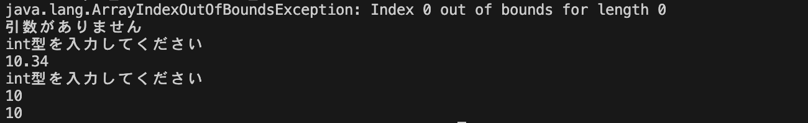

* コマンドライン引数に、整数値以外を入力した場合
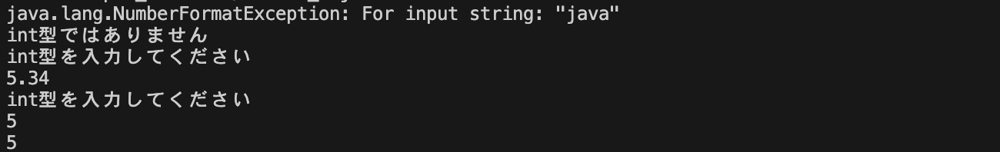

### 考察
#### チェック例外と非チェック例外ついて
* エラーと例外
Javaにはエラーと例外という2つの概念が存在し、正体はそれぞれ`Error`クラスと`Exception`クラスのオブジェクトである。
`Error`については、メモリがオーバーフローしたりクラスファイルが破損したりと、Java内部のプログラムでエラーがあると生じる。これは、ソースコードを管理するプログラマーにとっては、どうすることもできないため、処理は行わない。
一方で、`Exception`については、非チェック例外とチェック例外が存在し、どちらもプログラムで処理を行うことができる。**非チェック例外は、構文的に、またアルゴリズム的に正しいプログラムを書くことができればエラーの発生を防ぐことができる**ものである。そのため、`try-catch`による処理は必ずしも必要ではない。逆に、**チェック例外は、基本的には正しいプログラムを書いていても避けることができない可能性のあるもの**のことを言う。例えば、どれだけ正しいプログラムでも、扱うファイルそのものが削除されたり開くことができなかったりすれば対応できない。そこで、チェック例外を生じる可能性のある場合は、必ずtry-catchなどにより例外処理を行う必要がある。

* 主な**非**チェック例外  ( RuntimeException のサブクラス )

| 例外 | 状況|
| --------------- | --------------| 
| `NullPointerException` | 参照型変数にnullが入ったままその変数に参照 |
| `ArrayIndexOutOfBoundsException` | 配列で存在しない要素へのアクセス |
| `IllegalArgumentException` | 不正な引数をメソッドに渡した |
| `ArithmeticException` | 算術例外 |
| `ClassCastException` | 継承関係のないクラスへのキャスト |
| `NegativeArraySizeException` | 負の値を配列のサイズに指定 |
| `TypeNotPresentException` | セキュリティ違反 |
| `UnsupportedOperationException` | 型定義が未存在 |
| `NumberFormatException` | 文字列を数値に変換する際に不正な形式の文字列が渡された |


* 主なチェック例外

| 例外 | 状況|
| --------------- | --------------| 
| `IOException` | 入出力関係の例外 |
| `SQLException` | DB系の例外 |
| `ClassNotFoundException` | クラスが見つからない |
| `ArithmeticException` | 算術例外 |
| `InstantiationException` | インスタンス化不可のクラスをnewした時 |
| `InterruptedException` | スレッドへの割り込み |
| `NoSuchFieldException` | クラスに要求したフィールドがない |
| `NoSuchMethodException` | クラスに要求したメソッドがない |

<br>

#### コードの改良
* ソースコードの例外が発生した際にキーボードから整数を入力する処理について、int型の整数値が入力されなかった場合に再度入力を求める処理を繰り返している。この処理では、int型の整数値が入力されなかった場合に発生する`InputMismatchException`をtry-catchにより捕獲し、それ全体をループさせることで実装している。この処理において、Scannerクラスのメソッド`hasNextInt()`を利用すると、より簡潔にコードを書くことができることに気づいたので、そのコードを次に示す。

改良前のコード: 
```Java
    // int型変数 n が正しく入力されるまでループ処理
    while (true) {
        try {
            System.out.println("int型を入力してください");
            n = sc.nextInt();
            brea
        } catch (InputMismatchException ee) {
            // nextInt() のバッファを消去
            sc.nextLine();
        }
    }
```
改良後のコード: 
```Java
    System.out.println("int型を入力してください");
            
    // int型変数 n が正しく入力されるまでループ処理
    while (!sc.hasNextInt()) {
        // int型以外が入力されたらバッファを消去
        sc.nextLine();
        System.out.println("int型を入力してください");
    }
    n = sc.nextInt();   // int型で入力されたらそれを読み取る(バッファ内から)
```
---

## 課題3　例外オブジェクトをthrowするクラス
 
<details>
<summary> ソースファイル : 

`J7_3/src/J7_3.java`

</summary>

``` Java
import java.util.InputMismatchException;
import java.util.Scanner;

public class J7_3 {
    public static void main(String[] args) {
        Scanner sc = new Scanner(System.in);
        char choice = '\0';
        BankAccount person = new BankAccount();
        
        // メニューの表示と選択の読み取り
        System.out.println("預入: d, 引出: w, 残高照会: g, 終了: e");
        choice = sc.next().charAt(0);

        // 終了: e が選ばれなければ処理を繰り返す
        while(choice != 'e') {
            try {
                switch (choice) {
                    case 'd':   // 預入
                        System.out.println("預入金額を入力");
                        int deposits = sc.nextInt();
                        person.deposit(deposits);
                        break;

                    case 'w':   // 引出
                        System.out.println("引出金額を入力");
                        int withdraws = sc.nextInt();
                        person.withdraw(withdraws);
                        break;

                    case 'g':   // 残高照会
                        System.out.println("残高: " + person.getbalance());
                        break;

                    default:
                        System.out.println("d, w, g, e の中から入力してください");
                        break;
                }

            } catch (IllegalArgumentException e) {  // BankAccountクラスのメソッドが投げるエラー
                // エラー内容を表示
                System.out.println(e.getMessage());

            } catch (InputMismatchException e) {    // ScannerのnextInt()が投げるエラー
                System.out.println("int型を入力してください");
                sc.nextLine();

            } finally {
                // メニューの表示と読み取り
                System.out.println("\n預入: d, 引出: w, 残高照会: g, 終了: e");
                choice = sc.next().charAt(0);
            }
  
        }
    
        sc.close();

    }
}
```
</details>
<details>
<summary> ソースファイル : 

`J7_3/src/BankAccount.java`

</summary>

``` Java
public class BankAccount {
    private int balance = 0;    // 残高を表す

    // 引数の額を預け入れるメインスタンスソッド
    public void deposit(int deposits) throws IllegalArgumentException {
        // 引数が0以下の場合は、IllegalArgumentException を発生させる
        if(deposits <= 0) {
            throw new IllegalArgumentException("預入金額が0または負です");
        } 
        else {
            //　預けられた額残高を増やす 
            this.balance += deposits;
        }
    }

    // 引数の額を引き出すインスタンスメソッド
    public void withdraw(int withdraws) throws IllegalArgumentException {
        // 引数が0以下の場合や、引き出しで残高が負になる場合は、
        // IllegalArgumentException を発生させる
        if(withdraws <= 0) {
            throw new IllegalArgumentException("引出金額が0または負です");
        } 
        else if(this.balance < withdraws) {
            throw new IllegalArgumentException("残高不足の為引出出来ません");
        }
        else {
            //　引き出された額残高を減らす 
            this.balance -= withdraws;
        }
    }

    // 残高を確認するインスタンスメソッド
    public int getbalance() {
        return this.balance;
    }
}
```
</details>


### プログラムの説明
銀行口座を表すクラス`BankAccount`を作成した。このクラスは残高を表すインスタンス変数`balance`と、口座に対して引数の額を預け入れる`deposit()`と、引数の額を引き出す`withdraw()`と、残高を確認するための`getbalance()`という3つのインスタンスメソッドを持つ。

`deposit()`と`withdraw()`については、入力された金額 (引数) が0以下であったり、引き出しによって残高不足になる場合には、`throw`を用いて呼び出し元に例外`IllegalArgumentException`を投げるようにした。この時、例外が発生した時の状況によって例外オブジェクトが持つエラーメッセージの内容をかき分けた。

`main()`メソッドでは、"預入: d, 引出: w, 残高照会: g, 終了: e" というメニューを表示させ、終了の e が入力されるまで、メニューの中から選ばれた処理を繰り返すようにした。また、例外処理では、`BankAccount`クラスのメソッドから投げられた`IllegalArgumentException`とScannerクラスで発生しうる`InputMismatchException`をそれぞれcatchし処理した。

### 実行結果
* 実行結果は以下のようになった。
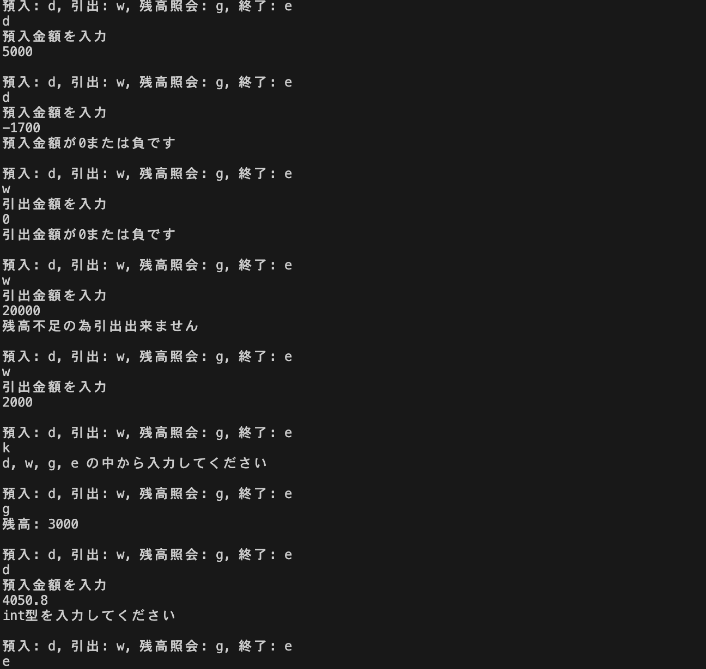


### 考察
#### 工夫した点
* メニューの中の"d, w, g, e" 以外の文字が入力された場合にも、switch文の`default`部分と、catchブロックで`InputMismatchException`を捕獲することで、プログラムが強制終了することがないようにした。

<br>

#### `throws`と`throw`について
* `throws`は、例外オブジェクトを発生する可能性のあるメソッドの定義において記述することができる。これにより、例外処理が必要な場合でも、その**メソッドを呼び出す側に例外処理を行わせ**て、このメソッド内でエラー処理をしなくてもコンパイルエラーにならない。また、次に書く`throw`によって、意図的に例外を発生させる場合には、そのメソッドに`throws`の記述が必要である (非チェック例外の場合は省略可能)。
* 例外オブジェクトを意図的に発生させるためには、`throw 例外オブジェクト`と記述する。`throw new 例外クラス()`として、例外オブジェクトを`new`演算子で生成すると同時にそれをthrowすることも可能である。また、ユーザーで定義した例外オブジェクトをthrowすることも可能だが、その例外オブジェクトのクラスは`throwable`クラスを継承している必要がある。

---

## 課題4　Classクラスのオブジェクト①
 
<details>
<summary> ソースファイル : 

`J7_4/src/J7_4.java`

</summary>

``` Java
public class J7_4 {
    public static void main(String[] args) throws Exception {
        Class<?> cls = null;
        
        // コマンドライン引数で受け取った完全修飾クラス名に一致する
        // Classオブジェクトを保存
        try {
            cls = Class.forName(args[0]);

        } catch (ArrayIndexOutOfBoundsException e) {    // 引数がなかった場合
            System.out.println("コマンドライン引数を入力してください");
            e.printStackTrace();

        } catch (ClassNotFoundException e) {
            System.out.println("クラス: " + args[0] + " が見つかりませんでした");
            e.printStackTrace();
            
        }

        // cls が参照を持つ = 例外処理がなかった場合
        if(cls != null) {
            System.out.println(cls.getName() + " のスーパークラス: ");

            int numOfParents = 0;   // スーパークラスの数を保存

            // スーパークラスを取得して更新する
            // getSuperclass() は取得できるスーパークラスがない場合に null
            // を返すことを利用して、スーパークラスの数を数える。 
            while((cls = cls.getSuperclass()) != null) {
                System.out.println("  " + cls.getName());
                numOfParents++;
            }

            System.out.println("\nスーパークラスの数: " + numOfParents + "個");
        }
        
    }
}
```
</details>


### プログラムの説明
コマンドラインから完全修飾クラス名を受け取り、受け取ったクラスにいくつのスーパークラスがあるか数えて表示するプログラムを作成した。

まず、`forName()`メソッドを利用して、コマンドラインから受け取った完全修飾クラス名に対応するClassクラスのオブジェクト`cls`を生成した。この時、コマンドライン引数が存在しなかった場合の`ArrayIndexOutOfBoundsException`や正しいクラス名でない場合の`ClassNotFoundException`が発生した場合に備えて、`try-catch`文による例外処理を施した。

次に、例外処理がなかった場合に限り、生成したClassクラスのオブジェクトclsのスーパークラスの数を数える処理を行うために、Classクラスの`getSuperclass()`メソッドを利用した。このメソッドは、そのClassクラスオブジェクトが直接のスーパークラスを持つ場合は、そのスーパークラスのClassクラスオブジェクトを返す。ここで、Classクラスオブジェクトがスーパークラスをこれ以上持たない場合は、null が戻り値になることを利用した。

具体的には、Classクラスオブジェクト`cls`に、`getSuperclass()`メソッドで自身のスーパークラスを保存するという処理を、`getSuperclass()`メソッドが null となり、スーパークラスが見つからなくなるまで繰り返した。そしてその処理の回数を変数`numOfParents`でカウントした。


### 実行結果
* コマンドライン引数を与えなかった場合
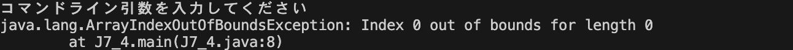

* コマンドライン引数に、存在しないクラス名を与えた場合
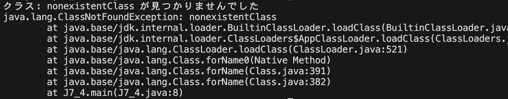

* コマンドライン引数に、`java.util.GregorianCalendar`を与えた場合
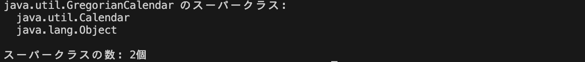

* コマンドライン引数に、`java.awt.Dialog`を与えた場合
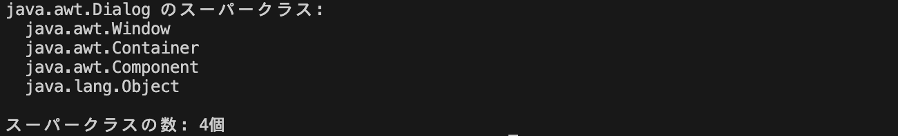

### 考察
#### 実行結果について
* コマンドライン引数が存在しなかった場合と、正しいクラス名でない場合には、正しく対応した例外処理を行うことができた。
* `java.util.GregorianCalendar`クラスと、`java.awt.Dialog`は次のような継承関係を持つ (Oracle Help Center Java API より引用) 。
```console
java.lang.Object
 └── java.util.Calendar
        └── java.util.GregorianCalendar
```
```console
java.lang.Object
 └── java.awt.Component
         └── java.awt.Container
                 └── java.awt.Window
                         └── java.awt.Dialog
```
これらから、実行結果が正しいことは明らかである。

<br>

#### 工夫した点
* 実行結果からわかるように、スーパークラスの数だけでなく、Classクラスの`getName()`メソッドを使って、そのスーパークラスの名前も表示するようにした。
<br>

#### `NullPointerException`の回避について
* Javaでは参照型の変数に`null`が格納されたまま、参照型の変数を参照しようとすると、`NullPointerException`が発生する。また、参照型の変数の初期値は、`null`が割り当てられている。
`Class<?> cls = Class.forName(className)`では、Classクラスのオブジェクト`cls`に、クラス名に一致するClassクラスオブジェクトの参照を代入する処理が行われている。このとき、例外が発生してこの処理が中断されたとする。すると、この変数`cls`には、適当な参照先が代入されない、つまり初期値nullが保存される。このまま、この変数`cls`を`cls.getSuperclass()`のようにして参照してしまうと、`NullPointerException`が発生してしまう。
これを回避するために、ソースコードでは、if文を用いて`cls`がnullかどうかによってその先の処理を行うかどうかを区別している。
---

## 課題5　Classクラスのオブジェクト②
 
<details>
<summary> ソースファイル : 

`J7_5/src/J7_5.java`

</summary>

``` Java
public class J7_5 {
    public static void main(String[] args) throws Exception {
        String className = null;
        
        try {
            className = args[0];
            
        } catch (ArrayIndexOutOfBoundsException e) {
            System.out.println("コマンドライン引数を入力してください");
            e.printStackTrace();

        }

        // className が参照を持つ　= コマンドライン引数による例外処理がなかった場合
        if(className != null) {
            int numOfParents = 0;
            try {
                // className クラスのスーパークラスの数を数えて変数に保存
                numOfParents = countParents(className); 

                // スーパークラスの数を表示
                System.out.println(className);
                System.out.println("> スーパークラスの数: " + numOfParents + "個");

            } catch (ClassNotFoundException e) {    // countParents()メソッドのエラー処理
                System.out.println("クラス: " + className + " が見つかりませんでした");
                e.printStackTrace();
            }   

        }
        
    }


    // 引数に受け取った完全修飾クラス名のClassオブジェクトについて
    // そのスーパークラスの数を数えるメソッド
    private static int countParents(String className) throws ClassNotFoundException {
        Class<?> cls = Class.forName(className);

        int numOfParents = 0;   // スーパークラスの数を保存
        // スーパークラスを取得して更新する
        // getSuperclass() は取得できるスーパークラスがない場合に null
        // を返すことを利用して、スーパークラスの数を数える。 
        while((cls = cls.getSuperclass()) != null) {
            numOfParents++;
        }
        
        return numOfParents;
    }

}
```
</details>


### プログラムの説明
課題４プログラムと同じ処理を行うプログラムを、スーパークラスを数える部分をmainメソッドとは別の静的メソッド`countParents()`を作成して実装した。

`countParents()`は、引数は調べるクラス名(String)、戻り値はスーパークラスの数である。また、Classクラスオブジェクトの生成において、`ClassNotFoundException`が生じた場合には、`throw`するように設計した。


### 実行結果
* コマンドライン引数を与えなかった場合
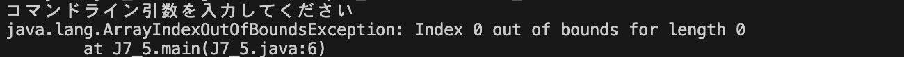

* コマンドライン引数に、存在しないクラス名を与えた場合
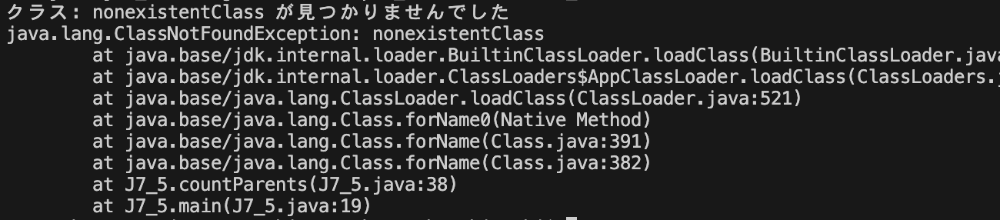

* コマンドライン引数に、`java.awt.Dialog`を与えた場合
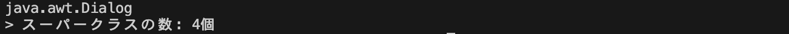


### 考察
#### 工夫した点
* コマンドライン引数が入力された時のみ、その引数の完全修飾クラス名のスーパークラスの数を数える処理を行うようにした。これを実現するために、コマンドライン引数を参照して保存する変数`className`に初期値`null`を与えて、コマンドライン引数の内容を`className`に保存する処理の後に、`className`がnullであるかどうかを判断した (`className = args[0];`で例外が発生した場合は、`className`は初期値のままであるから) 。
<br>

#### Classクラスについて
`Classクラス`を利用すると、実行時にオブジェクトのクラスの情報を調べたり、そのオブジェクトが持つメソッドを操作したりできる。この機能を**リフレクション**という。以下では、このClassクラスについてまとめる。
* Classクラスとは
Classクラスとは、 Javaにおいて型情報を保持する特別なクラスである。Object型の変数が持つ、getClass()メソッドで得られるオブジェクトはこのClassクラス型のオブジェクトである。

* Classクラスオブジェクトの生成
Classクラスオブジェクトを生成するには、次の3つの方法がある。
```Java
// １つめ
Class<クラス名> オブジェクト名 = クラス名.class;

// ２つ目
クラス名 オブジェクト名 = new クラス名();

// ３つ目
Class<?> オブジェクト名 = Class.forName("クラス名");
```

* Classオブジェクトからインスタンスを作成
Classオブジェクトを得ることができれば、それを利用してそのクラスのインスタンスを作成できる。その方法は、Classオブジェクトのメソッド`getDeclaredConstructor()`で、そのクラスのオブジェクトが持つコンストラクタを保存するオブジェクトを入手する (入手できるコンストラクタは、このメソッドに渡した引数の型に依存する) 。そして、そのコンストラクタオブジェクトが持つ`newInstance()`メソッドを利用して、インスタンスを生成する。コンストラクタの引数はこのnewInstance()メソッドの引数に渡す。

* Classオブジェクトからメソッドとフィールドを取得
Classオブジェクトは、メソッドを`Method`オブジェクトとして得る`getMethod()`メソッドや、フィールドを`Field`オブジェクトとして得る`getDeclaredField()`メソッドなどがある。これらは、`private`のような修飾子にかかわらずメソッドやフィールドを操作できてしまうため、注意が必要である。

* 以上を踏まえてClassクラスオブジェクトを生成し、そのメソッドとフィールドを操作すサンプルコードを作成したので以下に示す。

<details open>
<summary> ソースファイル : p/Hello.java, J7_Test.java

</summary>

``` Java
package p;

public class Hello {
    private String name;

    public Hello(String name) {
        this.name = name;
    }

    public void Greeting() {
        System.out.println("Hello " + name);
    }
}
```
```Java
package p;

public class J7_Test {
    public static void main(String[] args) throws Exception {
        try {
            // Classオブジェクトを取得
            Class<?> cls = Class.forName("p.Hello");

            // Classオブジェクトに対応するクラスのインスタンスを生成する
            Constructor constructor = cls.getConstructor(String.class);  // Helloオブジェクトを生成するコンストラクタを保存するコンストラクタオブジェクトを生成
            Hello obj = (Hello)constructor.newInstance("hoge");    // コンストラクタに引数 "everyone" を与えてインスタンスを生成
            obj.Greeting();     // インスタンスメソッドを利用


            // クラスオブジェクトからフィールドを取得
            Field field = cls.getDeclaredField("name");   // nameフィールドを保存するフィールドオブジェクトを生成
            field.setAccessible(true);      // フィールドにアクセス可能にする
            field.set(obj, "fuga");


            // クラスオブジェクトからメソッドを取得
            Method method = cls.getMethod("Greeting");    // Greeting()を保存するメソッドオブジェクトを生成
            method.invoke(obj);     // invoke()メソッドを利用して、メソッド(Greeting())を実行

        } catch (InvocationTargetException e) {
            e.printStackTrace();
        }
    }
}
```
実行結果: 
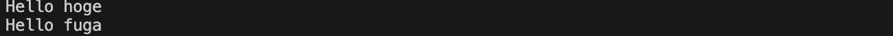
</details>

---


# 参考文献
> * ITSakura. Java リソースを自動でクローズ(try-with-resources文). https://itsakura.com/java-try-with-resources. (2023/11/24 参照)
> * プログラミングを学ぶならトレノキャンプ（TRAINOCAMP）. Javaでキーボード入力された値を取得する方法！【初心者向け】. https://camp.trainocate.co.jp/magazine/java-input/. (2023/11/24 参照)
> * 【Java】やっとScannerのhasNextInt()を使った判定方法が理解できた - It's okay to be weird. https://blog.okweird.net/entry/2013/08/15/172825. (2023/11/24 参照)
> * 25歳でフリーランス28歳で起業したエンジニア -じゃけぇ- のあれこれ. 【Java】検査例外と非検査例外の違いを図でまとめてみた. https://freelance-jak.com/technology/java/1157/. (2023/11/24 参照)
> * Java 入門. Java のリフレクション - Java の基本. https://java.keicode.com/lang/reflection.php. (2023/11/23 参照)

# 謝辞
* 特になし

# 感想など
* 特になし