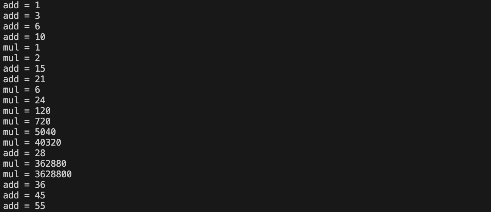
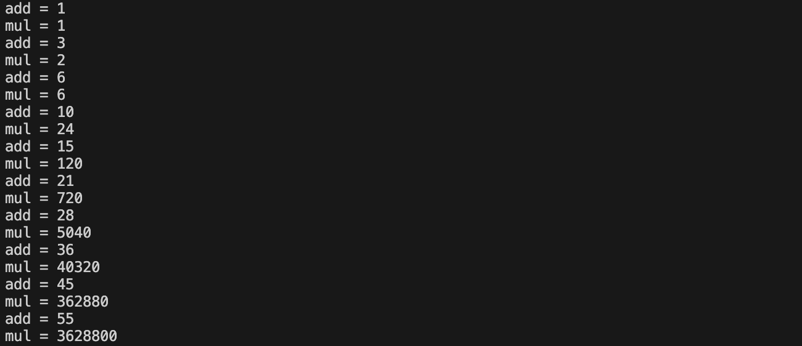
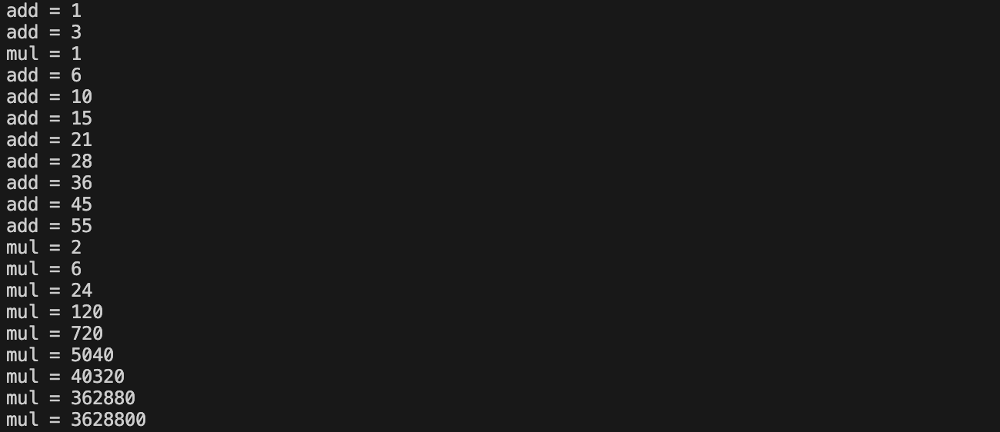
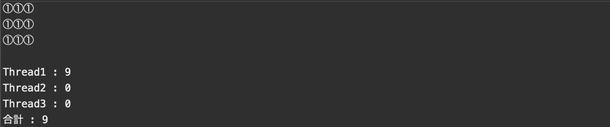
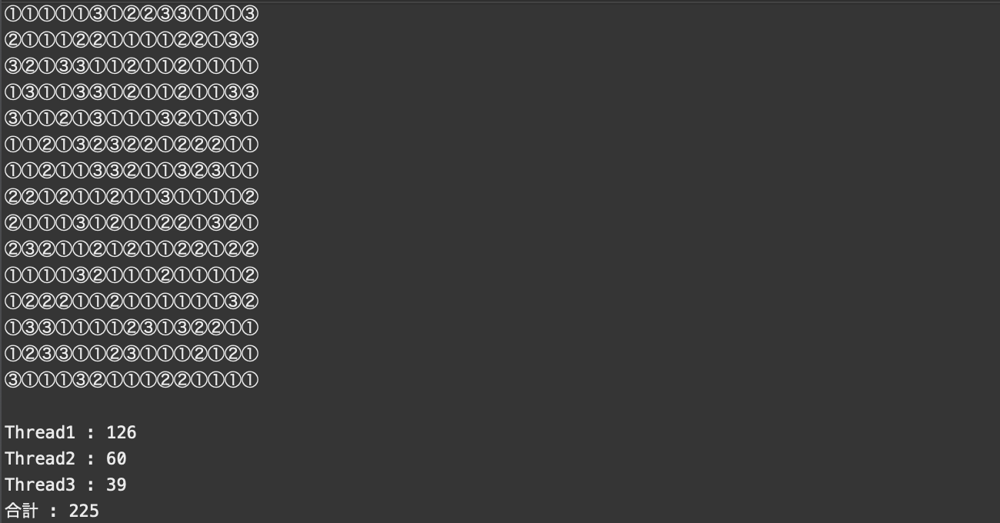

[](https://classroom.github.com/a/v8jpqrFc)
# プログラミング演習II 第８回
* 学籍番号：2264088
* 氏名：河原畑 宏次
* 所属：情報工学EP


# 課題の説明

## 課題1　足し算を行うスレッドと掛け算を行うスレッド
 
<details>
<summary> ソースファイル : 

`J8_1/src/J8_1.java`

</summary>

``` Java
public class J8_1 {
    public static void main(String[] args) throws Exception {
        AddThread add = new AddThread();
        MulThread mul = new MulThread();

        // スレッドを実行
        add.start();
        mul.start();
    }
}


// 1 ~ 10 までの整数を全て足し合わせるスレッド 
class AddThread extends Thread {
    @Override
    public void run(){
        // 計算結果を保存する変数
        int add = 0;

        for(int i = 1; i <= 10; i++) {
            add += i;

            // sleep() メソッドを実行
            try {
                Thread.sleep(1000);
            } catch (InterruptedException e) {
                e.printStackTrace();
            }

            // スレッドの名前と足し算結果を表示
            System.out.println("add" + " = " + add);
        }
    }

}


// 1 ~ 10 までの整数を全て掛け合わせるスレッド 
class MulThread extends Thread {
    @Override
    public void run(){
        // 計算結果を保存する変数
        int mul = 1;

        for(int i = 1; i <= 10; i++) {
            mul *= i;

            // sleep() メソッドを実行
            try {
                Thread.sleep(1000);
            } catch (InterruptedException e) {
                e.printStackTrace();
            }

            // スレッドの名前と掛け算の結果を表示
            System.out.println("mul" + " = " + mul);
        }
    }

}
```
</details>


### プログラムの説明
1 ~ 10までの整数を全て足し合わせるスレッド`AddThread`と、全て掛け合わせるスレッド`MulThread`を作成し同時に実行した。これらのスレッドでは、ひとつの演算を行うたびにスレッド名とその計算結果を出力するようにした。また、スレッド内のループ処理内で、`Thread.sleep(1000)`を行う場合と行わなかった場合の比較を行った。


### 実行結果
* `Thread.sleep(1000)`を記述しなかった場合



* `Thread.sleep(1000)`を記述した場合



### 考察
#### スレッドを用いた並列処理について
* スレッドを使用したプログラムでは、**完全に並列に複数のスレッドを実行しているわけではない**。実際にある時刻で処理が行われているスレッドは１種類であり、Javaの実行環境が複数のスレッドを切り替えながら、各スレッドの分割された処理を実行しているに過ぎないのである。これを高速に行うことで、あたかも並列処理を行っているかのように見せている。

<br>

#### 実行結果の違いについて
実行結果では、`Thread.sleep(1000)`を記述した場合は、足し算と掛け算が交互に行われたが、記述しなかった場合は、足し算と掛け算は綺麗に交互には行われなかった。この違いについて考える。
* `Thread.sleep(1000)`のコードは、Threadクラスのsleep()メソッドを実行している。sleep()メソッドは、引数に指定したミリ秒そのスレッドの処理を一時停止する。このとき、このスレッドは、sleep()が呼ばれた瞬間に、実行状態から休止状態に移り、sleep()に指定した時間がが終了すると、休止状態から実行可能状態に移る。
* よって、sleep()メソッドが記述された場合は、1秒ごとに掛け算と足し算の処理が行われたため、結果として同期したプログラムのように見えたと考えられる。
* 逆にsleep()メソッドを記述しなかった場合の挙動の原因を考える。そもそも、先の考察でスレッドの並列処理は。Javaの実行環境が実行するスレッドを切り替えることで実現していると述べた。ここで、実行可能状態にあるスレッドからどのスレッドが選ばれるかは、スレッドの優先度などを考慮して実行環境自体が決定する。そのため、再度実行すると次のように異なる実行結果を得た。


---


## 課題2　排他制御と同期制御
 
<details>
<summary> ソースファイル : 

`J8_2/src/J8_2.java`

</summary>

``` Java
public class J8_2 {
    public static void main(String[] args) throws Exception {
        Counter counter = new Counter();
        ThreadX threads[] = new ThreadX[3];

        // CounterクラスのインスタンスをThreadXのインスタンス間で共有
        for (int i = 0; i < 3; i++) {
            threads[i] = new ThreadX(counter);
            threads[i].start(); // スレッドを開始
        }

        // 全てのスレッドが終わるのを待つ
        for (int i = 0; i < 3; i++) {
            threads[i].join();
        }

        System.out.println("カウント : " + counter.getCount());
    }
}


// Counterクラスを共有するスレッド
class ThreadX extends Thread {
    // 共有するCounterクラスのオブジェクト
    private Counter counter;

    // コンストラクタ counterクラスのインスタンスを受け取る
    ThreadX(Counter counter) {
        this.counter = counter;
    }

    @Override
    public void run() {

        // 10000回 Counterクラスの変数countをインクリメント
        for (int i = 0; i < 10000; i++) {
            counter.countUP();
        }
        
    }
}
```
</details>
<details>
<summary> ソースファイル : 

`J8_2/src/Counter.java`

</summary>

```Java 
public class Counter {
    // カウントを保存する変数
    private int count = 0;

    // カウントを増やすメソッド
    public synchronized void countUP() {
        count++;
    }

    // count のゲッター
    public int getCount() {
        return count;
    }
 
}
```
</details>


### プログラムの説明
数をカウントするクラス `Counter `を作成した。
Counter クラスは、初期値を0 として現在のカウント`count`をprivate修飾子によりカプセル化した。そのインスタンスメソッドである、`countUp()`メソッドでカウントを1つ増やし、`getCount()` メソッドでカウントの値を確認できるようにした。

Thread を拡張した `ThreadX` クラスでは　`Counter`インスタンスを共有し、`run()` メソッド内のスレッド処理において、Counterインスタンスのフィールド`count`を１つ増やすことを10,000回実行した。

`main()`メソッドでは、`ThreadX`のインスタンスを３つ生成し、`start()`メソッドで起動し、`join()`メソッドで全てのスレッドの終了を確認してから、カウントされた値`count`を出力した。

ここで、countUp()メソッドに`synchronized`を使い、結果が 30,000 になることと、synchronized を使わなかった場合には、30,000 以下の値になることがあることを確認した。


### 実行結果
* countUp()メソッドに`synchronized`をつけた場合
どの実行結果も30,000になった。


* countUp()メソッドに`synchronized`をつけなかった場合
どの実行結果も30,000以下になった。


### 考察
#### `synchronized`修飾子について
* `synchronized`は、メソッドに付加することで、そのメソッドが実行されている間は、他のスレッドはこのメソッドを実行することはできず待つ必要がある。また、synchronizedブロックを利用するとそのブロック内では、指定したClassオブジェクトを他のスレッドから利用できなくすることができる。
* このように、あるデータに対して、同時にアクセスされることを制限することを、**排他制御**と呼ぶ。
<br>

#### `join()`メソッドについて
* Threadクラスが持つ`join()`メソッドについて、あるスレッド`thread1`処理の中で、`thread2.join()`が実行されると、`thread2`が終了するまで`thread1`の処理が一時停止される。
* sleep()メソッドと同様に、join()メソッドが実行された瞬間に、thread1は実行状態から停止状態に移り、thread2が終了した瞬間にthread1は、停止状態から実行可能状態に移る。
* このとき、main()メソッド自体も、ひとつのスレッド単位であることに注意する。
* このような、スレッド同士で実行のタイミングを調整することを、**同期制御**と呼ぶ。
<br>

#### 実行結果について
プログラムは、共通の変数countを10,000回インクリメントする処理を、３つの異なるスレッドから行った。しかし、countUP()メソッドに`synchronized`修飾子を付加しなかった場合は、実行結果が正しい値30,000にならなかった。この原因を考える。
* Javaにおいて、変数の値を書き換えるという処理は次のような手順で行われる。
  1. スレッドがメモリ上の変数の値を読み取り記憶する。
  2. 記憶した値を使って (使わない場合もある) 新しい値を作成する。
  3. 新しい値をメモリ上の変数の値に書き込む。

* 単に変数の値を変更する場合でも、上記のような手順を踏むため、複数のスレッドが、同時にひとつ目の処理を行ってしまうと正しく変数の値が更新されない。次に例を示す。

* 変数`count`が数値を保存し、その値を１増やす処理を２つのスレッドA, Bで行うとする。そのとき次のようなことが生じる可能性がある。
  1. `count = 5;`
  1. A がcountの値 5 を読み取り記憶する。
  2. B がcountの値 5 を読み取り記憶する。
  3. A が読み取った値 5 に 1 を足した値 6 をcountに書き込む。
  4. `count = 6;`
  5. B が読み取った値 5 に 1 を足した値 6 をcountに書き込む。
  6. `count = 6;    // 7にならない`
* このように、countが意図した値７にならないことが生じる。これと同様のことが今回のプログラムでも生じたと考えられる。
* これを防ぐためには、あるスレッドが変数の値を書き換えるという処理をしている間は、別のスレッドから同じ変数の値を書き換える処理が行われないようにすれば良い。つまり、先に述べたような排他制御や、同期制御を活用する必要がある。


---

## 課題3　Boardのプログラムのスレッドによる設計
 
<details>
<summary> ソースファイル : 

`J8_3/src/J8_3.java`

</summary>

``` Java
public class J8_3 {
    public static void main(String[] args) throws Exception {
        // 共有するBoardインスタンス
        Board board = new Board();
        board.clear(); // ボードをクリア

        // 3つのComputerインスタンスは、boardを共有する
        Computer[] computers = new Computer[3];
        computers[0] = new Computer('①', board);
        computers[1] = new Computer('②', board);
        computers[2] = new Computer('③', board);

        // スレッドを作成、開始
        Thread[] threads = new Thread[3];
        for (int i = 0; i < 3; i++) {
            threads[i] = new Thread(computers[i]);
            threads[i].start(); // スレッドを開始
        }

        // 全てのスレッドが終了するまで待機
        for (int i = 0; i < 3; i++) {
            threads[i].join();
        }

        // ボードのマスの内容を出力
        board.print();

        // 各スレッドがおいた数を出力
        int sum = 0; // 各スレッドがおいた数の合計を保存
        for (int i = 0; i < threads.length; i++) {
            System.out.println("Thread" + (i+1) +  " : " + computers[i].getNumOfPutted());
            sum += computers[i].getNumOfPutted();
        }
        System.out.println("合計 : " + sum); // 各スレッドがおいた数の合計を出力

    }
}

```
</details>
<details>
<summary> ソースファイル : 

`J8_3/src/Board.java`

</summary>

```Java 
public class Board {
    // 3x3のボードを模したchar型の配列
    protected char[][] board = new char[10][10];

    // 全マスを'○'で初期化するインスタンスメソッド
    public void clear() {
        for (int i = 0; i < board.length; i++) {
            for (int j = 0; j < board[i].length; j++) {
                board[i][j] = '〇';
            }
        }
    }

    // 全マスの内容を表示するインスタンスメソッド
    public void print() {
        for (char[] row : board) {
            for (char col : row) {
                System.out.print(col);
            }

            // 行ごとに改行
            System.out.println("");
        }

        // 3x3のボードごとに改行
        System.out.println("");
    }

    // 置く位置候補と置く記号を引数として、引数の場所に置けたらtrue、置けない場合はfalseを返す
    public synchronized boolean put(int i, int j, char c) {
        // 戻り値を表す変数
        boolean ret = true;
        
        // おける場合は、記号を置く
        if (board[i][j] == '〇') {
            board[i][j] = c;
        }
        // 置けない場合は、戻り値をfalseに設定し何もしない
        else {
            ret = false;
        }

        return ret;
    }

}
```
</details>

<details>
<summary> ソースファイル : 

`J8_3/src/Computer.java`

</summary>

```Java 
import java.util.Random;

public class Computer implements Runnable {
    // インスタンス変数
    private char symbol; // 置く記号
    private int numOfPutted = 0; // 置いた数
    private Board board; // Boardクラスインスタンス
    Random rd = new Random(); // スレッド処理ないで利用

    // コンストラクタ
    public Computer(char symbol, Board board) {
        this.symbol = symbol; // 記号を設定
        this.board = board; // Boardを設定
    }

    // 置いた数を返すゲッター
    public int getNumOfPutted() {
        return numOfPutted;
    }

    // スレッド処理
    @Override
    public void run() {
        for (int i = 0; i < 100; i++) {
            // 0 ~ 2 の乱数を発生
            int row = rd.nextInt(10);
            int col = rd.nextInt(10);

            // ボード board[row][col] に記号を配置
            // 100回連続で置けなければ終了
            if (board.put(row, col, this.symbol)) {
                this.numOfPutted++;
                i = 0; // 繰り返し回数のパラメータを初期化
                
                // [考察で追加] sleep()メソッドにより一時停止
                try {
                    Thread.sleep(10);
                } catch (InterruptedException e) {}
            }
        }
    }

}
```
</details>


### プログラムの説明
縦横3x3の9マス中のランダムな場所に記号①、②、③を置くプログラムを作成した。

クラス`Board`を抽象クラスではない普通のクラスとし、インスタンス変数として９マス用の３ｘ３のchar[][]と、インスタンスメソッドとしてボードのクリア用の`clear()`メソッド、印刷用の`print()`メソッドと synchonized メソッド`put()`を持つ。put()メソッドのジェネリクスは、`boolean put(int i,int j,char c)`として、置く位置候補と置く記号(文字)を 引数とし、引数の場所に置けたら true , 置けない場合 false を戻り値に設定した。

`Computer`クラスに `Runnable` インタフェースを実装して、インスタンス変数に、置く記号(char)、置いた数(int)、Boradクラスを定義し、コンストラクタで、記号と Board を与える。
スレッド処理を行うrun()メソッドでは、BoardのマスにBoardの`put()`メソッドを呼び出して記号を置き、その数をインスタンス変数`numOfPutted`で数えた。さらにｍこの変数のゲッターを用意した。
また、連続して100回置けなくなったら終了するようにして、無限ループにならないよう設計した。

`main()`メソッドでは、3つのComputerインスタンスに記号を与えて生成し、さらにそのインスタンスからそれぞれのスレッドを作成した。
全てのスレッドを起動した後、`join()`メソッドで全部のスレッドが終了したことを確認してから、Board のマスの内容とそれぞれのスレッドが置いた数を出力した。


### 実行結果
* 3x3のBoardで実行した結果


* 15x15のboardで実行した結果


### 考察
#### 実行結果について　
* 実行結果から各スレッドがおいた記号の数の合計は、確かにマス目の数に一致した。
* 今回のプログラムでは、各スレッドが交互に記号を置くという条件がなくなった。そのため、実行結果のように、スレッドの処理に偏りが生まれる可能性がある。この偏りについて、Javaでは、同じ優先度を持つ複数のスレッドが存在する場合、どのスレッドが優先的に実行されるかは不確定であるため交互に記号を置くようにするには、同期制御や排他制御を用いる必要がある。

#### プログラムの改良
このプログラムはもともと3つのComputerがBoardに交互に記号を置いていくプログラムであった。しかし先述したように、このプログラムではそれが実現できていない。そこで、スレッドの処理を使って各スレッドが交互に記号を置くプログラムにしようと思う。確かに、wait()メソッドやnotify()メソッドを用いた同期制御や排他制御を行うことで、実現可能だろう。しかしここでは、もう少し簡単に実現したい。

* そこで、スレッド処理を行う`run()`メソッドの中に、スレッドの一時停止を行う`Thread.sleep(10);`とそのtry-catchブロックを追加した。これにより、課題１のようにある程度同期の取れたプログラムにできた。変更したrun()メソッドと、実行結果を以下に示す。

<details open>
<summary> 改良したrun()メソッド

</summary>

``` Java
public class Computer implements Runnable {

    ~~~省略~~~

    // スレッド処理
    @Override
    public void run() {
        for (int i = 0; i < 100; i++) {
            // 0 ~ 2 の乱数を発生
            int row = rd.nextInt(3);
            int col = rd.nextInt(3);

            // ボード board[row][col] に記号を配置
            // 100回連続で置けなければ終了
            if (board.put(row, col, this.symbol)) {
                this.numOfPutted++;
                i = 0; // 繰り返し回数のパラメータを初期化

                // [追加] sleep()メソッドにより一時停止
                try {
                    Thread.sleep(10);
                } catch (InterruptedException e) {}
            }
        }
    }
}
```
実行結果: 


</details>


---

## 課題4　モニタによる平行プロセス
 
<details>
<summary> ソースファイル : 

`J8_4/src/J8_4.java`

</summary>

``` Java
public class J8_4 {
    public static void main(String[] args) throws Exception {
        Queue queue = new Queue();
        new Producer(queue).start();
        new Consumer("ConsumerA", queue).start();
        new Consumer("ConsumerB", queue).start();
        new Consumer("ConsumerC", queue).start();
    }
}
```
</details>

<details>
<summary> ソースファイル : 

`J8_4/src/Queue.java`

</summary>

```Java 
public class Queue {
    private final static int MAXSIZE = 10; // キューの最大容量
    int[] list = new int[MAXSIZE]; // 整数を格納するキュー
    int numOfdata = 0; // キューに存在するデータ数 (書き込み位置、読み取り位置に影響)
    int producedNum = 0; // Producerが生成する、０からの連続した整数を保存

    // キューに書き込むメソッド
    // データ数が０になったときに、一度に最大数まで書き込む
    // それ以外では待機する
    public synchronized void write() {
        //　キューにデータが残っている間は待機
        while (numOfdata > 0) {
            try {
                wait();
            } catch (InterruptedException e) {
                e.printStackTrace();
                System.exit(0);
            }
        }

        // キューの中のデータ数が０の時は、最大数までデータを書き込む
        for (int i = 0; i < MAXSIZE; i++) {
            list[i] = producedNum;
            numOfdata++;    // データ数を増やす
            producedNum++;  // 次に生成する数をインクリメント
        }

        notifyAll();    // 待機中のスレッドに通知

    }


    // キューからデータを取り出して読み取るメソッド
    // キューの中のデータが空になれば、全て書き込まれるまで待機する
    public synchronized int read() {
        // キューのデータが空のときは待機
        while (numOfdata == 0) {
            try {
                wait();
            } catch (InterruptedException e) {
                e.printStackTrace();
                System.exit(0);
            }
        }

        // 後に書き込まれたデータから読み取る
        int data = list[numOfdata];
        numOfdata--; // データ数を減らす

        notifyAll();    // 待機中のスレッドに通知
        
        return data;
    }

}
```
</details>

<details>
<summary> ソースファイル : 

`J8_4/src/Producer.java`

</summary>

```Java 
public class Producer extends Thread {
    private Queue queue; // キューのインスタンス

    // コンストラクタ　キューを保存
    public Producer(Queue queue) {
        this.queue = queue;
    }

    // スレッド処理
    // Producerは、キューが空になったらキューがいっぱいになるまで書き込む処理を繰り返す
    @Override
    public void run() {
        while (true) {
            try {
                Thread.sleep(1000);
            } catch (Exception e) {
                e.printStackTrace();
            }
            queue.write();
        }
    }
}
```
</details>

<details>
<summary> ソースファイル : 

`J8_4/src/Consumer.java`

</summary>

```Java 
class Consumer extends Thread {
    private String name;    // スレッドの名前
    private Queue queue;    // キューのインスタンス

    // コンストラクタ　スレッド名とキューを保存
    Consumer(String name, Queue queue) {
        this.name = name;
        this.queue = queue;
    }

    // スレッド処理
    // Consumerは、キューがいっぱいになるまで待機し、
    // キューが一杯になれば、キューが空になるまで一度に読み取る
    @Override
    public void run() {
        while (true) {
            try {
                Thread.sleep(1000);
            } catch (InterruptedException e) {
                e.printStackTrace();
            }
            System.out.println(this.name + " : " + queue.read());
        }
    }
}
```
</details>


### プログラムの説明
#### プログラムの概要
1つのスレッド `Producer` を使って0からの連続した整数を生成し、その整数は待ち行列を表すオブジェクト `Queue` のフィールド`list` (以下キューと呼ぶ) に書き込まれ、別の3つのスレッド `ConsumerA~C` に読み取られて表示されるプログラムを作成した。

但し、キューには、10個の整数のみ書き込むことができ、`Producer` は、キューが空になったら`write()`メソッドを用いて、キューが一杯になるまで書き込み、`Consumer` は、キューが一杯になるまで待機する。
逆にキューが一杯になったら、`Consumer` は`read()`メソッドを使用して、キューが空になるまで LIFO (Last In First Out) で読み出し画面に表示する。この時、`Producer` はキューが空になるまで待機する。

この仕組みを、メソッド`wait()`と `notifyAll()` を使用して、書き込むスレッドと読み出すスレッドの同期をとることで実現した。

実行結果を得る際には、`Thread.sleep(10000)`メソッドを利用して、速度を遅くして最初からの出力を確認した。

以下に、各メソッドについて具体的な解説を述べる。
<br>

#### `write()`メソッドについて
このメソッドは、`Producer`が空になったキューに最大までデータを書き込むために呼び出す。

ただし、`Producer`側では、ループ処理によって常にこのメソッドを呼び出し続ける。そのため、キューが空になっていない時にも呼ばれる場合が存在し、その時の処理をwhile文によって記述した。つまり、キューが空でないときは、`wait()`メソッドを呼び出し待ち状態に移り、他のスレッドからの`notifyAll()`メソッドによる通知があれば処理を再開する。
ただし、次に示すread()メソッドは、最後に`notifyAll()`メソッドを呼び出す。そのため、他のスレッドがnotifyAll()メソッドを呼び出しても、データが空でない時は待ち状態を維持できるように、wait()メソッド自体をwhile文で囲っている。

while文を抜けた時は、キューの中のデータが空になっているので、キューに連続した数字を10個書き込む。その後、データが空になり読み込み作業を中断して停止状態に移った`Consumer`スレッドを`notifyAll()`メソッドにより、実行可能状態に移させる。
<br>

#### `read()`メソッドについて
このメソッドは、`Consumer`がキューからデータを読み取り、それを画面に出力するために呼び出す。

`Consumer`側では、Producerと同様にループ処理によって常にこのメソッドを呼び出し続ける。そのた、キューが空の時にも呼び出される場合が存在し、その時の処理を、while文によって記述した。つまり、キューに読み取るデータが存在しない時には、wait()メソッドを呼び出し待ち状態に移る。ただしこのメソッドは最後に`notifyAll()`メソッドを使用する。そのため、他のConsumerスレッドがnotifyAll()メソッドを呼び出しても、データがからの時には待ち状態を維持できるように、wait()メソッド自体をwhile文で囲っている。

while文を抜けた時は、キューの中のデータが一杯になっているので、最初に書き込まれたデータから順によみとり、そのデータを削除する。その後、データが空になり読み込み作業を中断して停止状態に移った`Consumer`スレッドと`Producer`スレッドを`notifyAll()`メソッドにより、実行可能状態に移させる。


### 実行結果
* 実行結果は以下のようになった。
同じ整数が出力されたり、抜けた整数がないことから、正しく同期されていることがわかる。


* notifyAll()をなくした場合
リソースが全て消費された後に、デッドロックが生じた。


### 考察
#### デッドロックの可能性について
`Thread.sleep(1000);`とそのtry-catchブロックを削除したとき、次のような場合でデッドロックが起こる可能性があるのではないかと考えた。


1. write() メソッドが呼ばれ、while (numOfdata > 0) の条件が false となり待機が発生。
2. 同時に read() メソッドが呼ばれ、while (numOfdata == 0) の条件が false となり待機が発生。

しかし実際は、何度実行してもデッドロックが生じなかったため、この仮説が間違っているか、あるいは、この仮説のような事象が起こる可能性が非常に低いと推測される。

もし、この仮説が正しく、少しでもデッドロックの可能性があるのならば、その解決策を考えたい。そこで、read()メソッドとwrite()メソッドが、独立していなければデッドロックが起きないことを利用して、synchronized修飾子を付加した新たな`synchronized int readAndWrite(int option)`というメソッドがあれば解決できるのではないだろうか?
このメソッドは、引数に渡されたoptionにより、read()とwrite()の処理を切り分ける。そして、このメソッド自体がsynchronized修飾子で同時アクセスを禁止されているため、read()とwrite()のデッドロックが起きないと考える。

ただし、このメソッドの実装は、スレッド処理の並列処理という利点を活用することができていない。このプログラムが本当にデッドロックが起きるのか、そしてその時はどのようにすれば並列処理をしながら、デッドロックの対策が可能なのか、これらは今の私の知識ではわかりそうにないので、今後の課題とする。


---


# 参考文献
> * ENGINEER.CLUB. Javaのスレッド(Thread)を使いこなすコツを、基礎からしっかり伝授. https://www.bold.ne.jp/engineer-club/java-thread. (2023/11/30 参照)

# 謝辞
* 特になし。

# 感想など
並列処理の複雑さはC言語のポインタの比にならないと思った。
