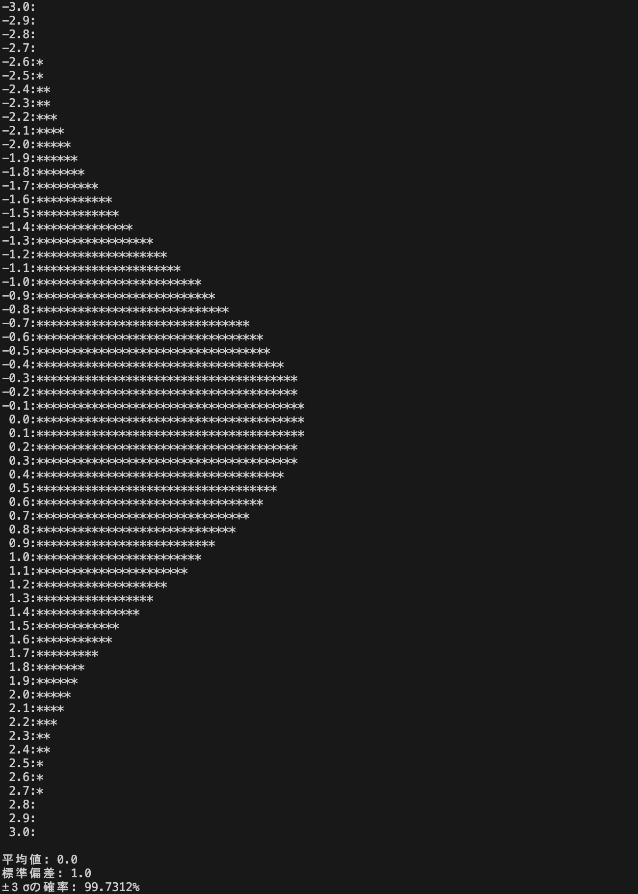
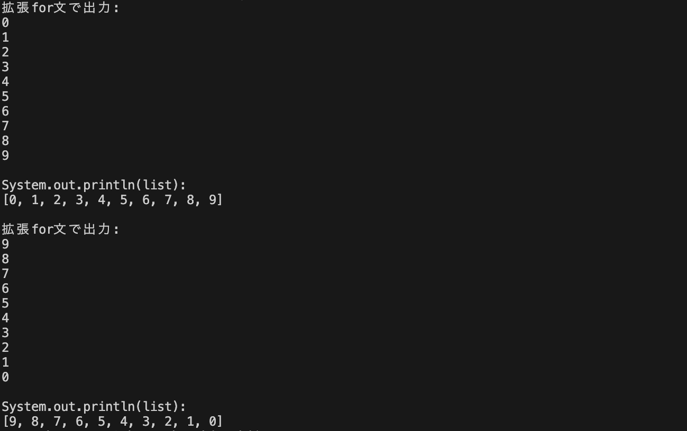
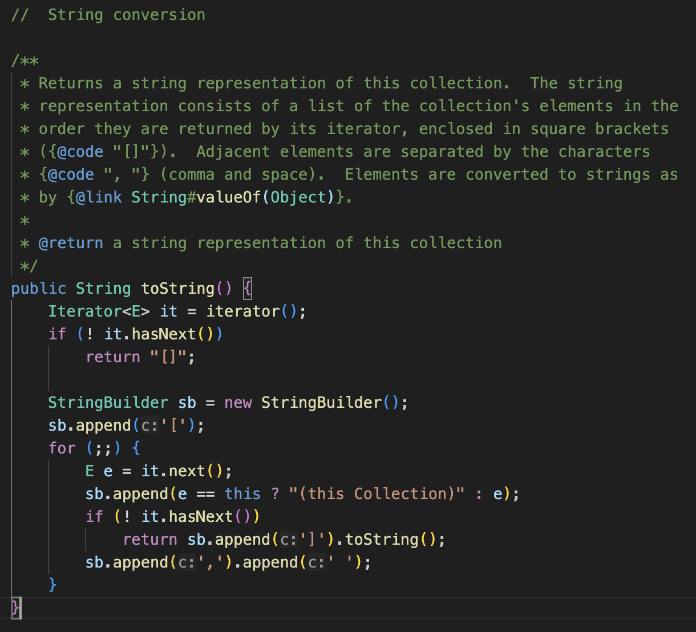
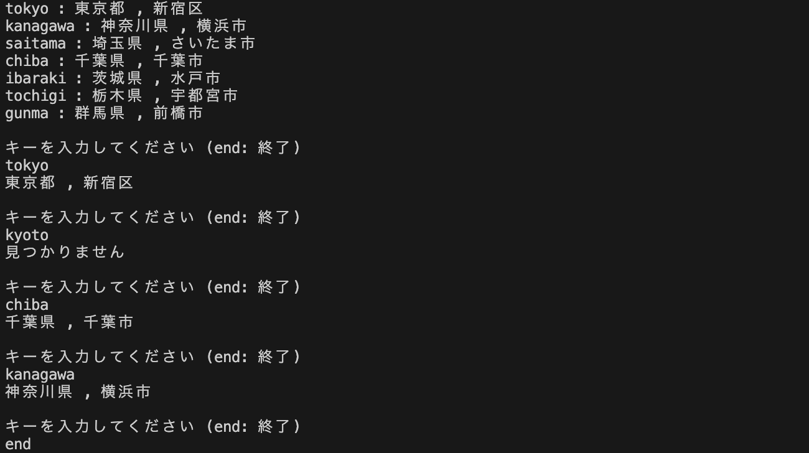
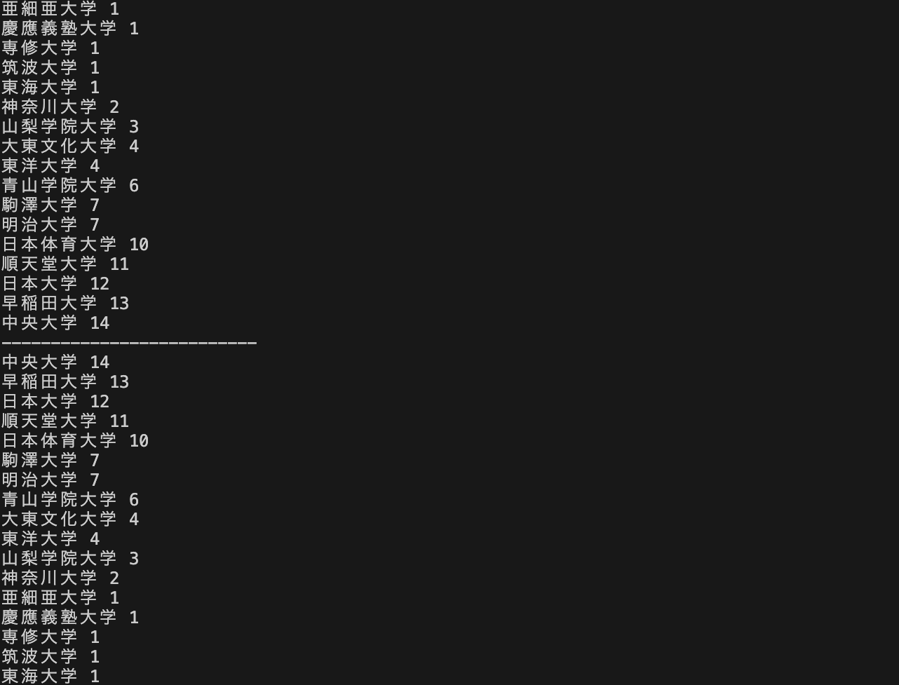

[](https://classroom.github.com/a/T1t7g8Td)
# プログラミング演習II 第９回
* 学籍番号：2264088
* 氏名：河原畑 宏次
* 所属：情報工学EP


# 課題の説明

## 課題1　CaldendarクラスとDateクラス
 
<details>
<summary> ソースファイル : 

`J9_1/src/J9_1.java`

</summary>

``` Java
import java.util.Date;
import java.util.GregorianCalendar;

public class J9_1 {
    // 誕生日を表す変数
    static final int year = 2003;
    static final int month = 5;
    static final int date = 19;

    public static void main(String[] args) throws Exception {
        // 誕生日のカレンダーを表すGregorianCalendarオブジェクト
        GregorianCalendar birthdayCalendar = new GregorianCalendar(year, month-1, date);

        // 誕生日を表すDateオブジェクト
        Date birthday = birthdayCalendar.getTime();

        // 現在時刻を表すDateオブジェクト
        Date currentDate = new Date();

        // 誕生日と現在時刻との差(s)を保存
        long diffOfSeconds = (currentDate.getTime() - birthday.getTime()) / 1000;
        
        // 誕生日と現在時刻との差(日)を計算し保存
        long diffOfDates = diffOfSeconds / (60 * 60 * 24);

        // 誕生日と経過日数を出力
        System.out.printf("誕生日: %d年%d月%d日\n", year, month, date);
        System.out.printf("経過日数: %d日\n", diffOfDates);
    }
}
```
</details>


### プログラムの説明
基準時からの経過時間を取得し、それを使って各自の誕生日からの日数を計算するアプリケーションを作成する。

まず、`GregorianCalendar`クラスのコンストラクタに、誕生日の年と月、日にちを入力して`GregorianCalendar`インスタンス`birthdayCalendar`を作成した。

次にGregorianCalendarのスーパークラスである`Calendar`クラスのメソッド`getTime()`を用いて誕生日の時間を表す`Date`インスタンス`birthday`を作成した。
さらに、現在時刻を保存するDateインスタンス`currentDate`も作成した。

この2つのDateインスタンスのメソッド`getTime()`を用いて現在時刻と誕生日との差を秒単位で取得し、変数`diffOfSeconds`に保存した。さらに、現在と誕生日との日にちの差を算出するために、先ほど得た秒単位の時間差を 60 x 60 x 24 (s / 日) でわった。


### 実行結果
* 誕生日として`2003年5月19日`を与えた場合


* 誕生日として、昨日を与えた場合　(実行日: 2023/12/6)


### 考察
#### DateクラスとCalendarクラスの違い
* Dateクラスは、基準時からの経過時間のミリ秒を持つだけの単純なクラスであり、ミリ秒のままでは扱いづらい、日付や年などの日時処理を行うクラスとして、Caldendarクラスが用意されている。そのため、この二つのクラスは相互に関係を持つため次のような変換が可能である。
* Date を Calendar に変更する。
```Java
Date date = new Date();
Calendar calendar = Calendar.getInstant();
calendar.setTime(date);
```
* Calendar を Date に変更する   (課題ではこちらを用いた)
```Java
Calendar calendar = Calendar.getInstant();
Date date = calendar.getTime();
```

<br>

#### `@Deprecated`について
* Javaでは、APIの変更、更新に伴い使用が推奨されなくなったAPIが存在する。そのような、非推奨のクラスやメソッド、フィールドなどには、@`@Deprecated`が付与される。これらのクラスやメソッドは、今後削除される可能性があるため代替クラスやメソッドを使うのが望ましい。
* 今回課題で扱ったDateクラスも、APIを確認するとほとんどのメソッドが非推奨となっていた。そこで、DateやCalendarクラスの代わりとして、Java.timeパッケージが追加された。今後はこの中の、Instantクラスや、LocalDateTimeクラスなどを使うことが望ましいと思われる。


<br>

---


## 課題2　正規分布の表現
 
<details>
<summary> ソースファイル : 

`J9_2/src/J9_2.java`

</summary>

``` Java
import java.util.Random;

public class J9_2 {
    // 正規分布の乱数を保存する配列
    private static int[] list = new int[61];
    // 平均値
    private static final double mean = 0.0;
    // 標準偏差
    private static final double sigma = 1.0;


    // main()メソッド
    public static void main(String[] args) throws Exception {
        // 正規分布に基づいた分布のリストを作成
        makeGaussianList();
        
        // 分布からグラフを作成
        drawGraph();
    }


    // 正規分布に基づいた乱数を発生させる
    // この時、±３σの範囲を61個に分割し分布を数える。±３σの範囲外は考えない
    // 乱数の整数部分で分割 (小数点は切り捨て)
    // list[0]: 0(= -３σ) 以上 1 未満, list[1]: 1 以上 2 未満, ... , list[60] = 60 (= +３σ) 以上 61 未満
    private static void makeGaussianList() {
        Random rd = new Random();

        for (int i = 0; i < 1000000; i++) {
            // 乱数を発生させて、配列list[]のindexに調整
            int index =  (int)Math.round(10 * rd.nextGaussian() * sigma + mean) + 30; // 乱数を切り捨て

            // 発生した乱数の分布を保存
            if (index >= 0 && index <= 60) {
                list[index + 30]++;
            }
        }
    }


    // 分布のリストからグラフを描画するメソッド
    // 要素数1000個につき * を1個出力
    private static void drawGraph() {
        int sum = 0;    // ±３σ間に生成された数(= リストの全要素数)をカウント    

        for (int i = 0; i < list.length; i++) {
            System.out.printf("%4.1f:", (double)(i-30)/10);

            // 要素数1000個につき * を1個出力
            for (int j = 1; j <= list[i] / 1000; j++) {
                System.out.print("*");
            }

            System.out.println("");

            // リスト中の±３σ間の全要素数をカウント
            if(i != 60) {
                sum += list[i];
            }     
        }
        
        // 平均値と標準偏差を出力
        System.out.println("\n平均値: " + mean);
        System.out.println("標準偏差: " + sigma);

        // ±３σ間の確率を出力
        System.out.println("±３σの確率: " + (double)sum * 100 / 1000000 + "%");
    }
}
```
</details>


### プログラムの説明
#### main()メソッドと概略
Randomクラスを利用して、正規分布の乱数を1000000個生成し、int型の大きさ61の配列に±3σの分布を数え数に応じたグラフを出力するプログラムを作成した。ただし、今回のプログラムでは、平均値は0.0、標準偏差は1.0の正規分布を考える。

まず、変数として、正規分布で発生した乱数の分布を保存する配列`list`と、定数として平均値`mean = 0`と標準偏差`sigma = 1.0`を定義した。 今回、正規分布で発生した乱数自体を保存するのではなく、±3σ間を61分割し、分割された範囲に発生した乱数の数を数え配列`list[61]`に保存した。標準偏差が1.0であるため、分割の仕方は、-3.0 ~ -2.9の範囲内で発生した乱数の数をlist[0]に、-2.9 ~ -2.8の範囲内で発生した乱数の数をlist[1]に...のように保存する。具体的には、以下の表のようになる。
| list [ index ]  | 数える発生した乱数 x の範囲  |
|:---:|:---:|
|  list[0] |  -3.0 ≦ x < -2.9 |
|  list[1] |  -2.9 ≦ x < -2.9 |
|  list[2] |  -2.8 ≦ x < -2.9 |
| ~~~~  |~~~~~~~~~~ |
|  list[31] |  -0.1 ≦ x < 0.0 |
|  list[32] |  0.0 ≦ x < 0.1 |
|  ~~~~ |  ~~~~~~~~~~ |
|  list[60] |  2.9 ≦ x < 3.0 |
|  list[61] |  3.0 ≦ x < 3.1 |

※ list[61]については、発生した乱数が3.0以外の場合は±3σの範囲に入らないことに注意したい。
※ また先述したが、この配列list[]は上記の範囲内で発生した乱数の数を保存することに注意したい。

`main()`メソッドでは、正規分布の乱数を発生させ上記の表に基づいてその分布をlist[]に保存するメソッド`makeGaussianList()`を呼び出している。その後、そこで得た分布に基づいてグラフを描画するメソッド`drawGraph()`を呼び出す。

<br>

#### `makeGaussianList()`について
このメソッドは、正規分布の乱数を発生させ、上記の表に基づいてその分布をlist[]に保存する。Randomクラスのメソッド`nextGaussian()`は、平均0.0、標準偏差1.0の正規分布のdouble値を返す。今回はこのメソッドの定義通りの正規分布が欲しいが、この値に標準偏差をかけた後、平均値を足すことで、任意の標準偏差と平均値を持つ正規分布に基づいた乱数を得ることができる。

上記の表において、発生する乱数とlist[]のindexに注目すると、発生した乱数10倍して小数点以下を切り捨てた値に、30を足した値がindexに一致することがわかる。よって、indexは次のようにして求められる。( 今回の条件に限り、sigma, mean は省略可能 )
```Java
int index =  (int) Math.round(10 * rd.nextGaussian() * sigma + mean) + 30;
```
ゆえに、このindexを用いて`list[index]++`を実行することで分布を数えることができる。このメソッドでは、この一連の処理を1,000,000回繰り返す。

<br>

#### `makeGraph()`について
このメソッドは、makeGaussianList()で得た乱数の分布からグラフを作成する。ただしグラフは、範囲内において要素数が1000個につき `*` を１個出力するようにする。
また、±3σ間に発生させた乱数が全体の約99.73%に収まることを確かめる処理を実装する。そのために、変数`sum`を用意し list[0] ~ list[60] の±3σ間に乱数がいくつ発生したかをカウントする。そして、`sum * 100/ (発生させた乱数の数 = 1000000)`で±3σ間の発生確率を求めた。

※ ±3σ間の値に対して、唯一list[61]中の3.0をカウントできていないことは考察で述べる。

<br>


### 実行結果
* 実行結果は以下のようになった。 (平均値: 0.0, 標準偏差: 1.0)



### 考察
#### 工夫した点
* コードが長くなり可読性が低くならないように、正規分布の乱数を発生する部分と、発生した分布からグラフを描画する部分とでそれぞれメソッドを作成し、main()メソッドを簡潔にした。

<br>

#### 改善点
* ±3σ間の乱数の発生確率を求める際に、list[0] ~ list[60] の要素数の合計を、±3σ間 (-3.0以上3.0以下) に発生した乱数の数として扱った。しかしこれでは、-3.0 以上 -3.0 **未満**の範囲での乱数の生成確率を扱っている。つまり、list[61]では 3.0 以上 3.1 未満の値をカウントするため、±3σの範囲内にある3.0が乱数として発生した場合にカウントできていない。これを解決するためには、発生した乱数をindexに変換する過程で、3.0が発生した場合だけindexを60にするといった特殊な処理が必要である。しかし、この誤差はほとんど影響しないことが予想されることや、コードの可読性が低下するという課題から今回はあえて記述しなかった。もし、　3.0が発生した場合だけ特殊な操作をする必要がないようなより良いアルゴリズムが思いついた時はコード全体を改善しようと思う。

<br>

---

## 課題3　ArrayListと拡張for文
 
<details>
<summary> ソースファイル : 

`J9_3/src/J9_3.javah`

</summary>

``` Java
import java.util.ArrayList;
import java.util.Arrays;
import java.util.Collections;
import java.util.Random;

public class J9_3 {
    // 0 ~ 9 のランダムな整数を保存するリスト
    private static ArrayList<Integer> list = new ArrayList<Integer>();
    // 乱数が重複しないように一度発生した乱数を保存する配列
    // -1 で初期化
    private static int[] flag = new int[10];
    static {
        Arrays.fill(flag, -1);
    }

    private static Random rd = new Random();

    public static void main(String[] args) throws Exception {
        // リストを作成
        makeList();

        // 昇順でソートして出力
        Collections.sort(list);
        printList();

        System.out.println();

        // 降順でソートして出力
        Collections.reverse(list);
        printList();

    }

    // リストを作成するメソッド
    private static void makeList() {
        int randNum = rd.nextInt(10); // 0 ~ 9 の乱数を発生

        // 0 ~ 9 の乱数をlistに追加
        for (int i = 0; i < 10; i++) {
            // 発生した乱数が重複しなくなるまで、乱数の発生を繰り返す
            while (flag[randNum] != -1) {
                randNum = rd.nextInt(10);
            }

            flag[randNum] = 0; // flagのindexと一致する乱数が発生したことを示す

            list.add(randNum); // 発生した乱数をリストに追加
        }
    }

    // リストを表示するメソッド
    private static void printList() {
        // リストの表示
        // 拡張for文
        System.out.println("拡張for文で出力: ");
        for (int i : list) {
            System.out.println(i);
        }

        // sysout で表示
        System.out.println("\nSystem.out.println(list): ");
        System.out.println(list);
    }
}
```
</details>


### プログラムの説明
Randomクラスを利用して、重複しない0以上9以下の整数の乱数を10個生成し、`ArrayList`クラスに格納し、ソートした後に出力するプログラムを作成した。

main()メソッドは、リストを作成するメソッド`makeList()`、リストを出力するメソッド`printList()`と、Collectionsクラスの`sort()`, `reverse()`を使用した。sort()とreverse()は、引数に渡されたわたされたオブジェクトをそれぞれ昇順と降順にソートするメソッドである。
まず、makeList()で重複しない乱数の入ったArrayListのインスタンス`list`を作成し、それを用いてsort(list)でlistの中身を照準に並べた。そして、printList()でその中身を出力した。この後に、同様の処理をreverse()を用いて行った。

リストを作成する`makeList()`メソッドでは、RandomクラスのnextInt()メソッドを用いて、0〜9の乱数をlistに保存する。ここで、この乱数が重複しないようにするために、`int[] flag[10]`という配列変数を利用する。flagは全要素が -1 で初期化されており、発生した乱数に対応する位置( index ) のflag[] の要素を0に設定することで、重複を検知している。
例えば、乱数として 3 が発生した場合には、flag[3] を -1 -> 0 に変更する。これにより、次に乱数として 3 が生成されたときには、flag[3] の値を確認することで、ここで生成された 3 という乱数が既出かどうか判断できる。
そして、重複しない乱数を得た場合には、add()メソッドでlistにその乱数を追加する。
この一連の処理を、10か繰り返すことで 0 ~ 9 の乱数を重複なく全てlistに保存できる。

リストを表示するメソッド`printList()`では、拡張for文と`System.out.println(list)`とした場合の２種類の出力を行う。


### 実行結果



### 考察
#### ArrayListクラスについて
ArrayListは大きさが伸縮可能な配列である。そのため、扱うデータ量が環境によって変わるようなプログラムには向いている。ここでは、課題で扱ったadd()メソッド以外の主要なメソッドを記す。

|メソッド名| メソッドの処理 |
|:--:|--|
| `void add((int index,) E e)`| 指定位置indexに要素eを挿入（index省略で末尾に挿入） |
| `int size()`| 要素の数を取得|
| `void clear()`| リストからすべての要素を削除|
| `boolean contains(Object e)`|リストに要素oが含まれているかを判定 |
|`int indexOf(Object e)` | 要素oが登場する最初のインデックス値を取得|
| `E get(int index)`| index番目の要素を取得|
|`boolean isEmpty()` |リストが空か判定 |
| `boolean remove(int index｜Object o)`|指定の要素を削除 |
| `E set(int index, E e)`| index番目の要素を置き換え|
| `<T> T[] toArray(T[] a)` | 引数に指定した配列の型で配列に変換 (引数の省略でObject型配列を生成)|

<br>

#### 拡張for文について
拡張for文は対象となる配列やコレクションの要素の数だけ繰り返し処理を行い次のように宣言する。
```java
for(データ型 変数名: コレクション名) {
    // 繰り返し処理
    // 変数を利用可能
}
```
上記のようにforの後の括弧の後に、変数名とコレクション名を指定することで、for文内で自動でその変数に配列の要素が順番に代入され、その変数を用いた処理を記述することができる。
ただし、拡張for文はコレクション自体を操作する (値の代入など) はできない。なぜなら、拡張for文の変数として扱っているものは、コレクションの実態ではなくコピーされたものだからである。これは、C言語の関数の値渡しの考え方に近いと思う。

<br>

#### `System.out.println(list)`について
`System.out.println(list)`とすると、出力は、listの要素が "[ ]" で囲まれて出力された。これは実際の処理として、`System.out.println(list.toString())`が行われていることが原因である。つまり、list.toString()にて、`[要素１, 要素2, ... ]`となるような処理が書かれていると予想される。これを確かめるために、ArrayListクラスのtoString()メソッドの定義を辿ると、`AbstractCollection`で定義されており以下のようになっていた。



<br>

---

## 課題4　HashMapによる探索
 
<details>
<summary> ソースファイル : 

`J9_4/src/J9_4.java`

</summary>

``` Java
import java.util.Scanner;

public class J9_4 {
    public static void main(String[] args) throws Exception {
        Scanner sc = new Scanner(System.in);
        Prefecture prefecture = new Prefecture();
        String inputKey = ""; // Scannerで読み取ったkeyを保存
        String returnStr = "";  // HashMap.get(inputKey) の戻り値を保存

        // HashMap に格納したすべてのキーと値のペアを表示
        System.out.println(prefecture);

        // キーの入力を受け付け
        System.out.println("キーを入力してください (end: 終了)");

        // end が入力されるまで繰り返し
        while (!(inputKey = sc.next()).equals("end")) {
            // get()で入力されたキーを探す。見つからなければnullが返される
            if ((returnStr = prefecture.map.get(inputKey)) == null) {
                System.out.println("見つかりません\n");
            } else {
                System.out.println(returnStr + "\n");
            }
        }

        sc.close();
    }
}
```
</details>

<details>
<summary> ソースファイル : 

`J9_4/src/Prefecture.java`

</summary>

```Java 
import java.util.HashMap;

public class Prefecture {
    // Hashする値
    public String[][] str = {
            { "東京都", "神奈川県", "埼玉県", "千葉県", "茨城県", "栃木県", "群馬県" },
            { "新宿区", "横浜市", "さいたま市", "千葉市", "水戸市", "宇都宮市", "前橋市" }
    };

    // Hashのキー
    public String[] strkey = { "tokyo", "kanagawa", "saitama", "chiba", "ibaraki", "tochigi", "gunma" };

    // HashMapの作成
    public HashMap<String, String> map = new HashMap<>();
    {
        for (int i = 0; i < strkey.length; i++) {
            map.put(strkey[i], (str[0][i] + " , " + str[1][i]));
        }
    }
    

    // toStringをオーバーライド
    // 戻り値が key : 都道府県名 , 県庁所在地名 ... となるように設定
    @Override
    public String toString() {
        String retStr = "";   // 戻り値

        // key : 都道府県名 , 県庁所在地名 
        for (int i = 0; i < strkey.length; i++) {
            retStr += strkey[i] + " : " + str[0][i] + " , " + str[1][i] + "\n";
        }

        return retStr;
    }
}
```
</details>


### プログラムの説明
HashMapと使って都道府県名と都道府県庁所在地を保存するアプリケーションを作成した。

`Prefecture`クラスでは、都道府県名と都道府県庁所在地を次のようなString型の二次元配列`str`で保存する。
```Java
// Hashする値
public String[][] str = {
        { "東京都", "神奈川県", "埼玉県", "千葉県", "茨城県", "栃木県", "群馬県" }, // 都道府県名
        { "新宿区", "横浜市", "さいたま市", "千葉市", "水戸市", "宇都宮市", "前橋市" }  // 都道府県庁所在地名
}
```
また、このstrに保存された、各都道府県名と対応する都道府県庁所在地名を、合わせてひとつの文字列したものを保存するHashMapを作成する。ここで、HashMapに使うキーの値としては、次の配列`strkey`に保存された値を用いる。
```Java
// Hashのキー
public String[] strkey = { "tokyo", "kanagawa", "saitama", "chiba", "ibaraki", "tochigi", "gunma" };
```
HashMapを宣言した後に実際にHashMapを作成するのは、イニシャライザの中である。for文を用いて`HashMap`クラスのメソッド'put()'で初期化している。
また、toString()メソッドをオーバーライドし、HashMapに格納した全てのキーと値のペアを表示するように変更した。

`main()`メソッドでは、Prefectureのインスタンをを作成した後、先ほどオーバーライドしたtoString()メソッドを使って、Prefectureクラスのすべてのキーと値のペアを出力した。
さらに、Scannerクラスを利用して、キーボードからキーを入力し、該当するキーがある場合にはその値を出力し、無い場合は"見つかりません"と出力するようにした。ただし、"end" が入力されるまで何回でも探索できるようにした。


### 実行結果



### 考察
#### `HashMap`クラスについて
今回の課題で用いたHashMapクラスについて、その主要なメソッドを以下にまとめた。
|メソッド名 | メソッドの処理|
|:--:|--|
|`void clear()`| 全ての要素を削除|
| `boolean containsValue(Object value)`| 値valueがマップに含まれているか判定|
| `boolean containsKey(Object Key)`| キーkeyがマップに含まれているか判定|
| `V get(Object key)`| キーkeyに対応する値を取得|
| `boolean isEmpty()`| マップが空か判定|
| `Set<K> keySet()`| 全てのキーを取得|
| `V put (K key, V value)`| 指定されたキーkeyと値valueのペアを追加|
| `V putIfAbsent(K key, V value)`| 指定されたキーが既に存在すれば何もせず、キーが存在しなければ値valueとのペアを作る|
| `boolean remove(Object key, Object value)`|指定のキーのペアを削除 |
| `int size()`| ペアの数を取得|

※ HashMap(K, V) ... K: keyの型、V: value型


<br>

#### イニシャライザについて
今回の課題では、HashMapの初期化にイニシャライザを用いた。ここでは、イニシャライザの使い方についてまとめたい。
* イニシャライザには、初期値をあらかじめ設定しておきたい場合に活用する。同様の機能を持つものにコンストラクタがあるが、コンストラクタでは処理できないものや、コンストラクタに記述すると煩雑になるものはイニシャライズに書くことが多い。
* イニシャライザは、クラス直下に`{処理}`と書くだけで利用できる。
* イニシャライザには、クラスインスタンスの生成時に実行される`インスタンスイニシャライザ`と、クラスが呼ばれたときに最初の一度だけ実行される`staticイニシャライザ`が存在する。上記のイニシャライザの書き方は、インスタンスイニシャライザの場合であり、staticイニシャライザを利用する場合は、先頭に`static`を付加して`static{処理}`と記述する。
* 特に、staticフィールドに関しては、コンストラクタで設定できないため、代わりに初期化するためにstaticイニシャライザが利用されることが多い。
* イニシャライザとコンストラクタ実行優先度については次のようになっている( 数字が若いと優先度が高く先に実行される )。
  1. staticイニシャライザ
  2. クラスイニシャライザ
  3. コンストラクタ
* ただし、同一クラス内で(static)イニシャライザは複数書くことができ、その場合は上から順番に処理され、同一のフィールドに対する処理は、最後に書いたものが最終的な初期値となる。


<br>

---

## 課題5　Listを使ったソート
 
<details>
<summary> ソースファイル : 

`J9_5/src/J9_5.java`

</summary>

``` Java
import java.io.File;
import java.util.*;

public class J9_5 {
    public static void main(String[] args) throws Exception {
        // J9_5.txt から、箱根駅伝の本戦出場校と優勝回数のデータを読み取るScanner
        Scanner stdin = new Scanner(new File("src/J9_5.txt"));
        String data = ""; // 読み取った1行のデータ
        ArrayList<University> ekidenList = new ArrayList<>();

        // データから出場校の名前と優勝回数を取得
        String name = "";
        int num = 0;
        while (stdin.hasNextLine()) {
            // データを読み取り、名前と優勝回数に分割
            data = stdin.nextLine();
            StringTokenizer st = new StringTokenizer(data);

            // 名前と優勝回数を保存
            name = st.nextToken();
            num = Integer.parseInt(st.nextToken());

            // Universityインスタンスを生成してリストに追加
            ekidenList.add(new University(name, num));
        }
        
        // 優勝回数でソート (昇順)
        Collections.sort(ekidenList, new MyComp(1));
        printList(ekidenList); // ソート結果を出力

        System.out.println("--------------------------");

        // 優勝回数でソート (降順)
        Collections.sort(ekidenList, new MyComp(-1));
        printList(ekidenList); // ソート結果を出力
    }

    // ArrayList<University> を表示するメソッド
    private static void printList(ArrayList<University> list) {
        for (University university : list) {
            System.out.println(university);
        }
    }
}

// ソートに利用するMyCompクラス
// MyComp(m) の引数mが、0以上の時は昇順、負の時は降順でソート用のComparatorを生成
class MyComp implements Comparator<University> {
    int m;

    MyComp(int m) {
        this.m = m;
    }

    public int compare(University o1, University o2) {
        int n1 = o1.n; // String n1 = o1.name; コメントはnameでソートする場合
        int n2 = o2.n; // String n2 = o2.name;
        if (m >= 0)
            return n1 - n2; // return n1.compaerTo(n2);
        else
            return n2 - n1; // return n2.compareTo(n1);
    }
}
```
</details>

<details>
<summary> ソースファイル : 

`J9_5/src/University.java`

</summary>

```Java 
public class University {
    String name;    // 箱根駅伝の本戦出場校の名前
    int n; // 優勝回数

    // コンストラクタで名前と優勝回数を保存
    public University(String name, int n) {
        this.name = name;
        this.n = n;
    }

    // toString()のオーバーライド
    // 戻り値は、"名前 優勝回数"
    @Override
    public String toString() {
        return (name + " " + n);
    }

}
```
</details>

<details>
<summary> ソースファイル : 

`J9_5/src/J9_5.txt`

</summary>

```text 
駒澤大学 7  
亜細亜大学 1  
慶應義塾大学 1  
山梨学院大学 3  
順天堂大学 11  
青山学院大学 6  
専修大学 1  
早稲田大学 13  
大東文化大学 4  
筑波大学 1  
中央大学 14  
東海大学 1  
東洋大学 4  
日本体育大学 10  
日本大学 12  
明治大学 7  
神奈川大学 2
```
</details>


### プログラムの説明
箱根駅伝の本戦出場校と優勝回数を保持する`University`クラスを作成し、インスタンス変数として、本戦出場校の名前を表す`name`と優勝回数を表す`n`を定義した。
コンストラクタでは、この二つの変数を初期化する。また、`toString()`メソッドをオーバーライドして、そのインスタンスが持つ "出場校名 優勝回数" が出力されるように変更した。

`main()`メソッドでは、出場校と優勝回数を保存するArrayListを作成するために、`University`型のArrayList`ekidenList`を作成した。
次に、出場校と優勝回数を記述した`J9_5.txt`ファイルから、"出場校名 優勝回数" という1行を読み取り、`StringTokenizer`クラスのメソッド`nextToken()`を用いて空白文字で分割した。分割して得た、出場校名と優勝回数を用いて、Universityインスタンスを作成しekidenListに追加した。
```Java
ekidenList.add(new University(name, num));  // name: 出場校名, num: 優勝回数
```
その後、指示された`Comparator`をCollectionクラスの`sort()`メソッドに作用させて、`ekidenList`を優勝回数で昇順と降順にソートと出力を行った。
```Java
Collections.sort(ekidenList, new MyComp(1));    // 昇順でソート
Collections.sort(ekidenList, new MyComp(-1));    // 降順でソート
```
使用したComparatorの`MyComp`クラスは、`J9_5/src/J9_5.java`に記述した。


### 実行結果



### 考察
#### `Comparator`インターフェースについて
* ArrayListのように要素が並んでいるようなものについて、それらの要素を並び替えるという場合を考える。例えば、数字の代償で並び替えるような単純な場合は気にしなくても良いが、今回のようなUniversityオブジェクト自体を並び替えるとなれば、何を用いてどのような基準で並び替えるのかが自明でない。このような際に、並び替えのルールを実装するためのインターフェースが`Comparator`インターフェースである。
* 自明な例で示したように、数字の並び替えでは、単に`Collections.sort()`とすればソートができる。しかし、ソートにルールを設けるためには、`sort()`の第2引数に、Comparator\<T>インターフェースを実装したクラスインスタンスを指定する必要がある。
* `Comparator<T>`インターフェースは、`compare()`というメソッドをひとつ持ち、ユーザーはこのメソッドを自分なりにオーバーライドする必要がある。
```Java
// o1: 比較オブジェクト１, o2: 比較オブジェクト２
// 戻り値は、最初の引数が２番目の引数より小さい場合は負の整数、重宝等しい場合は０、
// 最初の引数が２番目の引数より大きい場合は正の整数
int compare(T o1, T o2);
```
* ただし、sort() に第2引数がない場合（comparatorが渡されなかった場合）は、`compare()`において、`compareTo()`メソッドを用いた次のような処理が暗黙的にされる。
```Java
int compare(T o1, T o2) {
    return o1.compareTo(o2);
}

/*
    a.compareTo(b);
    a = b : 戻り値0
    a < b : 戻り値-1
    a > b : 戻り値1
*/
```

<br>

---


# 参考文献
> * ENGINEER.CLUB. JavaのDateについて、考え方から使い方、便利な応用まで徹底解説!. https://www.bold.ne.jp/engineer-club/java-date. (2023/12/5 参照)
> * workteria. 【Java】 イニシャライザとは？コンストラクタとの関係も解説. https://workteria.forward-soft.co.jp/blog/detail/10106. (2023/12/11 参照)
> * Java 入門. ArrayList 要素のソートと Comparator - Java のコレクションインターフェイス - Java 入門. https://java.keicode.com/lib/collections-sort.php. (2023/12/11 参照)
> * 技術空間. Comparatorを使ってListをソートする（Java）：技術空間. http://teqspaces.com/Java/7. (2023/12/11 参照)

# 謝辞
* 特になし

# 感想など
特になし